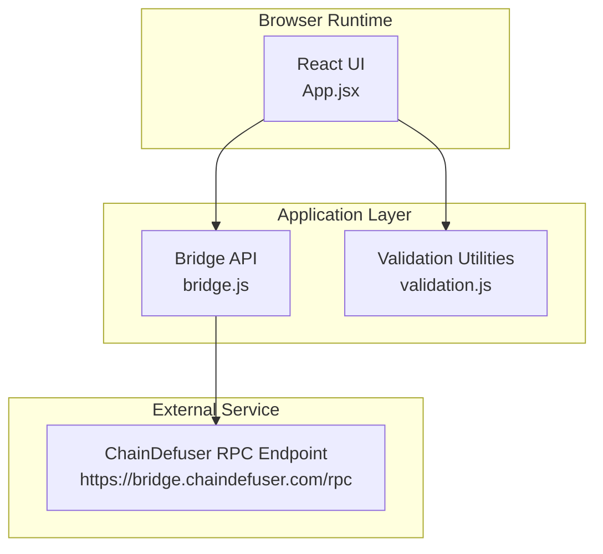
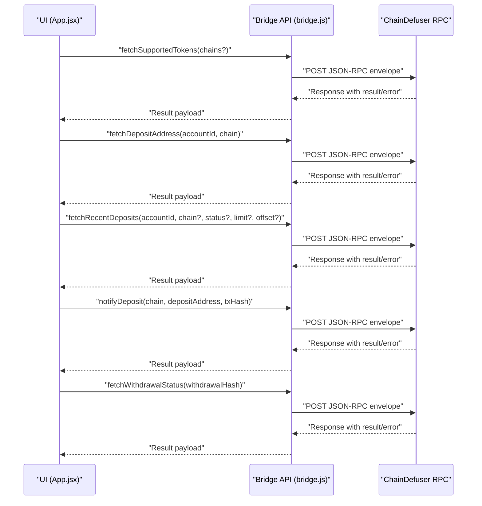
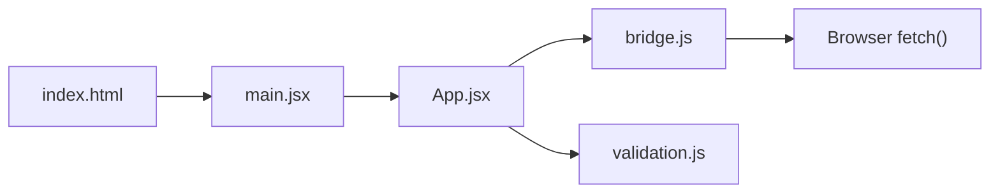

# API Reference

<cite>
**Referenced Files in This Document**
- [bridge.js](file://src/api/bridge.js)
- [validation.js](file://src/utils/validation.js)
- [App.jsx](file://src/App.jsx)
- [main.jsx](file://src/main.jsx)
- [index.html](file://index.html)
- [package.json](file://package.json)
- [netlify.toml](file://netlify.toml)
</cite>

## Table of Contents
1. [Introduction](#introduction)
2. [Project Structure](#project-structure)
3. [Core Components](#core-components)
4. [Architecture Overview](#architecture-overview)
5. [Detailed Component Analysis](#detailed-component-analysis)
6. [Dependency Analysis](#dependency-analysis)
7. [Performance Considerations](#performance-considerations)
8. [Troubleshooting Guide](#troubleshooting-guide)
9. [Conclusion](#conclusion)
10. [Appendices](#appendices)

## Introduction
This document provides a comprehensive API reference for the Bridge Fixer’s RPC integration with the ChainDefuser service. It documents the JSON-RPC client implementation, HTTP request/response patterns, and the available API functions used by the application. It also covers parameter validation, error handling, timeouts, and practical usage examples derived from the application’s implementation.

## Project Structure
The project is a React application that communicates with the ChainDefuser RPC endpoint. The API layer encapsulates JSON-RPC requests, while the UI layer orchestrates user interactions and polling for status updates.

**Diagram sources**
- [bridge.js:1-72](file://src/api/bridge.js#L1-L72)
- [validation.js:1-49](file://src/utils/validation.js#L1-L49)
- [App.jsx:1-373](file://src/App.jsx#L1-L373)

**Section sources**
- [bridge.js:1-72](file://src/api/bridge.js#L1-L72)
- [validation.js:1-49](file://src/utils/validation.js#L1-L49)
- [App.jsx:1-373](file://src/App.jsx#L1-L373)
- [main.jsx:1-11](file://src/main.jsx#L1-L11)
- [index.html:1-13](file://index.html#L1-L13)
- [package.json:1-20](file://package.json#L1-L20)
- [netlify.toml:1-9](file://netlify.toml#L1-L9)

## Core Components
- JSON-RPC client wrapper that sends POST requests to the ChainDefuser RPC endpoint and handles responses and errors.
- Public API functions for retrieving supported tokens, deposit addresses, recent deposits, notifying a deposit, and fetching withdrawal status.
- Validation utilities for addresses, account IDs, transaction hashes, and determining whether a deposit can be fixed.

Key behaviors:
- JSON-RPC 2.0 protocol with a monotonically increasing request ID.
- HTTP POST with Content-Type application/json.
- Error propagation from HTTP status and RPC error fields.
- Application-level polling and timeout controls for status checks.

**Section sources**
- [bridge.js:1-72](file://src/api/bridge.js#L1-L72)
- [validation.js:1-49](file://src/utils/validation.js#L1-L49)

## Architecture Overview
The UI triggers API calls to the Bridge API module, which constructs JSON-RPC envelopes and posts them to the ChainDefuser endpoint. Responses are parsed and returned to the UI, which then renders status and manages polling.

**Diagram sources**
- [bridge.js:33-71](file://src/api/bridge.js#L33-L71)
- [App.jsx:148-216](file://src/App.jsx#L148-L216)

## Detailed Component Analysis

### JSON-RPC Client Wrapper
- Endpoint: https://bridge.chaindefuser.com/rpc
- Protocol: JSON-RPC 2.0
- Request envelope fields: jsonrpc, id, method, params
- HTTP method: POST
- Headers: Content-Type application/json
- Error handling:
  - Throws on non-OK HTTP status
  - Throws if response contains an error field
- Response parsing: Returns the result field

Implementation highlights:
- Maintains a monotonically increasing request ID.
- Sends a params array containing a single object with method-specific fields.
- Returns only the result portion of the response.

**Section sources**
- [bridge.js:1-31](file://src/api/bridge.js#L1-L31)

### API Functions

#### fetchSupportedTokens(chains?)
- Purpose: Retrieve supported tokens, optionally filtered by chains.
- Parameters:
  - chains: Optional array of chain identifiers (e.g., ["near:ethereum", "near:polygon"]).
- Request method: supported_tokens
- Request params: An object with optional chains property.
- Response format: Tokens list payload (structure determined by service).
- Error handling: Propagates HTTP and RPC errors.
- Usage example: Called during app initialization to populate chain selection.

**Section sources**
- [bridge.js:33-39](file://src/api/bridge.js#L33-L39)
- [App.jsx:76-101](file://src/App.jsx#L76-L101)

#### fetchDepositAddress(accountId, chain)
- Purpose: Fetch a deposit address for an account on a specific chain.
- Parameters:
  - accountId: Non-empty string identifying the user account.
  - chain: Non-empty chain identifier (e.g., "near:ethereum").
- Request method: deposit_address
- Request params: Object with account_id and chain.
- Response format: Address payload (structure determined by service).
- Error handling: Propagates HTTP and RPC errors.
- Usage example: Used to populate the deposit address input field.

**Section sources**
- [bridge.js:41-46](file://src/api/bridge.js#L41-L46)
- [App.jsx:148-170](file://src/App.jsx#L148-L170)

#### fetchRecentDeposits(accountId, chain?, status?, limit?, offset?)
- Purpose: Retrieve recent deposits for an account, with optional filters.
- Parameters:
  - accountId: Non-empty string.
  - chain: Optional chain identifier.
  - status: Optional status filter.
  - limit: Optional numeric limit (default used by caller).
  - offset: Optional numeric offset.
- Request method: recent_deposits
- Request params: Object with account_id and optional chain, status, limit, offset.
- Response format: Deposts list payload (structure determined by service).
- Error handling: Propagates HTTP and RPC errors.
- Usage example: Polling loop checks deposit status and updates UI.

**Section sources**
- [bridge.js:48-57](file://src/api/bridge.js#L48-L57)
- [App.jsx:116-146](file://src/App.jsx#L116-L146)

#### notifyDeposit(chain, depositAddress, txHash)
- Purpose: Notify the service about a deposit so it can be indexed and tracked.
- Parameters:
  - chain: Non-empty chain identifier.
  - depositAddress: Non-empty validated address.
  - txHash: Non-empty transaction hash.
- Request method: notify_deposit
- Request params: Object with chain, deposit_address, tx_hash.
- Response format: Notification acknowledgment payload (structure determined by service).
- Error handling: Propagates HTTP and RPC errors.
- Usage example: Triggered after user confirms details; starts polling for completion.

**Section sources**
- [bridge.js:59-65](file://src/api/bridge.js#L59-L65)
- [App.jsx:194-216](file://src/App.jsx#L194-L216)

#### fetchWithdrawalStatus(withdrawalHash)
- Purpose: Fetch the status of a withdrawal identified by a hash.
- Parameters:
  - withdrawalHash: Non-empty string.
- Request method: withdrawal_status
- Request params: Object with withdrawal_hash.
- Response format: Withdrawal status payload (structure determined by service).
- Error handling: Propagates HTTP and RPC errors.
- Usage example: Not actively used in the UI; included for completeness.

**Section sources**
- [bridge.js:67-71](file://src/api/bridge.js#L67-L71)

### Validation Utilities
- validateAddress(address, chain): Validates EVM/TRON/BTC address prefixes and lengths based on chain prefix.
- validateAccountId(accountId): Ensures non-empty account ID.
- validateTxHash(txHash): Ensures non-empty transaction hash.
- canFixDeposit(status): Determines if a deposit can be fixed based on status.

These utilities are used by the UI to guard API calls and provide immediate feedback.

**Section sources**
- [validation.js:1-49](file://src/utils/validation.js#L1-L49)
- [App.jsx:148-216](file://src/App.jsx#L148-L216)

### UI Orchestration and Polling
- Polling interval: 5000 ms (5 seconds)
- Polling timeout: 60000 ms (60 seconds)
- The UI stops polling when a terminal status is detected or when the timeout elapses.
- The UI displays status badges and messages based on RPC responses.

**Section sources**
- [App.jsx:15-17](file://src/App.jsx#L15-L17)
- [App.jsx:116-146](file://src/App.jsx#L116-L146)

## Dependency Analysis
The application depends on:
- React runtime for UI rendering.
- JSON-RPC client module for external communication.
- Validation utilities for input sanitization.
- Browser fetch API for HTTP transport.

**Diagram sources**
- [App.jsx:1-14](file://src/App.jsx#L1-L14)
- [bridge.js:1-31](file://src/api/bridge.js#L1-L31)
- [main.jsx:1-11](file://src/main.jsx#L1-L11)
- [index.html:1-13](file://index.html#L1-L13)

**Section sources**
- [package.json:11-19](file://package.json#L11-L19)
- [App.jsx:1-14](file://src/App.jsx#L1-L14)
- [bridge.js:1-31](file://src/api/bridge.js#L1-L31)

## Performance Considerations
- Network latency: Expect variability depending on client location and service availability.
- Polling overhead: Frequent polling increases network traffic; adjust intervals judiciously.
- Payload sizes: Responses are JSON; keep parameters minimal to reduce bandwidth.
- Caching: The UI does not cache RPC responses; consider adding caching for repeated queries if needed.
- Timeout tuning: The UI enforces a 60-second polling timeout to prevent indefinite loops.

[No sources needed since this section provides general guidance]

## Troubleshooting Guide
Common issues and remedies:
- HTTP errors: The client throws on non-OK HTTP status. Inspect the error message for status code and text.
- RPC errors: When the response contains an error field, the client throws with the message or a fallback representation.
- Parameter validation failures: Ensure accountId, chain, depositAddress, and txHash meet validation criteria before calling APIs.
- No deposit address returned: Verify the account ID and chain combination; re-fetch if empty.
- Polling not stopping: The UI stops polling upon reaching a terminal status or after 60 seconds; check for transient errors that do not halt polling.

Operational tips:
- Enable browser developer tools to inspect network requests and responses.
- Log errors from the UI to capture detailed messages.
- Retry transient errors with exponential backoff if building a robust client outside this UI.

**Section sources**
- [bridge.js:20-31](file://src/api/bridge.js#L20-L31)
- [validation.js:1-49](file://src/utils/validation.js#L1-L49)
- [App.jsx:116-146](file://src/App.jsx#L116-L146)

## Conclusion
The Bridge Fixer integrates with ChainDefuser via a straightforward JSON-RPC client. The UI provides a user-friendly interface to fetch supported tokens, deposit addresses, check recent deposits, notify about deposits, and monitor statuses. The client handles HTTP and RPC error propagation, while the UI manages validation, polling, and user feedback.

[No sources needed since this section summarizes without analyzing specific files]

## Appendices

### Authentication and Rate Limiting
- Authentication: The client does not attach any authentication headers; the endpoint is accessed anonymously.
- Rate limiting: Not explicitly configured in the client. If encountering throttling, consider reducing polling frequency or batching requests.

**Section sources**
- [bridge.js:14-18](file://src/api/bridge.js#L14-L18)

### Error Codes and Messages
- HTTP error: Thrown when response.ok is false; includes status code and text.
- RPC error: Thrown when the response contains an error field; includes the message or a structured fallback.
- Validation errors: Returned by validation utilities with descriptive messages.

**Section sources**
- [bridge.js:20-31](file://src/api/bridge.js#L20-L31)
- [validation.js:1-49](file://src/utils/validation.js#L1-L49)

### Practical Usage Examples
- Fetch supported tokens:
  - Call fetchSupportedTokens() during app initialization to populate chain options.
  - Example invocation path: [App.jsx:76-101](file://src/App.jsx#L76-L101)
- Fetch deposit address:
  - Validate accountId and chain, then call fetchDepositAddress().
  - Example invocation path: [App.jsx:148-170](file://src/App.jsx#L148-L170)
- Check recent deposits:
  - Call fetchRecentDeposits() and render the results.
  - Example invocation path: [App.jsx:172-192](file://src/App.jsx#L172-L192)
- Notify deposit:
  - Validate address and txHash, then call notifyDeposit() and start polling.
  - Example invocation path: [App.jsx:194-216](file://src/App.jsx#L194-L216)
- Fetch withdrawal status:
  - Call fetchWithdrawalStatus() with a withdrawal hash.
  - Example invocation path: [bridge.js:67-71](file://src/api/bridge.js#L67-L71)

**Section sources**
- [App.jsx:76-101](file://src/App.jsx#L76-L101)
- [App.jsx:148-170](file://src/App.jsx#L148-L170)
- [App.jsx:172-192](file://src/App.jsx#L172-L192)
- [App.jsx:194-216](file://src/App.jsx#L194-L216)
- [bridge.js:67-71](file://src/api/bridge.js#L67-L71)

### Network Considerations and Debugging
- Network considerations:
  - Use HTTPS endpoints and ensure CORS allows requests from your origin.
  - Monitor network tab for request/response timing and error details.
- Retry mechanisms:
  - Implement retries for transient errors (e.g., network timeouts) with exponential backoff.
  - Respect polling timeouts to avoid indefinite waits.
- Debugging approaches:
  - Capture and log thrown errors from the client.
  - Validate inputs using the provided validators before invoking APIs.
  - Inspect the RPC response structure to adapt to service changes.

**Section sources**
- [bridge.js:14-18](file://src/api/bridge.js#L14-L18)
- [App.jsx:116-146](file://src/App.jsx#L116-L146)