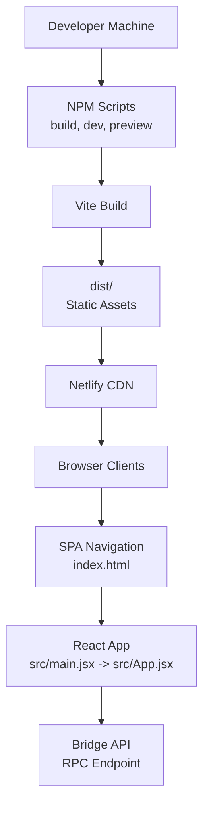
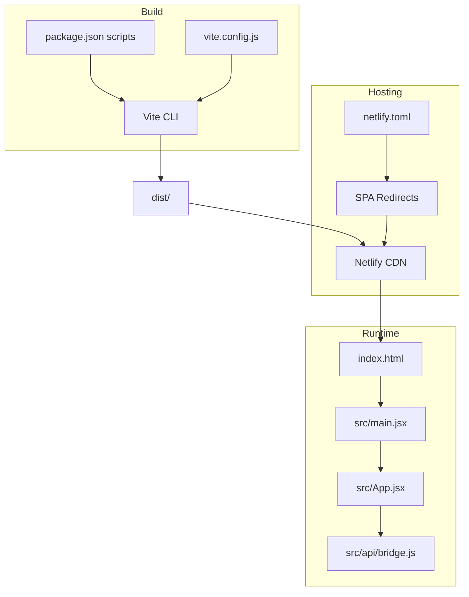
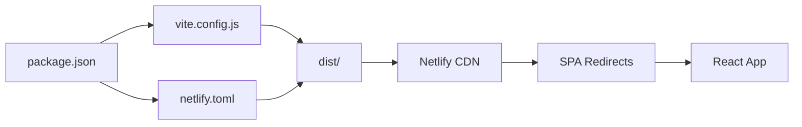

# Deployment and Hosting

<cite>
**Referenced Files in This Document**
- [netlify.toml](file://netlify.toml)
- [vite.config.js](file://vite.config.js)
- [package.json](file://package.json)
- [index.html](file://index.html)
- [src/main.jsx](file://src/main.jsx)
- [src/App.jsx](file://src/App.jsx)
- [src/api/bridge.js](file://src/api/bridge.js)
- [src/utils/validation.js](file://src/utils/validation.js)
</cite>

## Table of Contents
1. [Introduction](#introduction)
2. [Project Structure](#project-structure)
3. [Core Components](#core-components)
4. [Architecture Overview](#architecture-overview)
5. [Detailed Component Analysis](#detailed-component-analysis)
6. [Dependency Analysis](#dependency-analysis)
7. [Performance Considerations](#performance-considerations)
8. [Troubleshooting Guide](#troubleshooting-guide)
9. [Conclusion](#conclusion)
10. [Appendices](#appendices)

## Introduction
This document provides end-to-end deployment and hosting guidance for Bridge Fixer, a React-based static site built with Vite. It covers Netlify configuration, Vite build and asset optimization, production bundle generation, environment-specific settings, CI/CD setup, CDN and performance optimization, secrets management, monitoring, troubleshooting, and rollback procedures.

## Project Structure
Bridge Fixer is a single-page application (SPA) with a minimal static site footprint suitable for static hosting. The repository includes:
- Build configuration for Vite
- Netlify deployment configuration
- A React application entry and routing via SPA redirects
- API client code that communicates with a remote bridge service
- Utility validations for user inputs

**Diagram sources**
- [package.json:6-10](file://package.json#L6-L10)
- [vite.config.js:1-7](file://vite.config.js#L1-L7)
- [netlify.toml:1-9](file://netlify.toml#L1-L9)
- [index.html:8-12](file://index.html#L8-L12)
- [src/main.jsx:1-11](file://src/main.jsx#L1-L11)
- [src/App.jsx:53-373](file://src/App.jsx#L53-L373)
- [src/api/bridge.js:1-72](file://src/api/bridge.js#L1-L72)

**Section sources**
- [package.json:1-20](file://package.json#L1-L20)
- [vite.config.js:1-7](file://vite.config.js#L1-L7)
- [netlify.toml:1-9](file://netlify.toml#L1-L9)
- [index.html:1-13](file://index.html#L1-L13)
- [src/main.jsx:1-11](file://src/main.jsx#L1-L11)
- [src/App.jsx:53-373](file://src/App.jsx#L53-L373)
- [src/api/bridge.js:1-72](file://src/api/bridge.js#L1-L72)

## Core Components
- Vite configuration defines the React plugin and default build behavior.
- Netlify configuration sets the build command, publish directory, and SPA redirect rules.
- The React app initializes in index.html and renders the main application component.
- The API module encapsulates RPC calls to the bridge service endpoint.
- Validation utilities enforce client-side input correctness before API requests.

Key deployment-relevant behaviors:
- SPA routing relies on Netlify’s wildcard redirect to serve index.html for all routes.
- The build output is published to the dist directory.
- No environment variables are configured in the repository; runtime configuration is handled by the API endpoint.

**Section sources**
- [vite.config.js:1-7](file://vite.config.js#L1-L7)
- [netlify.toml:1-9](file://netlify.toml#L1-L9)
- [index.html:8-12](file://index.html#L8-L12)
- [src/api/bridge.js:1-72](file://src/api/bridge.js#L1-L72)
- [src/utils/validation.js:1-49](file://src/utils/validation.js#L1-L49)

## Architecture Overview
The deployment architecture centers on building a static site with Vite and serving it via Netlify’s global CDN with SPA routing support.

**Diagram sources**
- [vite.config.js:1-7](file://vite.config.js#L1-L7)
- [package.json:6-10](file://package.json#L6-L10)
- [netlify.toml:1-9](file://netlify.toml#L1-L9)
- [index.html:8-12](file://index.html#L8-L12)
- [src/main.jsx:1-11](file://src/main.jsx#L1-L11)
- [src/App.jsx:53-373](file://src/App.jsx#L53-L373)
- [src/api/bridge.js:1-72](file://src/api/bridge.js#L1-L72)

## Detailed Component Analysis

### Netlify Deployment Configuration
- Build command: runs the Vite build script.
- Publish directory: serves assets from dist/.
- SPA redirect: ensures all routes render index.html with a 200 status, enabling client-side routing.

Operational notes:
- Environment variables are not configured in the repository; if needed, add them via Netlify UI or CLI under “Site Settings > Build & deploy > Environment”.
- Custom domains are configured in Netlify under “Domain management”.

**Section sources**
- [netlify.toml:1-9](file://netlify.toml#L1-L9)

### Vite Build Process and Asset Optimization
- Plugin stack: React plugin is enabled for JSX transformations and Fast Refresh during development.
- Production build: generates optimized static assets in dist/.
- Asset handling: Vite resolves and bundles JS, CSS, and public assets; runtime paths are resolved relative to the base path.

Optimization considerations:
- Enable code splitting and dynamic imports for large features.
- Prefer modern browsers to leverage native ES modules and reduce polyfills.
- Use external CDN for large third-party libraries if applicable.

**Section sources**
- [vite.config.js:1-7](file://vite.config.js#L1-L7)
- [package.json:6-10](file://package.json#L6-L10)

### SPA Routing and Index Entry
- index.html injects the React root and mounts the application.
- SPA routing is handled by Netlify’s wildcard redirect to index.html, allowing deep links to work without server-side routing.

Best practices:
- Keep the base href consistent with the deployed path if hosting under a subpath.
- Ensure all client-side navigation uses proper history APIs or router links.

**Section sources**
- [index.html:8-12](file://index.html#L8-L12)
- [netlify.toml:5-8](file://netlify.toml#L5-L8)
- [src/main.jsx:1-11](file://src/main.jsx#L1-L11)

### API Client and Runtime Behavior
- The application communicates with a fixed RPC endpoint for bridge operations.
- Input validation occurs before API calls to improve UX and reduce unnecessary network requests.

Security and reliability:
- Network errors are surfaced to the UI; implement retry/backoff for transient failures if needed.
- Consider adding request timeouts and circuit breaker patterns for stability.

**Section sources**
- [src/api/bridge.js:1-72](file://src/api/bridge.js#L1-L72)
- [src/utils/validation.js:1-49](file://src/utils/validation.js#L1-L49)
- [src/App.jsx:148-216](file://src/App.jsx#L148-L216)

### Step-by-Step Deployment Instructions
1. Prepare repository
   - Commit and push all changes to the default branch.
2. Configure Netlify
   - Create a site from the repository.
   - Set Build command to the Vite build script.
   - Set Publish directory to dist/.
3. Configure SPA redirects
   - Add a wildcard redirect from /* to /index.html with status 200.
4. Optional: Configure custom domain
   - Add domain under “Domain management” and configure DNS records as instructed by Netlify.
5. Optional: Add environment variables
   - Under “Site Settings > Build & deploy > Environment”, add variables if needed.
6. Trigger build
   - Push to the configured branch or use Netlify’s manual deploy.
7. Verify
   - Access the deployed URL and confirm SPA routing works for deep links.

**Section sources**
- [netlify.toml:1-9](file://netlify.toml#L1-L9)
- [package.json:6-10](file://package.json#L6-L10)

### CI/CD Pipeline Setup and Automated Workflows
Recommended approach:
- Use a Git provider’s native CI/CD (e.g., GitHub Actions) to automate builds and deploys.
- Workflow steps:
  - Checkout code
  - Install dependencies
  - Run tests (optional)
  - Build with Vite
  - Deploy to Netlify using the official action or CLI
- Branch protection and PR checks can gate deployments to production.

Note: No CI configuration files were found in the repository. Implement the workflow in your provider’s native system.

**Section sources**
- [package.json:6-10](file://package.json#L6-L10)
- [vite.config.js:1-7](file://vite.config.js#L1-L7)

### Environment-Specific Configurations and Secrets Management
- Current configuration does not require environment variables.
- If environment-specific endpoints or flags are needed:
  - Define variables in Netlify UI or CLI.
  - Reference them in the application at runtime (e.g., via import.meta.env).
  - Never commit secrets to the repository.

Monitoring and observability:
- Use Netlify’s analytics and logs for basic insights.
- For advanced monitoring, integrate external tools (e.g., error tracking, performance monitoring) and configure appropriate environment variables.

**Section sources**
- [netlify.toml:1-9](file://netlify.toml#L1-L9)
- [src/api/bridge.js:1-72](file://src/api/bridge.js#L1-L72)

### CDN Configuration and Performance Optimization
- Netlify provides a global CDN; enable caching headers and compression via Netlify settings if needed.
- Optimize assets:
  - Minimize and split bundles.
  - Lazy-load non-critical features.
  - Use modern image formats and sizes.
- Lighthouse and Netlify’s performance reports can guide further tuning.

**Section sources**
- [netlify.toml:1-9](file://netlify.toml#L1-L9)
- [vite.config.js:1-7](file://vite.config.js#L1-L7)

## Dependency Analysis
The application depends on React and Vite with the React plugin. Netlify orchestrates the build and deployment pipeline.

**Diagram sources**
- [package.json:1-20](file://package.json#L1-L20)
- [vite.config.js:1-7](file://vite.config.js#L1-L7)
- [netlify.toml:1-9](file://netlify.toml#L1-L9)

**Section sources**
- [package.json:1-20](file://package.json#L1-L20)
- [vite.config.js:1-7](file://vite.config.js#L1-L7)
- [netlify.toml:1-9](file://netlify.toml#L1-L9)

## Performance Considerations
- Bundle size: Keep dependencies lean; consider tree-shaking and code splitting.
- Network latency: The app calls a remote RPC endpoint; ensure reliable connectivity and consider retry strategies.
- Rendering: Avoid unnecessary re-renders; memoize derived values where appropriate.
- Static hosting: Leverage CDN caching and compression for optimal delivery.

[No sources needed since this section provides general guidance]

## Troubleshooting Guide
Common deployment issues and resolutions:
- Build fails locally or on Netlify
  - Ensure Node.js and npm versions meet Vite requirements.
  - Clear node_modules and reinstall dependencies.
  - Confirm the build script matches the configured command.
- SPA routes return 404
  - Verify wildcard redirect from /* to /index.html with status 200 is present.
  - Test deep links after redeploy.
- Assets not loading
  - Confirm publish directory is dist/.
  - Check base path and asset URLs in the built output.
- API errors
  - Validate the RPC endpoint availability and CORS configuration.
  - Inspect network tab for error messages and adjust retry logic if needed.
- Rollback procedure
  - Use Netlify UI to revert to a previous successful deploy.
  - Alternatively, redeploy the last known good commit.

**Section sources**
- [netlify.toml:1-9](file://netlify.toml#L1-L9)
- [package.json:6-10](file://package.json#L6-L10)
- [src/api/bridge.js:14-31](file://src/api/bridge.js#L14-L31)

## Conclusion
Bridge Fixer is a lightweight, static React application that integrates seamlessly with Netlify for fast, reliable hosting. By aligning Vite’s build outputs with Netlify’s SPA redirect configuration, you achieve a robust deployment pipeline. Extend the setup with CI/CD automation, environment variables for runtime configuration, and CDN optimizations to scale and maintain performance.

[No sources needed since this section summarizes without analyzing specific files]

## Appendices

### Appendix A: Build and Preview Commands
- Development: start the Vite dev server.
- Production build: generate optimized assets in dist/.
- Preview: serve the production build locally.

**Section sources**
- [package.json:6-10](file://package.json#L6-L10)

### Appendix B: SPA Redirect Rule
- Ensure all routes fall back to index.html with a 200 status to support client-side routing.

**Section sources**
- [netlify.toml:5-8](file://netlify.toml#L5-L8)