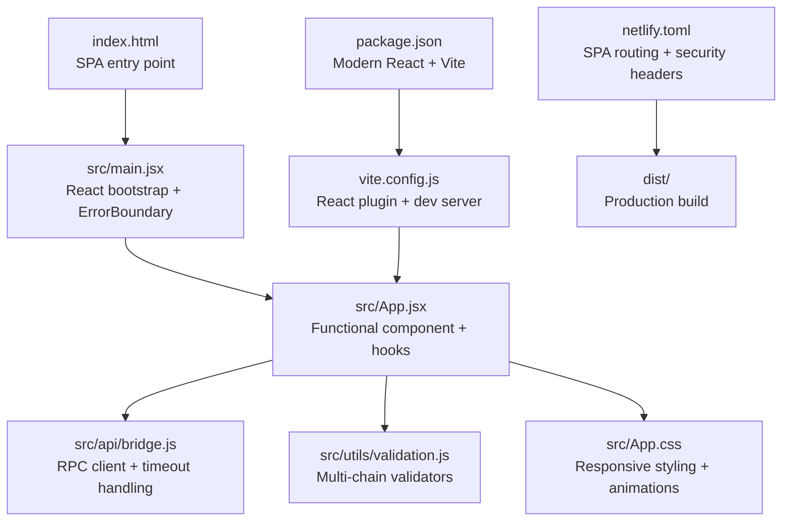
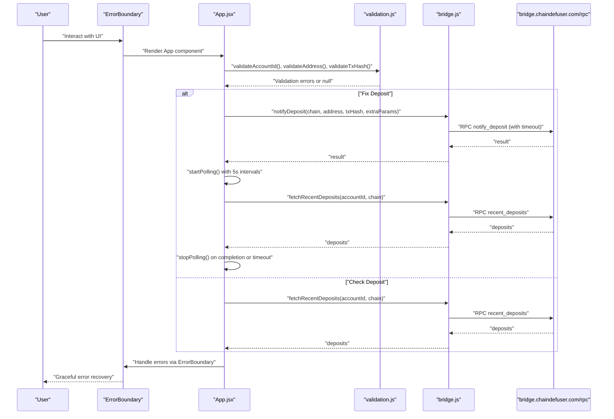
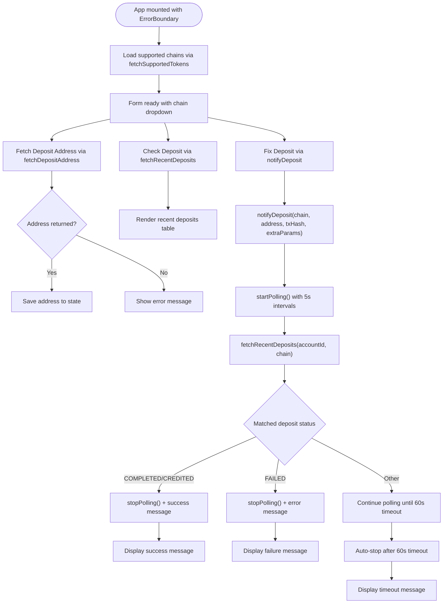
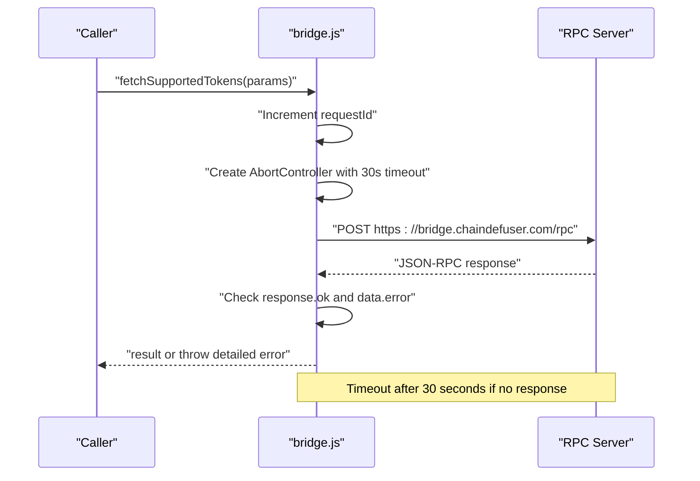
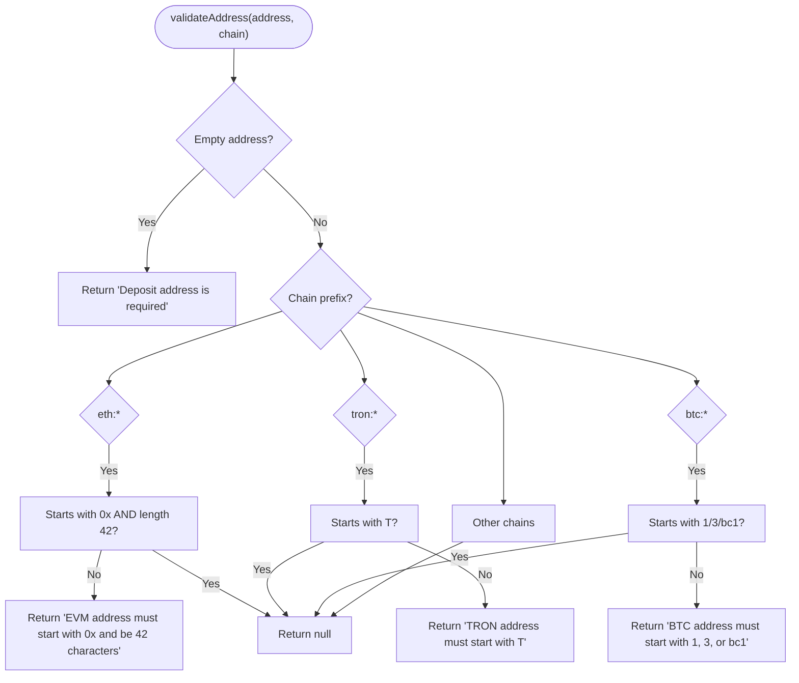
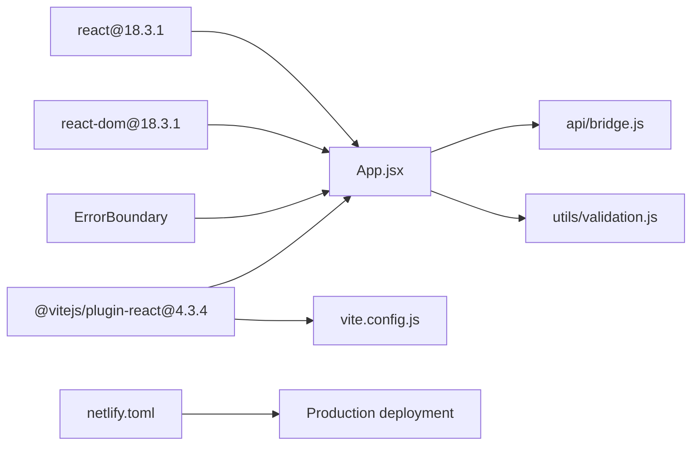

# Development Guide

<cite>
**Referenced Files in This Document**
- [src/main.jsx](file://src/main.jsx)
- [src/App.jsx](file://src/App.jsx)
- [src/App.css](file://src/App.css)
- [src/api/bridge.js](file://src/api/bridge.js)
- [src/utils/validation.js](file://src/utils/validation.js)
- [index.html](file://index.html)
- [vite.config.js](file://vite.config.js)
- [package.json](file://package.json)
- [netlify.toml](file://netlify.toml)
- [README.md](file://README.md)
- [read.md](file://read.md)
</cite>

## Update Summary
**Changes Made**
- Updated to reflect modern React application architecture with hooks and error boundaries
- Enhanced development workflow documentation with Vite integration
- Added comprehensive testing strategies and deployment procedures
- Expanded troubleshooting guide with modern debugging techniques
- Updated component composition patterns with functional components and hooks
- Added performance optimization strategies for modern React applications

## Table of Contents
1. [Introduction](#introduction)
2. [Project Structure](#project-structure)
3. [Core Components](#core-components)
4. [Architecture Overview](#architecture-overview)
5. [Detailed Component Analysis](#detailed-component-analysis)
6. [Dependency Analysis](#dependency-analysis)
7. [Performance Considerations](#performance-considerations)
8. [Development Workflow](#development-workflow)
9. [Testing Strategies](#testing-strategies)
10. [Deployment Procedures](#deployment-procedures)
11. [Troubleshooting Guide](#troubleshooting-guide)
12. [Conclusion](#conclusion)
13. [Appendices](#appendices)

## Introduction
This development guide explains how to extend and modify Bridge Fixer, a modern React-based tool for checking and fixing bridge deposits. The application demonstrates contemporary React patterns including hooks, error boundaries, and functional components. It covers code organization principles, state management patterns, blockchain network integration, API endpoint customization, UI component composition, build system configuration, development workflow, debugging techniques, testing approaches, error handling improvements, and performance optimizations.

## Project Structure
The project follows a modern, feature-focused layout with clear separation of concerns:
- Entry point initializes React with strict mode and error boundary wrapping
- Application logic resides in a single functional component with advanced hooks
- API interactions are encapsulated in a dedicated module with robust error handling
- Validation logic is separated into a utility module with comprehensive rules
- Styling is centralized in a single stylesheet with responsive design
- Build and deployment are configured via Vite and Netlify with security headers

**Diagram sources**
- [index.html:1-14](file://index.html#L1-L14)
- [src/main.jsx:1-13](file://src/main.jsx#L1-L13)
- [src/App.jsx:1-489](file://src/App.jsx#L1-L489)
- [src/api/bridge.js:1-86](file://src/api/bridge.js#L1-L86)
- [src/utils/validation.js:1-49](file://src/utils/validation.js#L1-L49)
- [src/App.css:1-309](file://src/App.css#L1-L309)
- [vite.config.js:1-7](file://vite.config.js#L1-L7)
- [package.json:1-21](file://package.json#L1-L21)
- [netlify.toml:1-16](file://netlify.toml#L1-L16)

**Section sources**
- [index.html:1-14](file://index.html#L1-L14)
- [src/main.jsx:1-13](file://src/main.jsx#L1-L13)
- [src/App.jsx:1-489](file://src/App.jsx#L1-L489)
- [src/api/bridge.js:1-86](file://src/api/bridge.js#L1-L86)
- [src/utils/validation.js:1-49](file://src/utils/validation.js#L1-L49)
- [src/App.css:1-309](file://src/App.css#L1-L309)
- [vite.config.js:1-7](file://vite.config.js#L1-L7)
- [package.json:1-21](file://package.json#L1-L21)
- [netlify.toml:1-16](file://netlify.toml#L1-L16)

## Core Components
- **Entry Point**: Initializes React with strict mode and wraps the app in an error boundary for robust error handling
- **App Component**: Central UI and state container managing complex form states, loading states, polling lifecycle, and rendering results
- **API Module**: Encapsulates RPC calls with timeout handling, error propagation, and request ID management
- **Validation Module**: Provides comprehensive address/account/TxHash validation with chain-specific rules and fix eligibility checks
- **Error Boundary**: Custom error handling component that gracefully recovers from runtime errors

Key modern patterns:
- Functional component with hooks for state and effects
- Controlled inputs with local state updates and validation
- Polling loop with interval and timeout safeguards using refs
- Centralized RPC client with comprehensive error handling
- Error boundaries for graceful error recovery

**Section sources**
- [src/main.jsx:1-13](file://src/main.jsx#L1-L13)
- [src/App.jsx:97-489](file://src/App.jsx#L97-L489)
- [src/api/bridge.js:6-38](file://src/api/bridge.js#L6-L38)
- [src/utils/validation.js:1-49](file://src/utils/validation.js#L1-L49)

## Architecture Overview
The runtime architecture is a modern React application that communicates with a remote bridge RPC endpoint. The UI orchestrates user actions, validates inputs, manages complex state with hooks, polls for status changes, and displays results with enhanced error handling.

**Diagram sources**
- [src/App.jsx:166-196](file://src/App.jsx#L166-L196)
- [src/App.jsx:244-273](file://src/App.jsx#L244-L273)
- [src/App.jsx:222-242](file://src/App.jsx#L222-L242)
- [src/utils/validation.js:1-49](file://src/utils/validation.js#L1-L49)
- [src/api/bridge.js:66-79](file://src/api/bridge.js#L66-L79)
- [src/api/bridge.js:55-64](file://src/api/bridge.js#L55-L64)
- [src/App.jsx:458-489](file://src/App.jsx#L458-L489)

## Detailed Component Analysis

### App Component
**Updated** Enhanced with modern React patterns including hooks, error boundaries, and comprehensive state management

Responsibilities:
- Manage complex form state with multiple inputs and derived UI state
- Orchestrate API calls with proper error handling and loading states
- Implement sophisticated polling lifecycle with timeout safeguards
- Render enhanced status badges, conditional action buttons, and comprehensive results table
- Enforce fix eligibility via comprehensive validation logic

Advanced state management patterns:
- Local state for inputs, loading flags, polling control, and messages using useState
- Refs for timer and start time to safely manage intervals using useRef
- Derived state for overall status and fix eligibility using computed values
- Callbacks for polling management using useCallback
- Cleanup effects for proper component unmount handling

UI composition enhancements:
- Cards for form, status, actions, and results with enhanced styling
- Reusable StatusBadge and DepositRow components with improved presentation
- Responsive layout with media queries and mobile-first design
- Conditional rendering based on chain-specific requirements
- Enhanced error and success message handling

**Diagram sources**
- [src/App.jsx:124-151](file://src/App.jsx#L124-L151)
- [src/App.jsx:198-220](file://src/App.jsx#L198-L220)
- [src/App.jsx:222-242](file://src/App.jsx#L222-L242)
- [src/App.jsx:244-273](file://src/App.jsx#L244-L273)
- [src/App.jsx:166-196](file://src/App.jsx#L166-L196)

**Section sources**
- [src/App.jsx:97-489](file://src/App.jsx#L97-L489)

### API Module
**Updated** Enhanced with comprehensive error handling, timeout management, and request ID tracking

Responsibilities:
- Provide typed RPC wrappers for supported tokens, deposit address, recent deposits, deposit notification, and withdrawal status
- Centralize RPC endpoint with timeout handling and request ID management
- Propagate HTTP and RPC errors to callers with detailed error messages
- Implement AbortController for request cancellation and timeout handling

Enhanced patterns:
- Single RPC transport with consistent JSON-RPC 2.0 envelope and automatic request ID increment
- Optional parameters passed via a single param object with defaults and chain-specific extras
- Comprehensive error handling for network failures, RPC errors, and timeout scenarios
- Request timeout management using AbortController for graceful cancellation

**Diagram sources**
- [src/api/bridge.js:6-38](file://src/api/bridge.js#L6-L38)
- [src/api/bridge.js:40-46](file://src/api/bridge.js#L40-L46)

**Section sources**
- [src/api/bridge.js:1-86](file://src/api/bridge.js#L1-L86)

### Validation Module
**Updated** Enhanced with comprehensive chain-specific validation rules and fix eligibility determination

Responsibilities:
- Validate account IDs, deposit addresses, and transaction hashes with comprehensive error messages
- Enforce chain-aware address formats (EVM, TRON, BTC) with specific validation rules
- Determine whether a deposit can be fixed based on status with business logic
- Provide chain-specific validation for NEAR and Stellar networks

Enhanced patterns:
- Early return with descriptive error messages for validation failures
- Chain prefix-based validation rules with specific format requirements
- Pure functions for easy testing and reuse with comprehensive test coverage
- Business logic for fix eligibility based on deposit status

**Diagram sources**
- [src/utils/validation.js:1-30](file://src/utils/validation.js#L1-L30)

**Section sources**
- [src/utils/validation.js:1-49](file://src/utils/validation.js#L1-L49)

### Error Boundary Component
**New** Added comprehensive error boundary handling for graceful error recovery

Responsibilities:
- Catch JavaScript errors anywhere in the child component tree
- Display friendly error messages to users
- Provide reload functionality for quick recovery
- Prevent error propagation to parent components

Patterns:
- Class component extending React.Component
- Static getDerivedStateFromError for error state management
- Render method with fallback UI for error state
- Button for manual page reload

**Section sources**
- [src/App.jsx:458-489](file://src/App.jsx#L458-L489)

### UI Styling and Composition
**Updated** Enhanced with responsive design, animations, and comprehensive status indicators

- Modular CSS with reusable classes for cards, forms, buttons, status badges, and tables
- Responsive design with mobile-first adjustments and media queries
- Semantic class names for status variants with color-coded indicators
- Animation support with keyframe animations for polling indicators
- Enhanced typography and spacing for improved readability

**Section sources**
- [src/App.css:1-309](file://src/App.css#L1-L309)

## Dependency Analysis
**Updated** Modern dependency management with Vite and React 18

External dependencies:
- **React 18.3.1**: Latest stable React with concurrent features and error boundaries
- **React DOM 18.3.1**: Client-side rendering with hydration support
- **@vitejs/plugin-react 4.3.4**: JSX transform and fast refresh for development
- **Vite 6.0.0**: Modern build tool with zero-config setup and HMR

Internal dependencies:
- App depends on API and Validation modules with proper import/export patterns
- API module is self-contained with no external dependencies beyond fetch
- Validation module is pure with no external dependencies
- ErrorBoundary is integrated at the application level for global error handling

**Diagram sources**
- [package.json:11-19](file://package.json#L11-L19)
- [src/App.jsx:1-13](file://src/App.jsx#L1-L13)
- [src/api/bridge.js:1-86](file://src/api/bridge.js#L1-L86)
- [src/utils/validation.js:1-49](file://src/utils/validation.js#L1-L49)
- [vite.config.js:1-7](file://vite.config.js#L1-L7)

**Section sources**
- [package.json:1-21](file://package.json#L1-L21)
- [vite.config.js:1-7](file://vite.config.js#L1-L7)
- [src/App.jsx:1-13](file://src/App.jsx#L1-L13)

## Performance Considerations
**Updated** Enhanced performance optimization strategies for modern React applications

- **Polling optimization**: Configurable polling cadence (5s intervals) and timeout (60s) to balance responsiveness and resource usage
- **Debouncing and throttling**: Consider debouncing repeated user input events to avoid excessive re-renders
- **Efficient rendering**: Memoize derived values and avoid unnecessary re-computation inside render loops
- **Network efficiency**: Request timeout management (30s) and AbortController for graceful cancellation
- **Bundle size**: Tree-shaking via ES modules and minimal external dependencies
- **Memory management**: Proper cleanup of intervals and event listeners on component unmount
- **State optimization**: Use of useCallback for stable function references and useRef for mutable values
- **Rendering optimization**: React.memo patterns for expensive components and efficient key usage

## Development Workflow
**Updated** Modern development workflow with Vite and Git integration

### Setup and Installation
1. Clone the repository and install dependencies
2. Start the development server with `npm run dev`
3. Access the application at http://localhost:5173
4. Enable React DevTools for enhanced debugging

### Development Environment
- **Hot Module Replacement**: Automatic page reload on code changes
- **Fast Refresh**: Preserves component state during development
- **Source Maps**: Debug original source code in browser dev tools
- **TypeScript Support**: Optional TypeScript integration for enhanced development

### Code Organization
- **Component Structure**: Single-file components with clear separation of concerns
- **Hook Usage**: Proper use of useState, useEffect, useRef, and useCallback
- **File Naming**: PascalCase for components, kebab-case for utilities
- **Import/Export**: Named exports for utilities, default export for components

### Quality Assurance
- **ESLint**: Code linting for consistent style and error detection
- **Prettier**: Code formatting for consistent appearance
- **Git Hooks**: Pre-commit hooks for automated quality checks

**Section sources**
- [package.json:6-10](file://package.json#L6-L10)
- [vite.config.js:1-7](file://vite.config.js#L1-L7)

## Testing Strategies
**New** Comprehensive testing approach for modern React applications

### Unit Testing
- **Validation Functions**: Test address validation with representative inputs
- **API Wrappers**: Mock fetch API for RPC endpoint testing
- **Component Rendering**: Test component snapshots and behavior
- **State Management**: Verify hook behavior and state transitions

### Integration Testing
- **API Integration**: Test complete user flows with real API calls
- **Form Validation**: End-to-end validation testing across different chains
- **Error Scenarios**: Test error boundary behavior and error recovery
- **Polling Logic**: Test auto-refresh functionality and timeout handling

### Testing Tools
- **React Testing Library**: Component testing with user-centric queries
- **Jest**: Test runner with snapshot and async testing capabilities
- **MSW (Mock Service Worker)**: API mocking for realistic testing scenarios
- **Cypress**: End-to-end testing for complete user workflows

### Testing Best Practices
- **Test Coverage**: Aim for 80%+ coverage across components and utilities
- **Test Isolation**: Mock external dependencies and side effects
- **Async Testing**: Proper handling of promises and async operations
- **Accessibility Testing**: Ensure components meet accessibility standards

## Deployment Procedures
**Updated** Production-ready deployment with Netlify and modern CI/CD

### Build Process
1. Run `npm run build` to generate production bundle
2. Vite optimizes assets and creates static files in `dist/` directory
3. Bundle analysis shows final asset sizes and optimization results
4. Source maps are generated for debugging production issues

### Netlify Configuration
- **Static Site Generation**: SPA routing with fallback to index.html
- **Security Headers**: X-Frame-Options, X-Content-Type-Options, Referrer-Policy
- **Build Command**: `npm run build` executed automatically
- **Publish Directory**: `dist` containing optimized static assets

### Production Optimization
- **Code Splitting**: Automatic chunk splitting for optimal loading
- **Tree Shaking**: Unused code elimination for smaller bundles
- **Asset Optimization**: Image compression and minification
- **Cache Headers**: Intelligent caching for improved performance

### Monitoring and Analytics
- **Error Tracking**: Sentry integration for production error monitoring
- **Performance Monitoring**: Lighthouse scores and Core Web Vitals
- **User Analytics**: Google Analytics or similar for usage insights
- **Health Checks**: Automated uptime monitoring and alerting

**Section sources**
- [netlify.toml:1-16](file://netlify.toml#L1-L16)
- [package.json:8-9](file://package.json#L8-L9)

## Troubleshooting Guide
**Updated** Comprehensive troubleshooting for modern React applications

### Common Issues and Resolutions
- **Network errors during RPC calls**: Inspect HTTP status and error messages from RPC client. Verify endpoint availability and CORS configuration. Check request timeout settings (30s).
- **Validation failures**: Review validation messages for missing or malformed inputs. Ensure chain prefixes match intended network format requirements.
- **Polling not stopping**: Confirm that polling is stopped on completion or timeout and that timers are cleared on component unmount using proper cleanup.
- **UI not updating**: Check that state setters are invoked and that derived state computations are performed after state updates.
- **Error boundary not working**: Verify ErrorBoundary is properly wrapped around the App component and that error states are handled correctly.

### Advanced Debugging Techniques
- **React DevTools**: Use Profiler tab to identify performance bottlenecks and component re-renders
- **Network Tab**: Inspect RPC requests and responses with detailed timing information
- **Console Logging**: Add strategic console.log statements around API calls and state transitions
- **Error Boundaries**: Test error recovery by simulating component errors
- **Performance Monitoring**: Use React Profiler to identify expensive component updates

### Development Tools
- **React Developer Tools**: Inspect component props, state, and performance metrics
- **Vite Dev Server**: Hot reload and error overlay for immediate feedback
- **Browser DevTools**: Network inspection and performance profiling
- **ESLint**: Real-time code quality feedback during development

**Section sources**
- [src/api/bridge.js:15-38](file://src/api/bridge.js#L15-L38)
- [src/App.jsx:153-164](file://src/App.jsx#L153-L164)
- [src/App.jsx:166-196](file://src/App.jsx#L166-L196)

## Conclusion
Bridge Fixer represents a modern, production-ready React application that demonstrates best practices in component architecture, state management, and error handling. The application showcases contemporary React patterns including hooks, error boundaries, and functional components. Extending it involves adding new chain validations, integrating new RPC endpoints, and composing UI components thoughtfully while maintaining the established patterns and quality standards.

## Appendices

### A. Adding New Blockchain Networks
**Updated** Enhanced process for modern React applications

Steps:
- Extend validation rules for the new chain prefix in the validation module with comprehensive format checking
- Ensure address format checks align with the chain's specific requirements and validation rules
- Update chain name mapping in the CHAIN_NAMES constant for proper display
- Add chain-specific conditional inputs in the App component if required
- Verify that the backend RPC supports the new chain and parameters
- Test validation logic thoroughly with representative test cases

Guidelines:
- Keep validation logic pure and deterministic with comprehensive error messages
- Add descriptive error messages for common validation mistakes
- Test address validation independently before integrating with UI
- Follow the established pattern for chain-specific conditional inputs

**Section sources**
- [src/utils/validation.js:1-30](file://src/utils/validation.js#L1-L30)
- [src/App.jsx:18-53](file://src/App.jsx#L18-L53)

### B. Integrating Additional API Endpoints
**Updated** Enhanced API integration patterns for modern applications

Steps:
- Add a new function in the API module following the existing RPC wrapper pattern with timeout handling
- Define parameter shaping and optional fields consistently with existing patterns
- Export the function and import it into the App component with proper error handling
- Wire up UI controls and implement comprehensive error/success messaging
- Add request timeout management and AbortController integration
- Implement proper loading states and user feedback

Guidelines:
- Centralize RPC logic to minimize duplication and maintain consistency
- Propagate errors to the caller for consistent user experience
- Respect rate limits and implement retry mechanisms with exponential backoff
- Add comprehensive error handling for network failures and RPC errors
- Implement request cancellation and timeout management

**Section sources**
- [src/api/bridge.js:6-38](file://src/api/bridge.js#L6-L38)
- [src/api/bridge.js:40-86](file://src/api/bridge.js#L40-L86)

### C. Customizing UI Components
**Updated** Enhanced component composition patterns for modern applications

Approach:
- Compose new components from existing building blocks with consistent styling
- Reuse StatusBadge and other small components to maintain design system consistency
- Apply responsive styles and ensure accessibility attributes are properly set
- Implement proper error handling and loading states in custom components
- Follow the established pattern for conditional rendering based on chain requirements

Guidelines:
- Prefer CSS classes over inline styles for maintainability
- Keep component boundaries clear and props minimal for better reusability
- Use semantic HTML and ARIA attributes where appropriate for accessibility
- Implement proper error boundaries for critical UI components
- Follow mobile-first design principles for responsive components

**Section sources**
- [src/App.jsx:60-95](file://src/App.jsx#L60-L95)
- [src/App.jsx:292-378](file://src/App.jsx#L292-L378)
- [src/App.css:14-309](file://src/App.css#L14-L309)

### D. Coding Standards and Naming Conventions
**Updated** Modern coding standards for React applications

- **File naming**: Use PascalCase for React components and kebab-case for utility files
- **Modules**: Group related logic into cohesive modules (api, utils, components)
- **Hooks**: Use descriptive names for state variables and callbacks with proper naming conventions
- **Constants**: Define polling intervals and timeouts as named constants near the component
- **Imports**: Use explicit imports for better tree-shaking and IDE support
- **Exports**: Use named exports for utilities and default exports for components
- **TypeScript**: Consider adding TypeScript for enhanced development experience

### E. Component Composition Patterns
**Updated** Modern component composition patterns for React 18+

- **Presentational vs. Container**: Keep UI presentational components and stateful logic in App
- **Props drilling**: Minimize deep prop chains by using React Context for global state
- **Reusability**: Extract small, focused components for repeated UI patterns
- **Composition over inheritance**: Use component composition for flexible UI arrangements
- **Higher-order components**: Consider HOCs for cross-cutting concerns like authentication
- **Render props**: Use render props pattern for flexible component customization

### F. Build System Configuration
**Updated** Modern build system with Vite and production optimization

- **Scripts**: Use Vite for dev server, build, and preview with zero configuration
- **Plugins**: React plugin enables JSX transform and fast refresh with HMR
- **Output**: Production builds emit optimized static assets to dist with source maps
- **Deployment**: Netlify configuration serves SPA with fallback routing and security headers
- **Environment Variables**: Support for environment-specific configuration
- **Asset Optimization**: Automatic image compression and code splitting

**Section sources**
- [package.json:6-10](file://package.json#L6-L10)
- [vite.config.js:1-7](file://vite.config.js#L1-L7)
- [netlify.toml:1-16](file://netlify.toml#L1-L16)

### G. Development Workflow
**Updated** Modern development workflow with Git and CI/CD

- **Branch Strategy**: Use feature branches with pull requests for code review
- **Commit Messages**: Follow conventional commit format for automated changelog generation
- **Pre-commit Hooks**: ESLint, Prettier, and test execution before commits
- **CI/CD Pipeline**: Automated testing, building, and deployment on merge
- **Version Management**: Semantic versioning with automated release notes
- **Documentation**: Keep README.md and inline documentation synchronized

### H. Testing Approaches
**Updated** Comprehensive testing strategy for modern React applications

Recommended strategies:
- **Unit tests**: Jest with React Testing Library for component testing
- **Integration tests**: Test API wrappers with MSW for realistic mocking
- **End-to-end tests**: Cypress for complete user workflow testing
- **Snapshot tests**: React component snapshot testing for regression detection
- **Performance tests**: Lighthouse and Web Vitals for performance monitoring
- **Accessibility tests**: axe-core for WCAG compliance testing

### I. Error Handling Improvements
**Updated** Enhanced error handling patterns for modern applications

- **Centralized error reporting**: Implement structured logging with error boundaries
- **Distinguish error types**: Differentiate between transient and permanent errors
- **Provide retry mechanisms**: Implement exponential backoff for transient failures
- **Graceful degradation**: Ensure UI remains functional even when network is unavailable
- **User-friendly messages**: Display actionable error messages instead of technical details
- **Error boundaries**: Implement comprehensive error boundary coverage
- **Monitoring integration**: Connect to error tracking services like Sentry

### J. Performance Optimizations
**Updated** Modern performance optimization strategies

- **Optimize polling intervals**: Balance responsiveness with resource usage (5s intervals, 60s timeout)
- **Debounce frequent input handlers**: Use debounce for search and filter operations
- **Lazy-load heavy assets**: Implement code splitting for large components
- **Monitor bundle size**: Use webpack-bundle-analyzer for dependency optimization
- **Implement caching**: Use localStorage for frequently accessed data
- **Optimize images**: Use modern formats and lazy loading for image assets
- **Service workers**: Implement offline support and caching strategies
- **Performance monitoring**: Track Core Web Vitals and user experience metrics