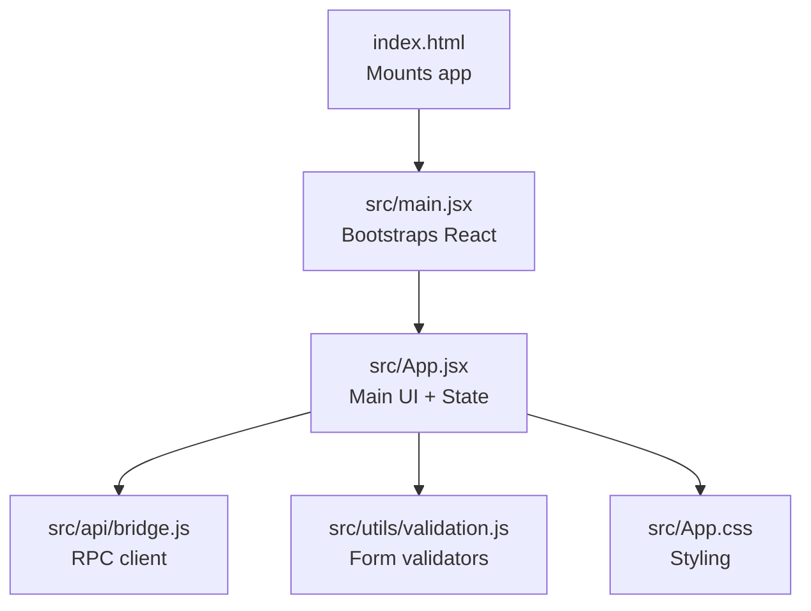
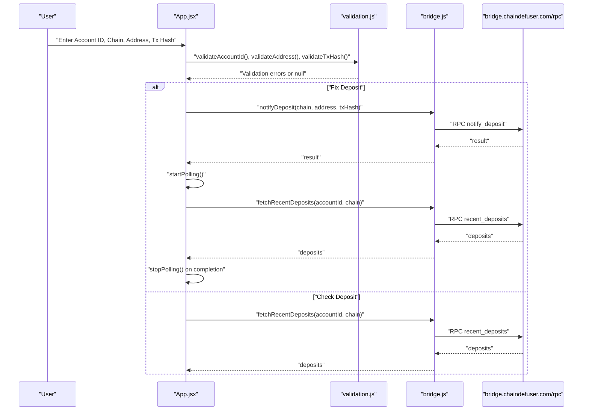
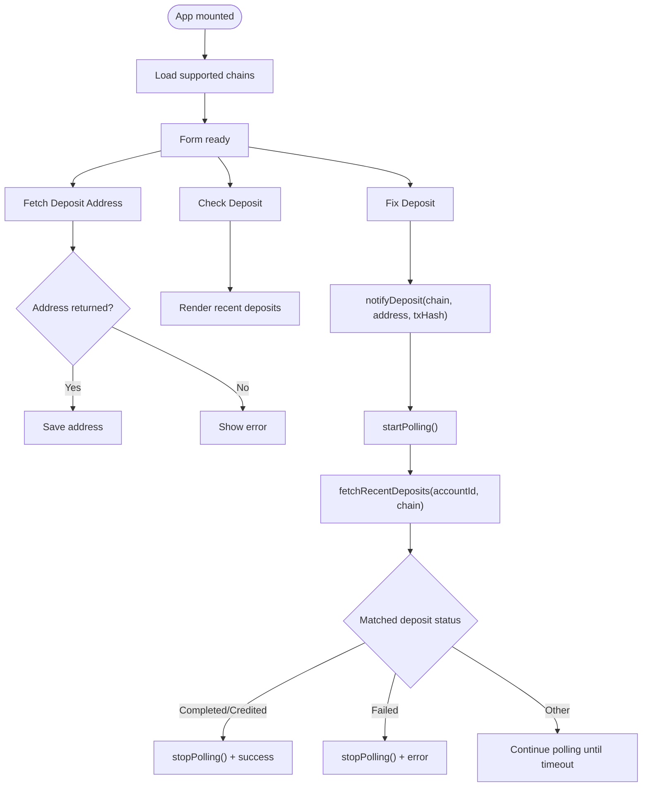
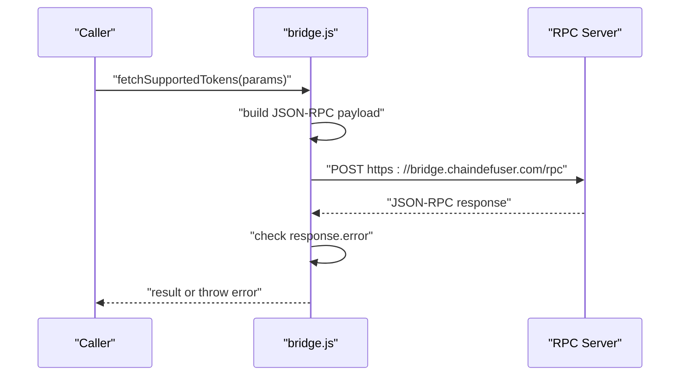
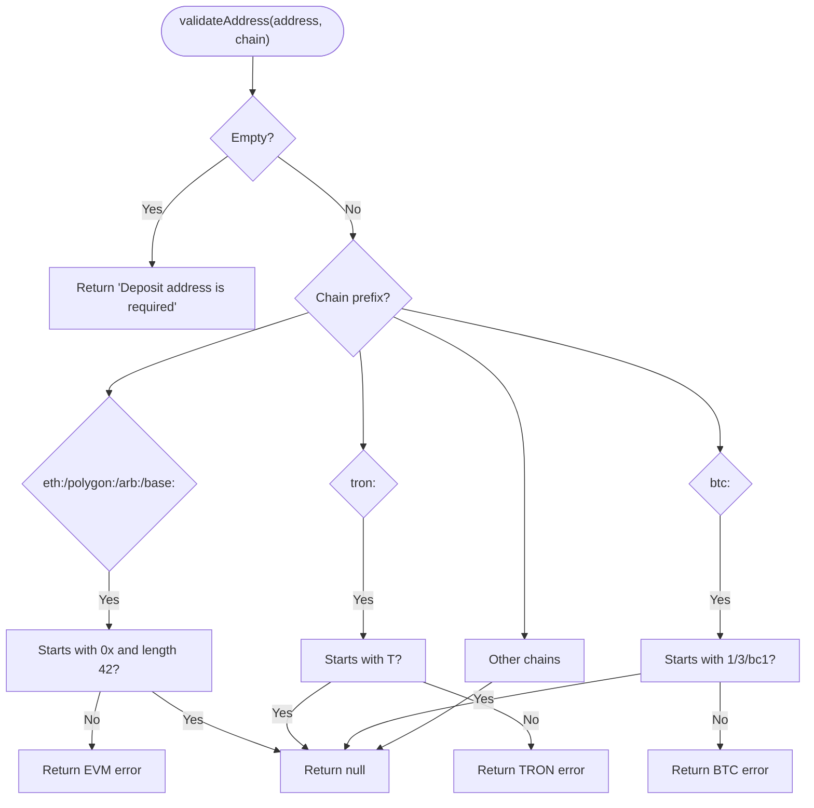
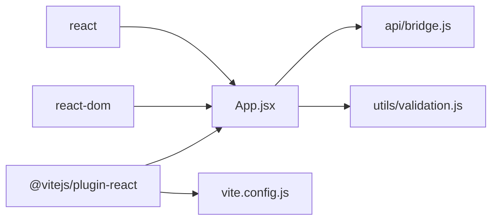

# Development Guide

<cite>
**Referenced Files in This Document**
- [src/main.jsx](file://src/main.jsx)
- [src/App.jsx](file://src/App.jsx)
- [src/App.css](file://src/App.css)
- [src/api/bridge.js](file://src/api/bridge.js)
- [src/utils/validation.js](file://src/utils/validation.js)
- [index.html](file://index.html)
- [vite.config.js](file://vite.config.js)
- [package.json](file://package.json)
- [netlify.toml](file://netlify.toml)
</cite>

## Table of Contents
1. [Introduction](#introduction)
2. [Project Structure](#project-structure)
3. [Core Components](#core-components)
4. [Architecture Overview](#architecture-overview)
5. [Detailed Component Analysis](#detailed-component-analysis)
6. [Dependency Analysis](#dependency-analysis)
7. [Performance Considerations](#performance-considerations)
8. [Troubleshooting Guide](#troubleshooting-guide)
9. [Conclusion](#conclusion)
10. [Appendices](#appendices)

## Introduction
This development guide explains how to extend and modify Bridge Fixer, a React-based tool for checking and fixing bridge deposits. It covers code organization, React component structure, state management patterns, adding new blockchain networks, integrating additional API endpoints, UI customization, build configuration, development workflow, debugging techniques, testing approaches, error handling improvements, and performance optimizations.

## Project Structure
The project follows a minimal, feature-focused layout:
- Entry point initializes React and mounts the root component.
- Application logic resides in a single functional component with local state and effects.
- API interactions are encapsulated in a dedicated module.
- Validation logic is separated into a utility module.
- Styling is centralized in a single stylesheet.
- Build and deployment are configured via Vite and Netlify.

**Diagram sources**
- [index.html:1-13](file://index.html#L1-L13)
- [src/main.jsx:1-11](file://src/main.jsx#L1-L11)
- [src/App.jsx:1-373](file://src/App.jsx#L1-L373)
- [src/api/bridge.js:1-72](file://src/api/bridge.js#L1-L72)
- [src/utils/validation.js:1-49](file://src/utils/validation.js#L1-L49)
- [src/App.css:1-303](file://src/App.css#L1-L303)

**Section sources**
- [index.html:1-13](file://index.html#L1-L13)
- [src/main.jsx:1-11](file://src/main.jsx#L1-L11)
- [src/App.jsx:1-373](file://src/App.jsx#L1-L373)
- [src/api/bridge.js:1-72](file://src/api/bridge.js#L1-L72)
- [src/utils/validation.js:1-49](file://src/utils/validation.js#L1-L49)
- [src/App.css:1-303](file://src/App.css#L1-L303)

## Core Components
- Entry point: Initializes React and renders the root component.
- App: Central UI and state container managing form inputs, loading states, polling, and rendering results.
- API module: Encapsulates RPC calls to the bridge service.
- Validation module: Provides address/account/TxHash validation and fix eligibility checks.

Key patterns:
- Functional component with hooks for state and effects.
- Controlled inputs with local state updates.
- Polling loop with interval and timeout safeguards.
- Centralized RPC client with error propagation.

**Section sources**
- [src/main.jsx:1-11](file://src/main.jsx#L1-L11)
- [src/App.jsx:53-373](file://src/App.jsx#L53-L373)
- [src/api/bridge.js:5-31](file://src/api/bridge.js#L5-L31)
- [src/utils/validation.js:1-49](file://src/utils/validation.js#L1-L49)

## Architecture Overview
The runtime architecture is a thin client that communicates with a remote bridge RPC endpoint. The UI orchestrates user actions, validates inputs, polls for status changes, and displays results.

**Diagram sources**
- [src/App.jsx:148-216](file://src/App.jsx#L148-L216)
- [src/utils/validation.js:1-49](file://src/utils/validation.js#L1-L49)
- [src/api/bridge.js:59-65](file://src/api/bridge.js#L59-L65)
- [src/api/bridge.js:48-57](file://src/api/bridge.js#L48-L57)

## Detailed Component Analysis

### App Component
Responsibilities:
- Manage form state and derived UI state.
- Orchestrate API calls and polling lifecycle.
- Render status badges, action buttons, messages, and results table.
- Enforce fix eligibility via validation logic.

State management patterns:
- Local state for inputs, loading flags, polling control, and messages.
- Refs for timer and start time to safely manage intervals.
- Derived state for overall status and fix eligibility.

UI composition:
- Cards for form, status, actions, and results.
- Reusable StatusBadge and DepositRow components.
- Responsive layout with media queries.

**Diagram sources**
- [src/App.jsx:76-101](file://src/App.jsx#L76-L101)
- [src/App.jsx:148-192](file://src/App.jsx#L148-L192)
- [src/App.jsx:194-216](file://src/App.jsx#L194-L216)
- [src/App.jsx:116-146](file://src/App.jsx#L116-L146)

**Section sources**
- [src/App.jsx:18-28](file://src/App.jsx#L18-L28)
- [src/App.jsx:30-51](file://src/App.jsx#L30-L51)
- [src/App.jsx:53-373](file://src/App.jsx#L53-L373)

### API Module
Responsibilities:
- Provide typed RPC wrappers for supported tokens, deposit address, recent deposits, deposit notification, and withdrawal status.
- Centralize RPC endpoint and request ID management.
- Propagate HTTP and RPC errors to callers.

Patterns:
- Single RPC transport with consistent JSON-RPC 2.0 envelope.
- Optional parameters passed via a single param object with defaults.
- Explicit error handling for network and RPC failures.

**Diagram sources**
- [src/api/bridge.js:5-31](file://src/api/bridge.js#L5-L31)
- [src/api/bridge.js:33-39](file://src/api/bridge.js#L33-L39)

**Section sources**
- [src/api/bridge.js:1-72](file://src/api/bridge.js#L1-L72)

### Validation Module
Responsibilities:
- Validate account IDs, deposit addresses, and transaction hashes.
- Enforce chain-aware address formats (EVM, TRON, BTC).
- Determine whether a deposit can be fixed based on status.

Patterns:
- Early return with descriptive error messages.
- Chain prefix-based validation rules.
- Pure functions for easy testing and reuse.

**Diagram sources**
- [src/utils/validation.js:1-30](file://src/utils/validation.js#L1-L30)

**Section sources**
- [src/utils/validation.js:1-49](file://src/utils/validation.js#L1-L49)

### UI Styling and Composition
- Modular CSS with reusable classes for cards, forms, buttons, status badges, and tables.
- Responsive design with mobile-first adjustments.
- Semantic class names for status variants and animations.

**Section sources**
- [src/App.css:14-303](file://src/App.css#L14-L303)

## Dependency Analysis
External dependencies:
- React and ReactDOM for UI rendering.
- @vitejs/plugin-react for JSX transform and HMR.
- Vite for dev server and bundling.

Internal dependencies:
- App depends on API and Validation modules.
- API module is self-contained and does not depend on App.
- Validation module is pure and does not depend on App.

**Diagram sources**
- [package.json:11-18](file://package.json#L11-L18)
- [src/App.jsx:2-13](file://src/App.jsx#L2-L13)
- [src/api/bridge.js:1-72](file://src/api/bridge.js#L1-L72)
- [src/utils/validation.js:1-49](file://src/utils/validation.js#L1-L49)
- [vite.config.js:1-7](file://vite.config.js#L1-L7)

**Section sources**
- [package.json:1-20](file://package.json#L1-L20)
- [vite.config.js:1-7](file://vite.config.js#L1-L7)
- [src/App.jsx:2-13](file://src/App.jsx#L2-L13)

## Performance Considerations
- Polling cadence and timeout: The polling interval and timeout are tuned to balance responsiveness and resource usage. Adjusting these constants can reduce unnecessary requests.
- Debouncing and throttling: Consider debouncing repeated user input events to avoid excessive re-renders.
- Efficient rendering: Memoize derived values and avoid unnecessary re-computation inside render loops.
- Network efficiency: Batch requests where possible and cancel ongoing requests on route changes or component unmount.
- Bundle size: Keep external dependencies minimal and leverage tree-shaking via ES modules.

[No sources needed since this section provides general guidance]

## Troubleshooting Guide
Common issues and resolutions:
- Network errors during RPC calls: Inspect HTTP status and error messages propagated from the RPC client. Verify endpoint availability and CORS configuration.
- Validation failures: Review validation messages for missing or malformed inputs. Ensure chain prefixes match the intended network.
- Polling not stopping: Confirm that polling is stopped on completion or timeout and that timers are cleared on component unmount.
- UI not updating: Check that state setters are invoked and that derived state computations are performed after state updates.

Debugging techniques:
- Use browser DevTools to inspect network requests and responses.
- Add console logs around API calls and state transitions.
- Temporarily disable polling to simplify reproduction.
- Validate inputs in isolation using the validation module.

**Section sources**
- [src/api/bridge.js:20-31](file://src/api/bridge.js#L20-L31)
- [src/App.jsx:103-114](file://src/App.jsx#L103-L114)
- [src/App.jsx:121-146](file://src/App.jsx#L121-L146)

## Conclusion
Bridge Fixer is a compact, modular React application that demonstrates clean separation of concerns between UI, API, and validation logic. Extending it involves adding new chain validations, integrating new RPC endpoints, and composing UI components thoughtfully. The build system is straightforward and suitable for rapid iteration.

[No sources needed since this section summarizes without analyzing specific files]

## Appendices

### A. Adding New Blockchain Networks
Steps:
- Extend validation rules for the new chain prefix in the validation module.
- Ensure address format checks align with the chain’s address scheme.
- Update UI hints and placeholders to reflect the new chain.
- Verify that the backend RPC supports the new chain and parameters.

Guidelines:
- Keep validation logic pure and deterministic.
- Add descriptive error messages for common mistakes.
- Test address validation independently before integrating with UI.

**Section sources**
- [src/utils/validation.js:1-30](file://src/utils/validation.js#L1-L30)

### B. Integrating Additional API Endpoints
Steps:
- Add a new function in the API module following the existing RPC wrapper pattern.
- Define parameter shaping and optional fields consistently.
- Export the function and import it into the App component.
- Wire up UI controls and error/success messaging.

Guidelines:
- Centralize RPC logic to minimize duplication.
- Propagate errors to the caller for consistent UX.
- Respect rate limits and implement retries with backoff if needed.

**Section sources**
- [src/api/bridge.js:5-31](file://src/api/bridge.js#L5-L31)
- [src/api/bridge.js:33-72](file://src/api/bridge.js#L33-L72)

### C. Customizing UI Components
Approach:
- Compose new components from existing building blocks (cards, buttons, inputs).
- Reuse StatusBadge and other small components to maintain consistency.
- Apply responsive styles and ensure accessibility attributes.

Guidelines:
- Prefer CSS classes over inline styles.
- Keep component boundaries clear and props minimal.
- Use semantic HTML and ARIA attributes where appropriate.

**Section sources**
- [src/App.jsx:18-28](file://src/App.jsx#L18-L28)
- [src/App.jsx:30-51](file://src/App.jsx#L30-L51)
- [src/App.css:14-303](file://src/App.css#L14-L303)

### D. Coding Standards and Naming Conventions
- File naming: Use kebab-case for HTML/CSS/JS files and PascalCase for React components.
- Modules: Group related logic into cohesive modules (e.g., api, utils).
- Hooks: Use descriptive names for state variables and callbacks.
- Constants: Define polling intervals and timeouts as named constants near the component.

[No sources needed since this section provides general guidance]

### E. Component Composition Patterns
- Presentational vs. container: Keep UI presentational (e.g., StatusBadge) and stateful logic in App.
- Props drilling: Minimize deep prop chains by grouping related props or using context sparingly.
- Reusability: Extract small, focused components for repeated UI patterns.

[No sources needed since this section provides general guidance]

### F. Build System Configuration
- Scripts: Use Vite for dev server, build, and preview.
- Plugins: React plugin enables JSX transform and fast refresh.
- Output: Production builds emit static assets to dist.
- Deployment: Netlify configuration serves SPA with fallback routing.

**Section sources**
- [package.json:6-10](file://package.json#L6-L10)
- [vite.config.js:1-7](file://vite.config.js#L1-L7)
- [netlify.toml:1-9](file://netlify.toml#L1-L9)

### G. Development Workflow
- Start dev server with the provided script.
- Edit files and rely on hot module replacement.
- Preview production build locally before deploying.
- Commit changes and push to trigger CI/CD if configured.

**Section sources**
- [package.json:6-10](file://package.json#L6-L10)

### H. Testing Approaches
Recommended strategies:
- Unit tests for validation functions with representative inputs.
- Snapshot tests for UI components to detect regressions.
- Integration tests for API wrappers to verify request/response shapes.
- Manual QA for user flows involving polling and error states.

[No sources needed since this section provides general guidance]

### I. Error Handling Improvements
- Centralize error reporting and surface actionable messages.
- Distinguish between transient and permanent errors.
- Provide retry mechanisms for transient failures.
- Gracefully degrade UI when network is unavailable.

[No sources needed since this section provides general guidance]

### J. Performance Optimizations
- Optimize polling intervals and stop conditions.
- Debounce frequent input handlers.
- Lazy-load heavy assets and split bundles.
- Monitor bundle size and remove unused dependencies.

[No sources needed since this section provides general guidance]