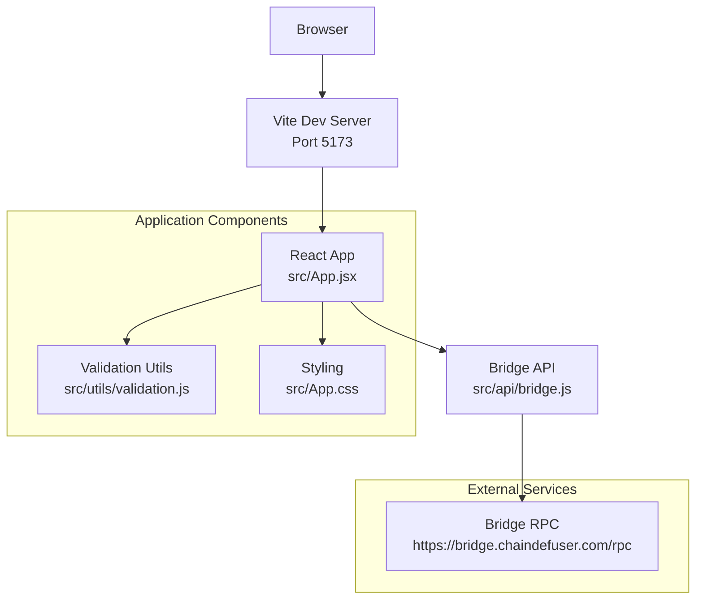

# Getting Started

<cite>
**Referenced Files in This Document**
- [package.json](file://package.json)
- [vite.config.js](file://vite.config.js)
- [index.html](file://index.html)
- [src/main.jsx](file://src/main.jsx)
- [src/App.jsx](file://src/App.jsx)
- [src/App.css](file://src/App.css)
- [src/api/bridge.js](file://src/api/bridge.js)
- [src/utils/validation.js](file://src/utils/validation.js)
- [netlify.toml](file://netlify.toml)
</cite>

## Update Summary
**Changes Made**
- Enhanced development environment setup documentation for React + Vite architecture
- Updated build process documentation with Netlify deployment configuration
- Added comprehensive troubleshooting guide for common development issues
- Improved Vite configuration explanation with React-specific optimizations
- Expanded environment variable considerations for production deployment

## Table of Contents
1. [Introduction](#introduction)
2. [Prerequisites](#prerequisites)
3. [Installation](#installation)
4. [Development Environment Setup](#development-environment-setup)
5. [Build and Preview](#build-and-preview)
6. [Local Development Workflow](#local-development-workflow)
7. [Environment Variables](#environment-variables)
8. [Vite Configuration Basics](#vite-configuration-basics)
9. [Architecture Overview](#architecture-overview)
10. [Troubleshooting Guide](#troubleshooting-guide)
11. [Conclusion](#conclusion)

## Introduction
Bridge Fixer is a modern React-based web application designed to help users recover bridged deposits by interacting with a remote bridge service. The application provides a user-friendly interface for fetching deposit addresses, checking recent deposits, and triggering fixes for failed or missing deposits. Built with Vite for rapid development and React for dynamic UI components, it integrates seamlessly with a bridge RPC endpoint for backend operations.

The application supports multiple blockchain networks including Ethereum, BNB Chain, Polygon, Optimism, Arbitrum, Solana, Bitcoin, and others, making it a versatile tool for cross-chain deposit recovery.

## Prerequisites
Before you begin, ensure you have the following installed:
- **Node.js**: Version 18 or later is recommended for optimal compatibility with modern tooling and Vite ecosystem
- **npm**: Node Package Manager (comes with Node.js) or yarn as an alternative package manager
- **Git**: For version control and repository cloning

These requirements are inferred from the project configuration and dependencies declared in the repository, specifically the React 18.3.1 and Vite 6.0.0 versions.

**Section sources**
- [package.json:11-19](file://package.json#L11-L19)

## Installation
Follow these steps to install and prepare the project:

1. **Clone the repository** to your local machine:
   ```bash
   git clone https://github.com/your-username/deposit-fixer.git
   cd deposit-fixer
   ```

2. **Navigate to the project directory**:
   ```bash
   cd deposit-fixer
   ```

3. **Install dependencies** using your preferred package manager:
   ```bash
   # Using npm (recommended)
   npm install
   
   # Or using yarn
   yarn install
   ```

The project declares React and React DOM as dependencies along with Vite and @vitejs/plugin-react as development dependencies, indicating a modern React + Vite setup optimized for development speed and hot module replacement.

**Section sources**
- [package.json:11-19](file://package.json#L11-L19)

## Development Environment Setup
To start the development server and begin working on Bridge Fixer:

1. **Start the development server**:
   ```bash
   npm run dev
   ```
   *(Alternative: `yarn dev` if using yarn)*

2. **Open the application** in your browser:
   ```
   http://localhost:5173
   ```

The development server is powered by Vite, which provides:
- **Fast cold starts** (typically under 100ms)
- **Hot Module Replacement (HMR)** for instant UI updates
- **Optimized React JSX transformation** via @vitejs/plugin-react
- **Automatic TypeScript/JSX support** without additional configuration

**Key setup details:**
- Vite dev server runs on port 5173 by default
- Hot reloading is enabled by default for React projects
- The HTML entry point mounts the React app to the #root element
- React Strict Mode is enabled for better error detection during development

**Section sources**
- [package.json:6-10](file://package.json#L6-L10)
- [vite.config.js:1-7](file://vite.config.js#L1-L7)
- [index.html:8-12](file://index.html#L8-L12)
- [src/main.jsx:1-13](file://src/main.jsx#L1-L13)

## Build and Preview
To build the project for production and test the deployment locally:

1. **Build the project**:
   ```bash
   npm run build
   ```
   *(Alternative: `yarn build` if using yarn)*

2. **Preview the production build**:
   ```bash
   npm run preview
   ```
   *(Alternative: `yarn preview` if using yarn)*

The build process generates optimized static assets in the `dist` directory with:
- **Minified JavaScript and CSS** for faster loading
- **Asset optimization** including images and fonts
- **Source maps** for debugging (in development mode)
- **Service worker support** for offline functionality

**Production preview server** serves assets on port 4173 by default, allowing you to test the production build locally before deployment.

**Netlify deployment configuration** automatically handles:
- Build command: `npm run build`
- Publish directory: `dist`
- SPA routing fallback to `/index.html`

**Section sources**
- [package.json:6-10](file://package.json#L6-L10)
- [netlify.toml:1-16](file://netlify.toml#L1-L16)

## Local Development Workflow
Recommended workflow for efficient local development:

### Daily Development Cycle:
1. **Start development server**:
   ```bash
   npm run dev
   ```

2. **Make changes to React components** under `src/`:
   - Modify UI components in `src/App.jsx`
   - Update styling in `src/App.css`
   - Add new API endpoints in `src/api/bridge.js`
   - Extend validation logic in `src/utils/validation.js`

3. **Save files to trigger hot reload**:
   - Vite automatically refreshes the browser on file changes
   - React components update without full page reloads
   - State is preserved during hot reloads

4. **Test functionality**:
   - Use the UI to test deposit address fetching
   - Validate deposit checking workflows
   - Test fix deposit functionality
   - Verify error handling and status updates

5. **Build and preview for testing**:
   ```bash
   npm run build
   npm run preview
   ```

### Advanced Development Features:
- **Component state management**: React hooks for managing application state
- **Real-time polling**: Automatic deposit status checking every 5 seconds
- **Error boundaries**: Graceful error handling with user-friendly messages
- **Responsive design**: Mobile-first approach with CSS media queries

**Section sources**
- [package.json:6-10](file://package.json#L6-L10)
- [vite.config.js:1-7](file://vite.config.js#L1-L7)
- [src/App.jsx:148-489](file://src/App.jsx#L148-L489)

## Environment Variables
The current implementation uses a hardcoded RPC endpoint for bridge operations. No environment variables are explicitly defined in the repository.

**Current configuration**:
- **RPC Endpoint**: `https://bridge.chaindefuser.com/rpc`
- **Request Timeout**: 30 seconds for all API calls
- **No runtime environment configuration** required for local development

**For production deployment considerations**:
If you plan to deploy this application, consider adding environment variables for:
- `VITE_BRIDGE_RPC_ENDPOINT`: Configurable RPC endpoint
- `VITE_APP_NAME`: Custom application name
- `VITE_API_TIMEOUT`: Configurable request timeout

**Section sources**
- [src/api/bridge.js:1-86](file://src/api/bridge.js#L1-L86)

## Vite Configuration Basics
The project uses a minimal but powerful Vite configuration tailored for React development:

### Core Configuration:
```javascript
import { defineConfig } from 'vite'
import react from '@vitejs/plugin-react'

export default defineConfig({
  plugins: [react()],
})
```

### Key Features:
- **React Plugin**: Automatic JSX transformation and React Fast Refresh
- **Minimal Configuration**: Zero-config setup with sensible defaults
- **ES Modules**: Native ES module support for modern JavaScript
- **TypeScript Support**: Built-in TypeScript and JSX support

### Development Optimizations:
- **Fast Refresh**: Instant component updates without losing state
- **Source Maps**: Debugging support in development
- **Hot Module Replacement**: Efficient module updates
- **Tree Shaking**: Automatic dead code elimination

**Section sources**
- [vite.config.js:1-7](file://vite.config.js#L1-L7)
- [package.json:15-19](file://package.json#L15-L19)

## Architecture Overview
High-level architecture of the Bridge Fixer application:



### Application Layers:
1. **Presentation Layer**: React components in `src/App.jsx`
2. **Business Logic**: Validation utilities in `src/utils/validation.js`
3. **Data Access**: Bridge API wrapper in `src/api/bridge.js`
4. **Styling**: CSS modules in `src/App.css`
5. **Configuration**: Vite setup and Netlify deployment

### Data Flow:
- User interactions trigger React state updates
- Validation ensures data integrity before API calls
- Bridge API handles RPC communication
- Real-time polling updates deposit status
- Error boundaries provide graceful error handling

**Diagram sources**
- [vite.config.js:1-7](file://vite.config.js#L1-L7)
- [src/App.jsx:1-489](file://src/App.jsx#L1-L489)
- [src/api/bridge.js:1-86](file://src/api/bridge.js#L1-L86)
- [src/utils/validation.js:1-49](file://src/utils/validation.js#L1-L49)
- [src/App.css:1-309](file://src/App.css#L1-L309)

## Troubleshooting Guide
Common issues and their solutions:

### Development Server Issues:
- **Cannot start dev server**:
  - Ensure Node.js 18+ is installed: `node --version`
  - Run `npm install` to install all dependencies
  - Check if port 5173 is available: `lsof -i :5173`
  - Clear npm cache: `npm cache clean --force`

- **Hot reload not working**:
  - Verify file extensions (.jsx, .css) are correct
  - Check for syntax errors in React components
  - Restart development server if necessary

### Build Issues:
- **Build fails with dependency errors**:
  - Run `npm audit fix` to resolve security vulnerabilities
  - Clear node_modules and reinstall: `rm -rf node_modules && npm install`
  - Check for incompatible package versions

- **Preview server not serving assets**:
  - Confirm `dist` directory exists after successful build
  - Run `npm run preview` from project root
  - Check for port conflicts on 4173

### Runtime Issues:
- **Network/API errors**:
  - The application communicates with a hardcoded RPC endpoint
  - Verify internet connectivity to `https://bridge.chaindefuser.com/rpc`
  - Check browser console for CORS-related errors
  - Monitor network tab for failed requests

- **UI not responding**:
  - Check for JavaScript errors in browser console
  - Verify React Developer Tools extension is working
  - Look for unhandled promise rejections

- **Styling issues**:
  - Verify CSS classes are correctly applied
  - Check for conflicting styles in App.css
  - Ensure responsive breakpoints are working

### Performance Issues:
- **Slow development server**:
  - Close unnecessary applications
  - Increase Node.js memory limit: `NODE_OPTIONS=--max_old_space_size=4096 npm run dev`
  - Clear Vite cache: `rm -rf node_modules/.vite`

- **Large bundle size**:
  - Analyze bundle with `npm run build -- --mode production`
  - Check for unused dependencies
  - Optimize images and assets

**Section sources**
- [package.json:6-10](file://package.json#L6-L10)
- [src/api/bridge.js:1-86](file://src/api/bridge.js#L1-L86)

## Conclusion
You are now ready to develop and run Bridge Fixer locally with a modern React + Vite setup. The application provides:

- **Smooth development experience** with instant hot reloads
- **Production-ready build process** with optimized assets
- **Seamless deployment** to Netlify with SPA routing support
- **Comprehensive error handling** with user-friendly feedback
- **Real-time deposit monitoring** with automatic status checking

**Quick Commands Reference**:
- `npm run dev` - Start development server
- `npm run build` - Create production build
- `npm run preview` - Test production build locally

**Next Steps**:
1. Explore the React components in `src/App.jsx`
2. Experiment with different blockchain networks
3. Test the deposit recovery workflows
4. Customize styling in `src/App.css`
5. Add new validation rules in `src/utils/validation.js`

The application's architecture supports easy extension for additional blockchain networks and features. For deployment, the Netlify configuration provides a robust foundation for hosting the React application with proper SPA routing and security headers.

**Happy coding!** 🚀