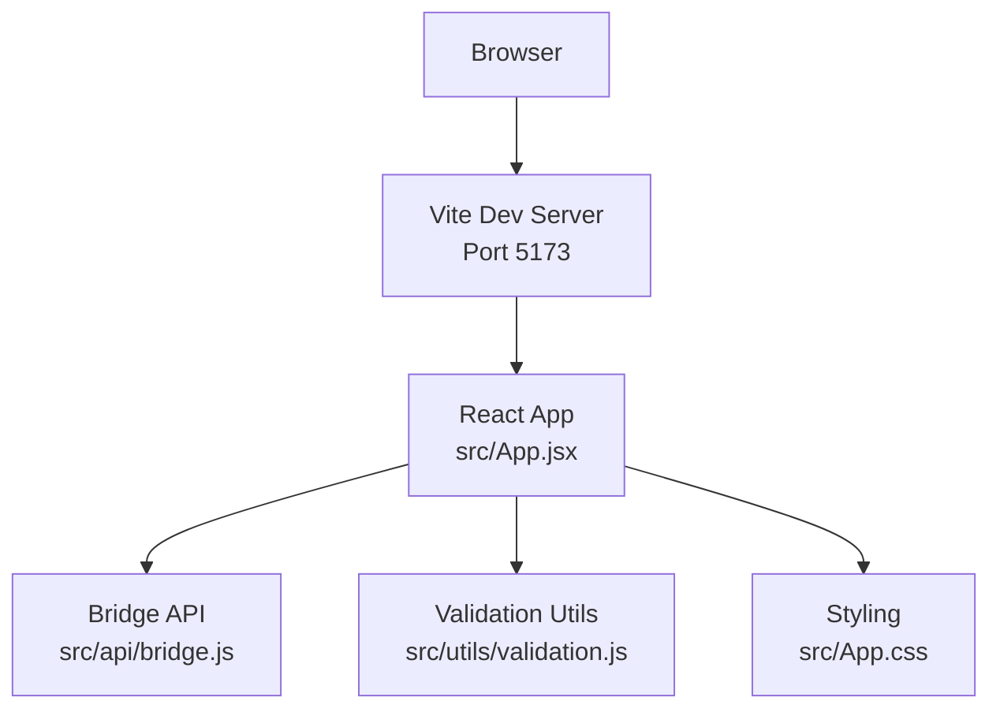

# Getting Started

<cite>
**Referenced Files in This Document**
- [package.json](file://package.json)
- [vite.config.js](file://vite.config.js)
- [index.html](file://index.html)
- [src/main.jsx](file://src/main.jsx)
- [src/App.jsx](file://src/App.jsx)
- [src/App.css](file://src/App.css)
- [src/api/bridge.js](file://src/api/bridge.js)
- [src/utils/validation.js](file://src/utils/validation.js)
- [netlify.toml](file://netlify.toml)
</cite>

## Table of Contents
1. [Introduction](#introduction)
2. [Prerequisites](#prerequisites)
3. [Installation](#installation)
4. [Development Environment Setup](#development-environment-setup)
5. [Build and Preview](#build-and-preview)
6. [Local Development Workflow](#local-development-workflow)
7. [Environment Variables](#environment-variables)
8. [Vite Configuration Basics](#vite-configuration-basics)
9. [Architecture Overview](#architecture-overview)
10. [Troubleshooting Guide](#troubleshooting-guide)
11. [Conclusion](#conclusion)

## Introduction
Bridge Fixer is a React-based web application designed to help users recover bridged deposits by interacting with a remote bridge service. It provides a user interface for fetching deposit addresses, checking recent deposits, and triggering fixes for failed or missing deposits. The application uses Vite for development and build tooling, React for the UI, and integrates with a bridge RPC endpoint for backend operations.

## Prerequisites
Before you begin, ensure you have the following installed:
- Node.js: Version 18 or later is recommended for optimal compatibility with modern tooling.
- npm or yarn: Package managers to install dependencies and run scripts.

These requirements are inferred from the project configuration and dependencies declared in the repository.

**Section sources**
- [package.json:11-18](file://package.json#L11-L18)

## Installation
Follow these steps to install and prepare the project:
1. Clone the repository to your local machine.
2. Navigate to the project directory.
3. Install dependencies using your preferred package manager:
   - npm: Run npm install
   - yarn: Run yarn install

The project declares React and Vite as dependencies and @vitejs/plugin-react as a dev dependency, indicating a React + Vite setup.

**Section sources**
- [package.json:11-18](file://package.json#L11-L18)

## Development Environment Setup
To start the development server:
- Run npm run dev (or yarn dev if using yarn)
- Open http://localhost:5173 in your browser

The development server is powered by Vite, which provides fast cold starts and hot module replacement (HMR). The application entry point is configured in index.html to load src/main.jsx, which renders the root React component.

Key setup details:
- Vite dev server runs on port 5173 by default.
- Hot reloading is enabled by default in Vite for React projects.
- The HTML entry point mounts the React app to the #root element.

**Section sources**
- [package.json:6-10](file://package.json#L6-L10)
- [vite.config.js:1-7](file://vite.config.js#L1-L7)
- [index.html:8-12](file://index.html#L8-L12)
- [src/main.jsx:1-11](file://src/main.jsx#L1-L11)

## Build and Preview
To build the project for production:
- Run npm run build (or yarn build if using yarn)
- After building, run npm run preview (or yarn preview) to serve the built assets locally

The build process generates static assets in the dist directory, and the preview server serves them on port 4173 by default. The Netlify configuration defines the build command and publish directory for deployment.

Important notes:
- The build output is intended for the dist directory.
- The preview command is useful for testing the production build locally.

**Section sources**
- [package.json:6-10](file://package.json#L6-L10)
- [netlify.toml:1-9](file://netlify.toml#L1-L9)

## Local Development Workflow
Recommended workflow for local development:
1. Start the development server with npm run dev.
2. Make changes to React components under src/.
3. Save files to trigger hot reload in the browser.
4. Use the UI to test deposit address fetching, deposit checking, and fixing flows.
5. Validate error handling and status updates.
6. When ready, build with npm run build and preview with npm run preview.

Hot reloading:
- Vite enables HMR by default for React projects, so changes to components are reflected immediately without full page reloads.

**Section sources**
- [package.json:6-10](file://package.json#L6-L10)
- [vite.config.js:1-7](file://vite.config.js#L1-L7)
- [src/App.jsx:148-216](file://src/App.jsx#L148-L216)

## Environment Variables
No environment variables are explicitly defined in the repository. The application relies on:
- A hardcoded RPC endpoint for bridge operations.
- No runtime environment configuration is required for local development.

If you plan to deploy this application, consider adding environment variables for the RPC endpoint and any configurable features. For now, the application uses a fixed endpoint defined in the bridge API module.

**Section sources**
- [src/api/bridge.js:1-31](file://src/api/bridge.js#L1-L31)

## Vite Configuration Basics
The project uses a minimal Vite configuration tailored for React:
- Plugin: @vitejs/plugin-react is enabled.
- No additional Vite plugins or custom configuration are present.

This setup provides:
- Fast development builds with HMR.
- Automatic JSX transformation via the React plugin.
- Minimal configuration overhead.

**Section sources**
- [vite.config.js:1-7](file://vite.config.js#L1-L7)
- [package.json:15-17](file://package.json#L15-L17)

## Architecture Overview
High-level architecture of the application:
- Frontend: React components render the UI and manage state.
- API Layer: Functions in src/api/bridge.js encapsulate RPC calls to the bridge service.
- Validation: Utility functions in src/utils/validation.js validate user inputs.
- Styling: Tailwind-like CSS classes are used for styling in src/App.css.
- Routing: Single-page application with client-side routing via React Router (implied by the presence of a router in the project structure).

**Diagram sources**
- [vite.config.js:1-7](file://vite.config.js#L1-L7)
- [src/App.jsx:1-373](file://src/App.jsx#L1-L373)
- [src/api/bridge.js:1-72](file://src/api/bridge.js#L1-L72)
- [src/utils/validation.js:1-49](file://src/utils/validation.js#L1-L49)
- [src/App.css:1-303](file://src/App.css#L1-L303)

## Troubleshooting Guide
Common issues and resolutions:
- Cannot start dev server:
  - Ensure Node.js is installed and npm/yarn is available.
  - Run npm install to install dependencies.
  - Verify port 5173 is not in use by another process.
- Build fails:
  - Check for syntax errors in React components.
  - Ensure all dependencies are installed.
  - Clean node_modules and reinstall if necessary.
- Preview server not serving assets:
  - Confirm dist directory exists after build.
  - Run npm run preview to serve built assets.
- Network/API errors:
  - The application communicates with a hardcoded RPC endpoint. If the endpoint is unreachable, network connectivity or service availability may be the issue.
- Styling issues:
  - Verify CSS classes are correctly applied in components.
  - Check for typos in class names.

**Section sources**
- [package.json:6-10](file://package.json#L6-L10)
- [src/api/bridge.js:1-31](file://src/api/bridge.js#L1-L31)

## Conclusion
You are now ready to develop and run Bridge Fixer locally. Use npm run dev for development, npm run build for production builds, and npm run preview to test the production build. The application’s React + Vite setup provides a smooth development experience with hot reloading. For deployment, the Netlify configuration specifies the build command and publish directory. If you encounter issues, refer to the troubleshooting section or verify your environment and dependencies.