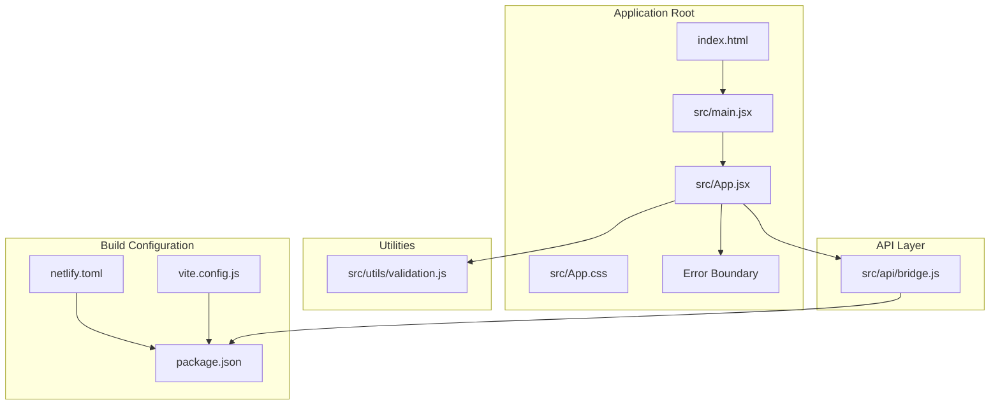
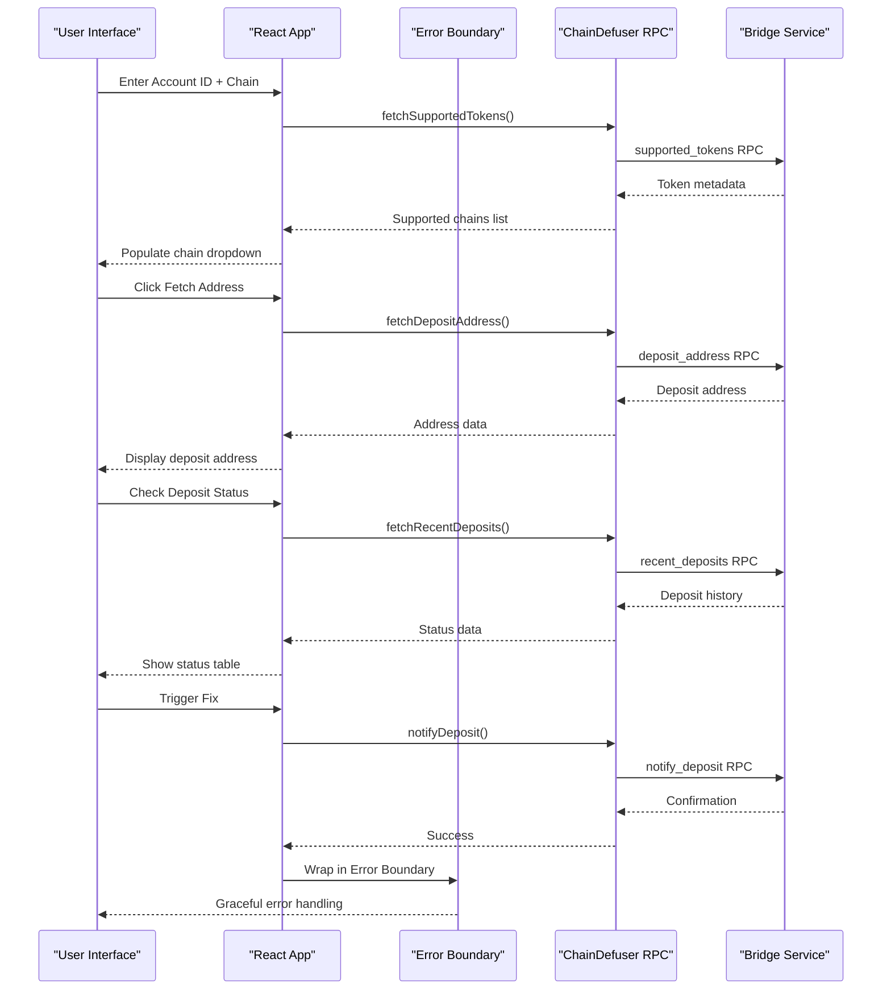
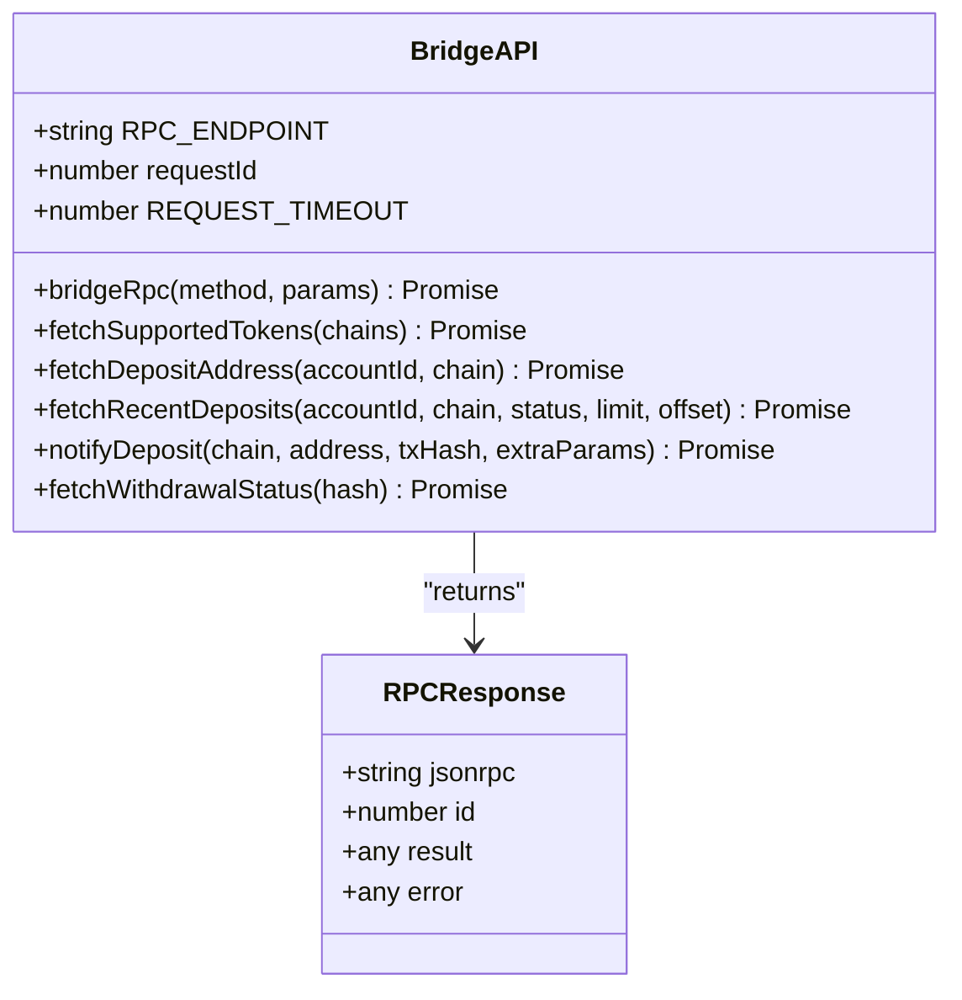
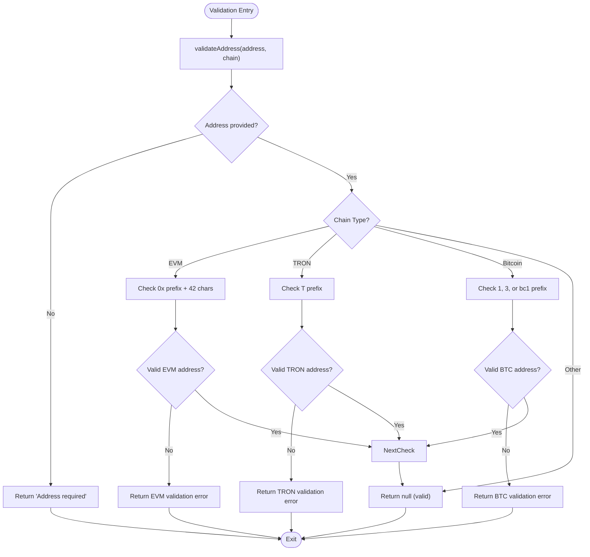
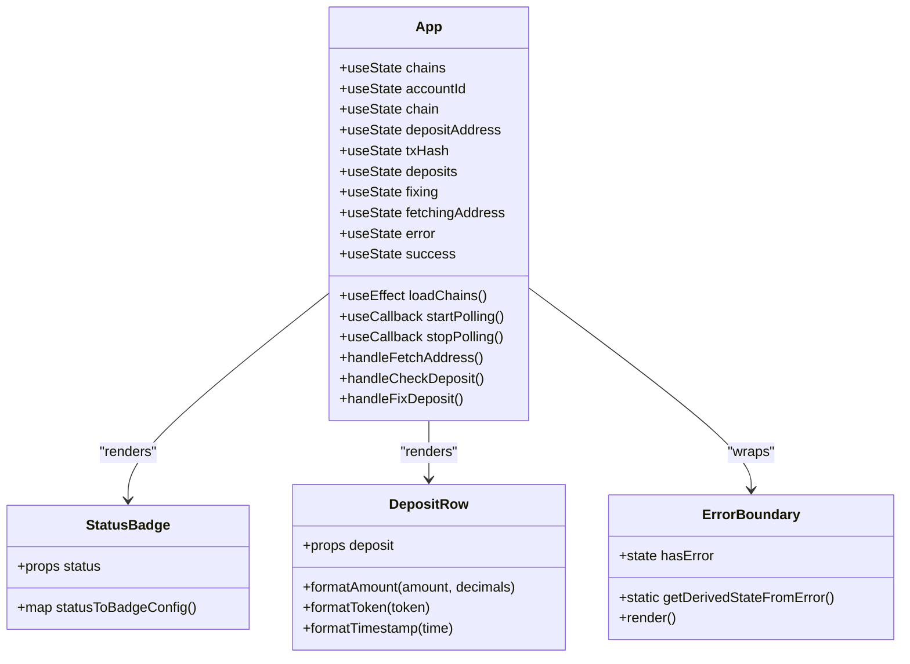

# Project Overview

<cite>
**Referenced Files in This Document**
- [package.json](file://package.json)
- [vite.config.js](file://vite.config.js)
- [netlify.toml](file://netlify.toml)
- [index.html](file://index.html)
- [src/main.jsx](file://src/main.jsx)
- [src/App.jsx](file://src/App.jsx)
- [src/App.css](file://src/App.css)
- [src/api/bridge.js](file://src/api/bridge.js)
- [src/utils/validation.js](file://src/utils/validation.js)
</cite>

## Update Summary
**Changes Made**
- Updated project structure documentation to reflect the modern React 18 + Vite architecture
- Enhanced multi-chain support documentation covering 20+ blockchain networks
- Added comprehensive validation system documentation
- Updated error boundary implementation details
- Enhanced styling and responsive design documentation
- Improved deployment configuration documentation for Netlify

## Table of Contents
1. [Introduction](#introduction)
2. [Project Structure](#project-structure)
3. [Core Components](#core-components)
4. [Architecture Overview](#architecture-overview)
5. [Detailed Component Analysis](#detailed-component-analysis)
6. [Multi-Chain Support](#multi-chain-support)
7. [Validation System](#validation-system)
8. [Error Handling and Resilience](#error-handling-and-resilience)
9. [Styling and User Experience](#styling-and-user-experience)
10. [Deployment and Production](#deployment-and-production)
11. [Technology Stack](#technology-stack)
12. [Conclusion](#conclusion)

## Introduction
Bridge Fixer is a sophisticated blockchain bridge deposit recovery tool designed to help users resolve issues with NEAR Intents bridge deposits across multiple blockchain networks. The application provides a comprehensive solution for blockchain users experiencing problems with cross-chain asset transfers, offering real-time deposit monitoring, automated status checking, and recovery mechanisms for stuck or missing deposits.

The tool serves blockchain users who encounter bridge transaction issues, particularly those involving cross-chain asset transfers between Ethereum, Polygon, Arbitrum, Base, Bitcoin, TRON, and 18 other blockchain networks. It provides an intuitive web interface for monitoring and resolving bridge deposit issues with built-in validation, error handling, and automated status polling.

**Section sources**
- [src/App.jsx:283-288](file://src/App.jsx#L283-L288)

## Project Structure
The project follows a modern React 18 application structure with Vite as the build tool, organized into clear functional modules with professional development practices:

**Diagram sources**
- [index.html:1-14](file://index.html#L1-L14)
- [src/main.jsx:1-13](file://src/main.jsx#L1-L13)
- [src/App.jsx:1-489](file://src/App.jsx#L1-L489)
- [src/api/bridge.js:1-86](file://src/api/bridge.js#L1-L86)
- [src/utils/validation.js:1-49](file://src/utils/validation.js#L1-L49)
- [package.json:1-21](file://package.json#L1-L21)
- [vite.config.js:1-7](file://vite.config.js#L1-L7)
- [netlify.toml:1-16](file://netlify.toml#L1-L16)

**Section sources**
- [package.json:1-21](file://package.json#L1-L21)
- [vite.config.js:1-7](file://vite.config.js#L1-L7)
- [netlify.toml:1-16](file://netlify.toml#L1-L16)
- [index.html:1-14](file://index.html#L1-L14)

## Core Components
The application consists of several key components that work together to provide comprehensive deposit recovery functionality:

### Application Shell and Error Boundaries
The main application entry point initializes React with strict mode and error boundaries. The application uses a single-page architecture with comprehensive error handling through a custom ErrorBoundary component that gracefully handles runtime errors.

### Deposit Management Interface
The core interface provides six main functionalities:
- Account ID input for NEAR, Ethereum, and other blockchain account identification
- Comprehensive chain selection dropdown with 20+ supported networks
- Deposit address retrieval and display with automatic formatting
- Transaction hash validation and status checking
- Real-time status monitoring with 5-second polling intervals
- Recovery mechanism activation for stuck deposits

### Status Monitoring System
The application implements an intelligent polling mechanism that automatically checks deposit status every 5 seconds with a 60-second timeout to prevent indefinite polling loops. The system provides visual feedback through animated status indicators and comprehensive deposit history tables.

### State Management and Lifecycle
The application uses React's modern hooks (useState, useEffect, useRef, useCallback) for efficient state management and lifecycle control, with proper cleanup of polling intervals and resource management.

**Section sources**
- [src/main.jsx:1-13](file://src/main.jsx#L1-L13)
- [src/App.jsx:97-456](file://src/App.jsx#L97-L456)
- [src/utils/validation.js:1-49](file://src/utils/validation.js#L1-L49)

## Architecture Overview
The application follows a client-side architecture with centralized API communication through the ChainDefuser RPC service, implementing modern React patterns with comprehensive error handling:

**Diagram sources**
- [src/App.jsx:124-151](file://src/App.jsx#L124-L151)
- [src/App.jsx:198-220](file://src/App.jsx#L198-L220)
- [src/App.jsx:222-242](file://src/App.jsx#L222-L242)
- [src/App.jsx:244-273](file://src/App.jsx#L244-L273)
- [src/api/bridge.js:40-85](file://src/api/bridge.js#L40-L85)
- [src/App.jsx:458-486](file://src/App.jsx#L458-L486)

The architecture implements a clean separation between presentation logic and data access, with comprehensive error boundaries preventing application crashes and providing graceful degradation.

**Section sources**
- [src/App.jsx:1-489](file://src/App.jsx#L1-L489)
- [src/api/bridge.js:1-86](file://src/api/bridge.js#L1-L86)

## Detailed Component Analysis

### API Communication Layer
The bridge API module provides a unified interface to the ChainDefuser RPC service, implementing standardized JSON-RPC 2.0 communication with comprehensive error handling:

**Diagram sources**
- [src/api/bridge.js:1-86](file://src/api/bridge.js#L1-L86)

The API layer handles:
- JSON-RPC 2.0 protocol compliance with automatic request ID incrementation
- Comprehensive error handling for HTTP and RPC errors
- Request timeout management with AbortController
- Parameter serialization for different RPC methods
- Support for chain-specific parameters (NEAR sender account, Stellar memo)

**Section sources**
- [src/api/bridge.js:1-86](file://src/api/bridge.js#L1-L86)

### Validation System
The validation module implements comprehensive chain-specific address validation rules with support for 20+ blockchain networks:

**Diagram sources**
- [src/utils/validation.js:1-49](file://src/utils/validation.js#L1-L49)

**Section sources**
- [src/utils/validation.js:1-49](file://src/utils/validation.js#L1-L49)

### User Interface Components
The application implements a modular component architecture with specialized UI elements and comprehensive state management:

**Diagram sources**
- [src/App.jsx:97-456](file://src/App.jsx#L97-L456)
- [src/App.jsx:60-95](file://src/App.jsx#L60-L95)
- [src/App.jsx:458-486](file://src/App.jsx#L458-L486)

**Section sources**
- [src/App.jsx:97-456](file://src/App.jsx#L97-L456)
- [src/App.jsx:60-95](file://src/App.jsx#L60-L95)
- [src/App.jsx:458-486](file://src/App.jsx#L458-L486)

## Multi-Chain Support
The application provides comprehensive multi-chain support covering 20+ blockchain networks with specialized validation and parameter handling:

### Supported Blockchain Networks

| Chain Prefix | Network | Address Format | Special Parameters |
|-------------|---------|----------------|-------------------|
| eth:1 | Ethereum | 0x prefixed, 42 characters | None |
| eth:56 | BNB Chain | 0x prefixed, 42 characters | None |
| eth:137 | Polygon | 0x prefixed, 42 characters | None |
| eth:10 | Optimism | 0x prefixed, 42 characters | None |
| eth:42161 | Arbitrum One | 0x prefixed, 42 characters | None |
| eth:8453 | Base | 0x prefixed, 42 characters | None |
| eth:43114 | Avalanche | 0x prefixed, 42 characters | None |
| eth:42220 | Celo | 0x prefixed, 42 characters | None |
| eth:59144 | Linea | 0x prefixed, 42 characters | None |
| eth:534352 | Scroll | 0x prefixed, 42 characters | None |
| eth:7777777 | Zora | 0x prefixed, 42 characters | None |
| eth:324 | zkSync Era | 0x prefixed, 42 characters | None |
| eth:1088 | Metis | 0x prefixed, 42 characters | None |
| eth:42170 | Arbitrum Nova | 0x prefixed, 42 characters | None |
| eth:288 | Boba Network | 0x prefixed, 42 characters | None |
| eth:25 | Cronos | 0x prefixed, 42 characters | None |
| eth:100 | Gnosis | 0x prefixed, 42 characters | None |
| eth:1284 | Moonbeam | 0x prefixed, 42 characters | None |
| eth:1285 | Moonriver | 0x prefixed, 42 characters | None |
| eth:1666600000 | Harmony | 0x prefixed, 42 characters | None |
| eth:1313161554 | Aurora | 0x prefixed, 42 characters | None |
| eth:11297108109 | Palm | 0x prefixed, 42 characters | None |
| eth:143 | Monad | 0x prefixed, 42 characters | None |
| eth:196 | X Layer | 0x prefixed, 42 characters | None |
| eth:36900 | ADI Chain | 0x prefixed, 42 characters | None |
| btc:mainnet | Bitcoin | 1, 3, or bc1 prefixed | None |
| tron:mainnet | Tron | T prefixed | None |
| near:mainnet | NEAR | .near domain | nearSenderAccount |
| sol:mainnet | Solana | Base58 | None |
| stellar:mainnet | Stellar | Base58 | memo |
| doge:mainnet | Dogecoin | 1, 3, or D prefixed | None |
| xrp:mainnet | XRP Ledger | r, n, or X prefixed | None |
| sui:mainnet | Sui | Hex encoded | None |
| apt:mainnet | Aptos | Hex encoded | None |

**Section sources**
- [src/App.jsx:18-53](file://src/App.jsx#L18-L53)
- [src/App.jsx:352-377](file://src/App.jsx#L352-L377)
- [src/api/bridge.js:66-79](file://src/api/bridge.js#L66-L79)

## Validation System
The validation module implements comprehensive input validation with chain-specific rules and user-friendly error messages:

### Input Validation Rules

#### Address Validation
- **EVM-Compatible Chains**: Must start with "0x" and be exactly 42 characters long
- **TRON**: Must start with "T"
- **Bitcoin**: Must start with "1", "3", or "bc1"
- **Generic**: Non-empty string validation for other chains

#### Account ID Validation
- **NEAR Accounts**: Standard .near domain format
- **Ethereum**: 0x prefixed address format
- **Other Chains**: Non-empty string validation

#### Transaction Hash Validation
- **Ethereum**: 0x prefixed hex string
- **Other Chains**: Non-empty string validation

#### Recovery Eligibility
- **NOT_FOUND**: Deposit not indexed yet
- **FAILED**: Deposit processing failed
- **COMPLETED/CREDITED**: Already processed successfully
- **PENDING**: Currently being processed

**Section sources**
- [src/utils/validation.js:1-49](file://src/utils/validation.js#L1-L49)
- [src/App.jsx:275-281](file://src/App.jsx#L275-L281)

## Error Handling and Resilience
The application implements comprehensive error handling and resilience mechanisms:

### Error Boundary Implementation
The custom ErrorBoundary component provides graceful error handling with:
- Automatic detection of React component errors
- User-friendly error messages
- One-click page reload functionality
- Prevents application crashes and maintains user experience

### Runtime Error Management
- **Network Errors**: Graceful handling of RPC service unavailability
- **Validation Errors**: Immediate user feedback for invalid inputs
- **Timeout Handling**: 30-second request timeouts with AbortController
- **Polling Errors**: Continued polling despite transient failures

### User Experience Enhancements
- **Loading States**: Visual feedback during API requests
- **Success/Error Messages**: Clear status notifications
- **Disabled States**: Button states based on validation results
- **Graceful Degradation**: Partial functionality during errors

**Section sources**
- [src/App.jsx:458-486](file://src/App.jsx#L458-L486)
- [src/api/bridge.js:15-38](file://src/api/bridge.js#L15-L38)

## Styling and User Experience
The application features a modern, responsive design with comprehensive styling and accessibility considerations:

### Design System
- **Color Palette**: Professional blue (#2563eb) for primary actions, red (#dc2626) for danger actions
- **Typography**: System fonts with clear hierarchy and readable sizes
- **Spacing**: Consistent 8px grid system with responsive margins
- **Borders**: Subtle 1px borders with rounded corners (8px radius)

### Status Indicators
- **Not Found**: Light red background with dark red text
- **Pending**: Light yellow background with dark orange text  
- **Completed**: Light green background with dark green text
- **Unknown**: Light gray background with dark gray text

### Responsive Design
- **Mobile First**: Optimized for mobile devices with stacked layouts
- **Tablet Support**: Two-column layouts on larger screens
- **Accessibility**: Proper contrast ratios and keyboard navigation
- **Animations**: Subtle loading animations and hover effects

### Interactive Elements
- **Buttons**: Hover effects with color transitions
- **Forms**: Focus states with blue outlines
- **Tables**: Hover highlighting for better readability
- **Status Badges**: Animated pulsing for active polling

**Section sources**
- [src/App.css:1-309](file://src/App.css#L1-L309)

## Deployment and Production
The application uses modern deployment practices with Netlify hosting and SPA routing:

### Build Configuration
- **Development**: Fast Vite dev server with hot module replacement
- **Production**: Optimized bundle with tree-shaking and minification
- **Environment**: Module-based package.json for ES modules support

### Netlify Configuration
- **Static Hosting**: Zero-config deployment with SPA routing
- **Security Headers**: X-Frame-Options, X-Content-Type-Options, Referrer-Policy
- **SPA Fallback**: Client-side routing support with index.html fallback
- **Build Commands**: npm run build with dist output directory

### Production Features
- **Error Boundaries**: Prevent application crashes in production
- **Request Timeouts**: 30-second timeout protection
- **Polling Limits**: 60-second auto-poll timeout
- **Resource Cleanup**: Proper interval cleanup on component unmount

**Section sources**
- [package.json:6-10](file://package.json#L6-L10)
- [vite.config.js:1-7](file://vite.config.js#L1-L7)
- [netlify.toml:1-16](file://netlify.toml#L1-L16)

## Technology Stack
The project utilizes modern web technologies with professional development practices:

### Frontend Framework
- **React 18.3.1**: Latest stable version with concurrent features
- **React DOM 18.3.1**: Server-side rendering and DOM manipulation
- **Modern Hooks**: useState, useEffect, useRef, useCallback for optimal performance

### Build Tools
- **Vite 6.0.0**: Lightning-fast build tool with native ES modules
- **React Plugin**: Official React plugin with JSX transform
- **ES Modules**: Native ES module support with package.json type: module

### Styling
- **Pure CSS**: No CSS-in-JS, maintaining simplicity and performance
- **Responsive Design**: Mobile-first approach with media queries
- **Custom Properties**: Extensive use of CSS variables for theming

### Development Experience
- **TypeScript Optional**: JavaScript with JSDoc comments
- **Hot Reload**: Instant feedback during development
- **Source Maps**: Debugging support in production
- **Linting**: No ESLint configuration, relying on Vite's built-in features

### Production Deployment
- **Netlify Static Hosting**: Zero-config deployment
- **SPA Routing**: Client-side routing with fallback configuration
- **Security Headers**: Comprehensive security headers
- **Performance**: Optimized bundles with minimal dependencies

**Section sources**
- [package.json:11-19](file://package.json#L11-L19)

## Conclusion
Bridge Fixer represents a comprehensive solution for blockchain users experiencing bridge deposit issues across 20+ blockchain networks. The application combines modern React 18 development practices with robust backend integration through the ChainDefuser RPC service, offering multi-chain support, intelligent status monitoring, and comprehensive error handling.

Key strengths include:
- **Comprehensive Multi-Chain Support**: Coverage of 20+ blockchain networks with specialized validation
- **Modern Architecture**: React 18 with hooks, error boundaries, and Vite build tooling
- **User-Friendly Interface**: Intuitive design with comprehensive feedback and error handling
- **Robust Error Handling**: Graceful degradation and user-friendly error messages
- **Professional Deployment**: Netlify hosting with SPA routing and security headers
- **Performance Optimization**: Efficient polling, memory management, and responsive design

The deployment-ready architecture ensures reliable hosting with SPA routing support, while the clean separation of concerns between UI and data access layers provides maintainability and scalability for future enhancements.