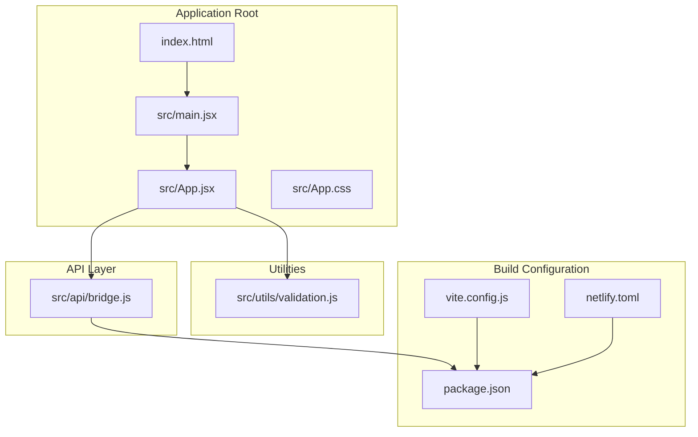
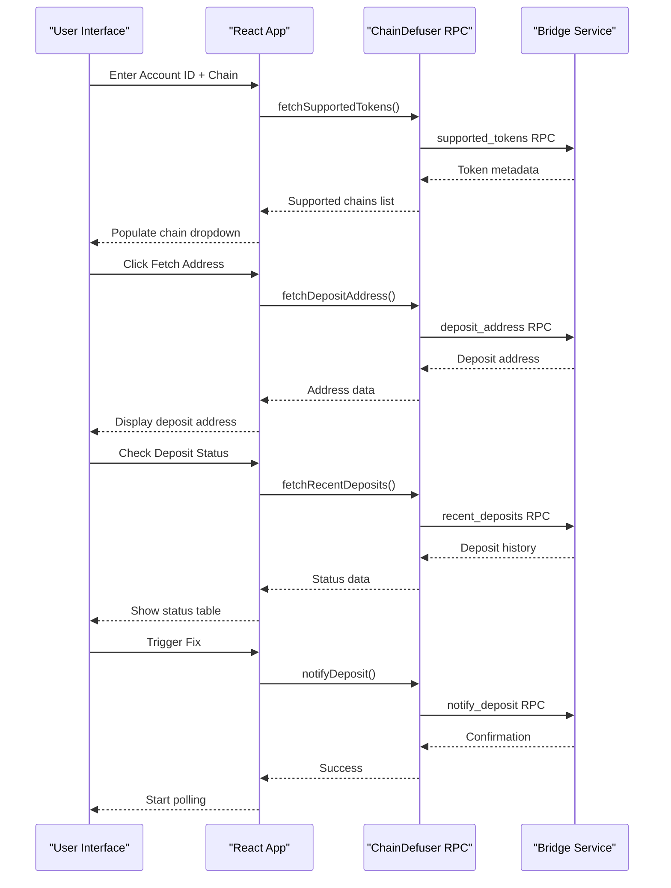
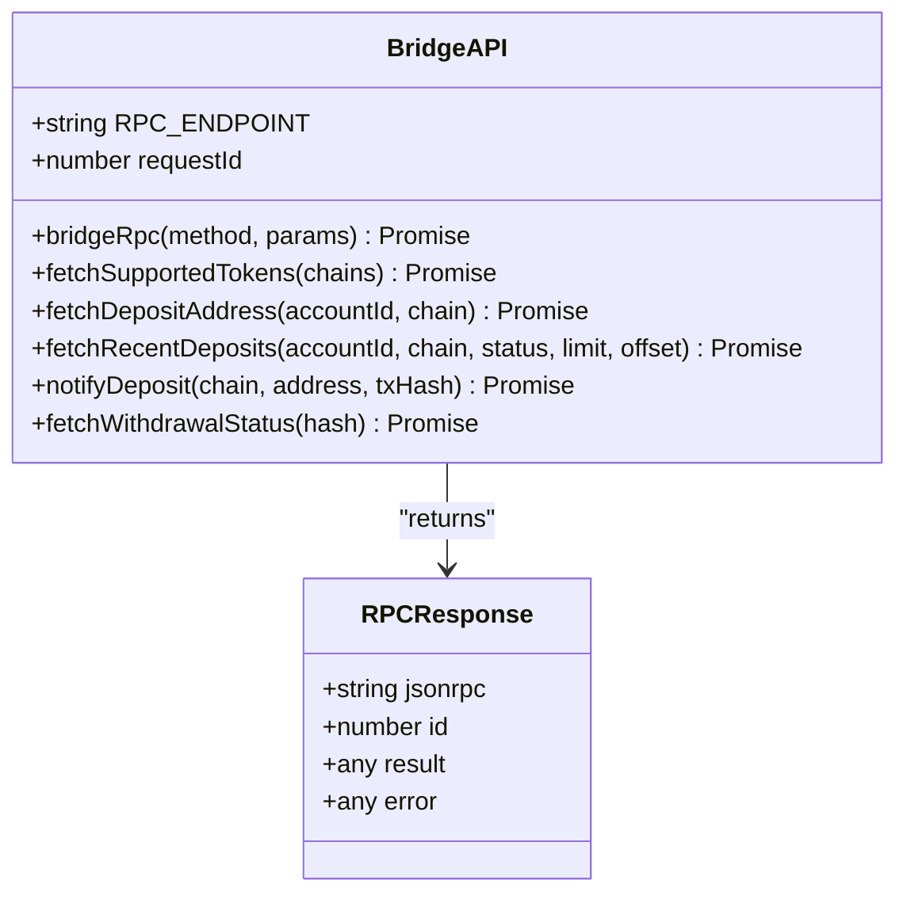
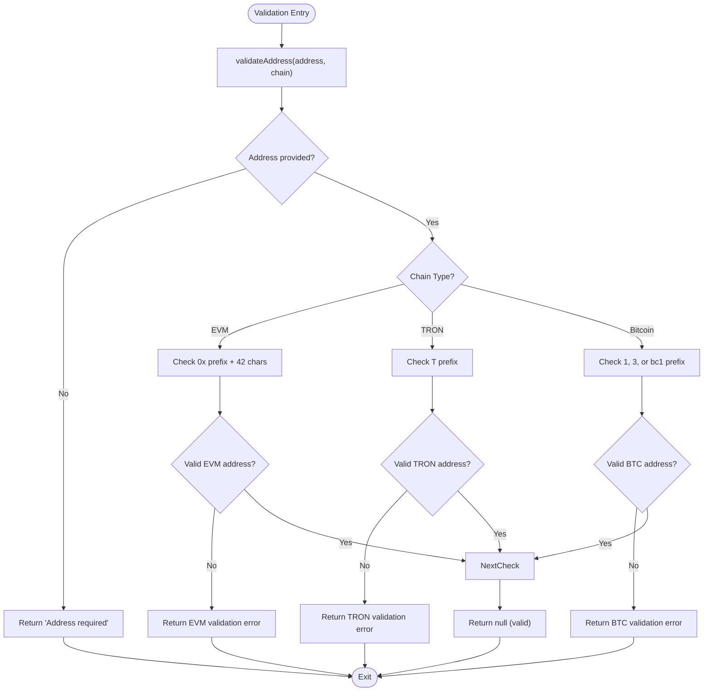
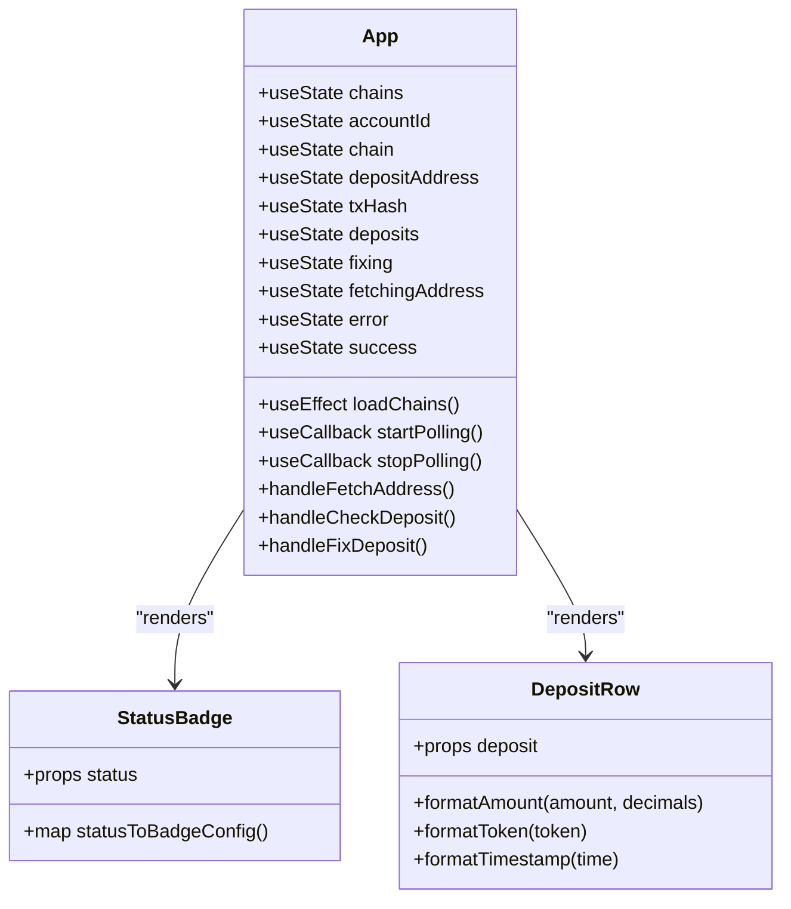

# Project Overview

<cite>
**Referenced Files in This Document**
- [package.json](file://package.json)
- [vite.config.js](file://vite.config.js)
- [netlify.toml](file://netlify.toml)
- [index.html](file://index.html)
- [src/main.jsx](file://src/main.jsx)
- [src/App.jsx](file://src/App.jsx)
- [src/App.css](file://src/App.css)
- [src/api/bridge.js](file://src/api/bridge.js)
- [src/utils/validation.js](file://src/utils/validation.js)
</cite>

## Table of Contents
1. [Introduction](#introduction)
2. [Project Structure](#project-structure)
3. [Core Components](#core-components)
4. [Architecture Overview](#architecture-overview)
5. [Detailed Component Analysis](#detailed-component-analysis)
6. [Dependency Analysis](#dependency-analysis)
7. [Performance Considerations](#performance-considerations)
8. [Troubleshooting Guide](#troubleshooting-guide)
9. [Conclusion](#conclusion)
10. [Appendices](#appendices)

## Introduction
Bridge Fixer is a blockchain bridge deposit recovery tool designed to help users resolve issues with NEAR Intents bridge deposits. The application enables users to fetch deposit addresses, check deposit statuses across multiple chains, and trigger recovery mechanisms when deposits are stuck or missing.

The tool targets blockchain users who encounter problems with bridge transactions, particularly those involving cross-chain asset transfers. It provides a user-friendly interface for monitoring and resolving bridge deposit issues, with built-in validation and automated status polling.

## Project Structure
The project follows a modern React 18 application structure with Vite as the build tool. The codebase is organized into clear functional modules:



**Diagram sources**
- [index.html:1-13](file://index.html#L1-L13)
- [src/main.jsx:1-11](file://src/main.jsx#L1-L11)
- [src/App.jsx:1-373](file://src/App.jsx#L1-L373)
- [src/api/bridge.js:1-72](file://src/api/bridge.js#L1-L72)
- [src/utils/validation.js:1-49](file://src/utils/validation.js#L1-L49)
- [package.json:1-20](file://package.json#L1-L20)
- [vite.config.js:1-7](file://vite.config.js#L1-L7)
- [netlify.toml:1-9](file://netlify.toml#L1-L9)

**Section sources**
- [package.json:1-20](file://package.json#L1-L20)
- [vite.config.js:1-7](file://vite.config.js#L1-L7)
- [netlify.toml:1-9](file://netlify.toml#L1-L9)
- [index.html:1-13](file://index.html#L1-L13)

## Core Components
The application consists of several key components that work together to provide the deposit recovery functionality:

### Application Shell and Routing
The main application entry point initializes React and renders the primary App component. The application uses a single-page architecture with client-side routing through React components.

### Deposit Management Interface
The core interface provides four main functionalities:
- Account ID input for NEAR account identification
- Chain selection dropdown populated from supported tokens
- Deposit address retrieval and display
- Transaction hash validation and status checking

### Status Monitoring System
The application implements an intelligent polling mechanism that automatically checks deposit status every 5 seconds, with a 60-second timeout to prevent indefinite polling.

### Validation and Error Handling
Built-in validation ensures proper input formatting for different blockchain address types, with specific rules for EVM-compatible chains, TRON, and Bitcoin addresses.

**Section sources**
- [src/main.jsx:1-11](file://src/main.jsx#L1-L11)
- [src/App.jsx:53-373](file://src/App.jsx#L53-L373)
- [src/utils/validation.js:1-49](file://src/utils/validation.js#L1-L49)

## Architecture Overview
The application follows a client-side architecture with centralized API communication through the ChainDefuser RPC service:



**Diagram sources**
- [src/App.jsx:148-216](file://src/App.jsx#L148-L216)
- [src/api/bridge.js:33-71](file://src/api/bridge.js#L33-L71)

The architecture implements a clean separation between presentation logic and data access, with all blockchain interactions handled through the centralized RPC endpoint.

**Section sources**
- [src/App.jsx:1-373](file://src/App.jsx#L1-L373)
- [src/api/bridge.js:1-72](file://src/api/bridge.js#L1-L72)

## Detailed Component Analysis

### API Communication Layer
The bridge API module provides a unified interface to the ChainDefuser RPC service, implementing standardized JSON-RPC 2.0 communication:



**Diagram sources**
- [src/api/bridge.js:1-72](file://src/api/bridge.js#L1-L72)

The API layer handles:
- JSON-RPC 2.0 protocol compliance
- Automatic request ID incrementation
- Error handling for HTTP and RPC errors
- Parameter serialization for different RPC methods

**Section sources**
- [src/api/bridge.js:1-72](file://src/api/bridge.js#L1-L72)

### Validation System
The validation module implements chain-specific address validation rules:



**Diagram sources**
- [src/utils/validation.js:1-49](file://src/utils/validation.js#L1-L49)

**Section sources**
- [src/utils/validation.js:1-49](file://src/utils/validation.js#L1-L49)

### User Interface Components
The application implements a modular component architecture with specialized UI elements:



**Diagram sources**
- [src/App.jsx:18-51](file://src/App.jsx#L18-L51)
- [src/App.jsx:30-51](file://src/App.jsx#L30-L51)

**Section sources**
- [src/App.jsx:18-51](file://src/App.jsx#L18-L51)
- [src/App.jsx:30-51](file://src/App.jsx#L30-L51)

### Multi-Chain Support Implementation
The application supports multiple blockchain networks through standardized chain identifiers:

| Chain Prefix | Network | Address Format |
|-------------|---------|----------------|
| eth: | Ethereum | 0x prefixed, 42 characters |
| polygon: | Polygon | 0x prefixed, 42 characters |
| arb: | Arbitrum | 0x prefixed, 42 characters |
| base: | Base | 0x prefixed, 42 characters |
| tron: | TRON | T prefixed |
| btc: | Bitcoin | 1, 3, or bc1 prefixed |

**Section sources**
- [src/utils/validation.js:8-27](file://src/utils/validation.js#L8-L27)

## Dependency Analysis
The project maintains minimal external dependencies focused on core functionality:

```mermaid
graph LR
subgraph "Runtime Dependencies"
REACT[react ^18.3.1]
REACTDOM[react-dom ^18.3.1]
end
subgraph "Development Dependencies"
VITE[vite ^6.0.0]
VITEPLUGIN[@vitejs/plugin-react ^4.3.4]
REACTPLUGIN[react ^18.3.1]
end
subgraph "Application Code"
MAIN[src/main.jsx]
APP[src/App.jsx]
BRIDGE[src/api/bridge.js]
VALIDATION[src/utils/validation.js]
end
MAIN --> REACT
APP --> REACT
APP --> REACTDOM
BRIDGE --> REACT
VALIDATION --> REACT
VITEPLUGIN --> VITE
REACTPLUGIN --> VITE
```

**Diagram sources**
- [package.json:11-18](file://package.json#L11-L18)

**Section sources**
- [package.json:1-20](file://package.json#L1-L20)

## Performance Considerations
The application implements several performance optimizations:

### Polling Strategy
- Fixed interval polling (5 seconds) prevents excessive API calls
- 60-second timeout prevents indefinite polling loops
- Smart polling start/stop reduces unnecessary network requests

### Memory Management
- Proper cleanup of polling intervals on component unmount
- Efficient state updates using React's setState batching
- Minimal DOM manipulation through virtual DOM rendering

### Network Optimization
- Single RPC endpoint reduces connection overhead
- Request deduplication through shared state
- Error boundaries prevent cascading failures

## Troubleshooting Guide

### Common Issues and Solutions

**Chain Selection Problems**
- Verify that the selected chain matches the deposit address format
- Check that the chain identifier follows the expected format (eth:, polygon:, etc.)

**Address Validation Failures**
- Ensure EVM addresses start with "0x" and are exactly 42 characters
- Verify TRON addresses start with "T"
- Confirm Bitcoin addresses start with "1", "3", or "bc1"

**RPC Communication Errors**
- Check network connectivity to the ChainDefuser service
- Verify that the RPC endpoint is accessible
- Monitor for rate limiting or service availability issues

**Status Checking Delays**
- Allow time for blockchain confirmations
- Verify transaction hash validity on the source chain
- Check that the deposit address matches the intended recipient

**Section sources**
- [src/App.jsx:148-216](file://src/App.jsx#L148-L216)
- [src/api/bridge.js:20-31](file://src/api/bridge.js#L20-L31)

## Conclusion
Bridge Fixer provides a streamlined solution for blockchain users experiencing bridge deposit issues. The application combines a clean React 18 interface with robust backend integration through the ChainDefuser RPC service, offering multi-chain support and intelligent status monitoring.

Key strengths include:
- Comprehensive multi-chain support with proper validation
- User-friendly interface for deposit recovery operations
- Automated status polling with intelligent timeout handling
- Clean separation of concerns between UI and data access layers

The deployment-ready architecture using Vite and Netlify ensures reliable hosting with SPA routing support.

## Appendices

### Technology Stack Details
- **Frontend Framework**: React 18.3.1 with modern hooks and functional components
- **Build Tool**: Vite 6.0.0 for fast development and optimized production builds
- **Styling**: Pure CSS with responsive design and accessibility considerations
- **Deployment**: Netlify static hosting with SPA fallback routing

### Deployment Configuration
The application uses Netlify's static site hosting with SPA routing configured through redirect rules, ensuring proper handling of client-side routes.

**Section sources**
- [package.json:11-18](file://package.json#L11-L18)
- [netlify.toml:1-9](file://netlify.toml#L1-L9)
- [vite.config.js:1-7](file://vite.config.js#L1-L7)