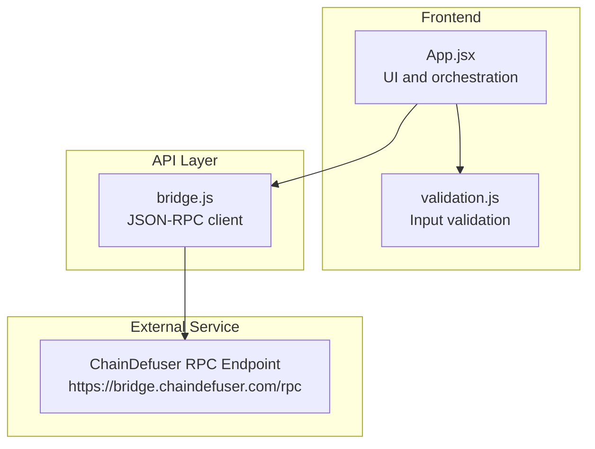
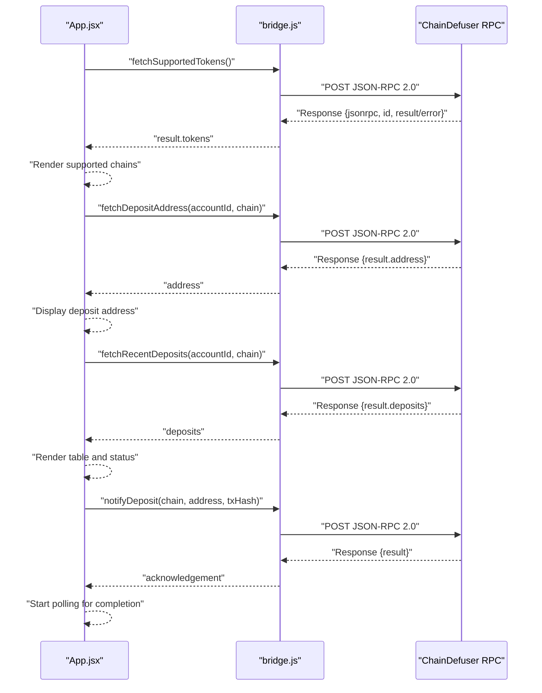
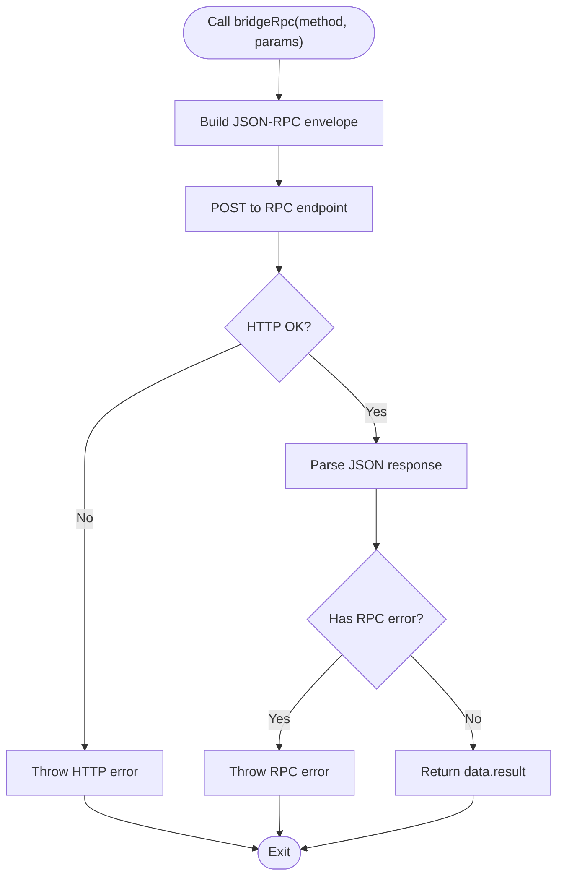
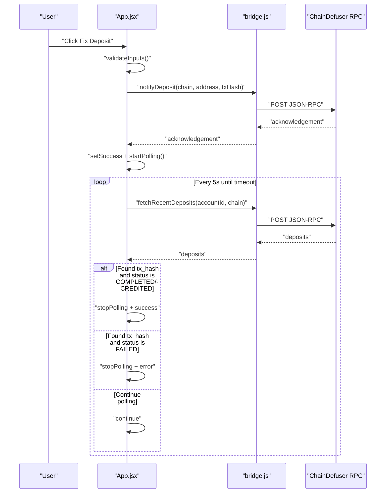
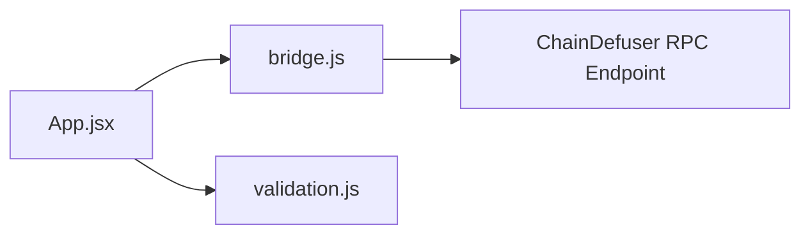

# API Integration Layer

<cite>
**Referenced Files in This Document**
- [bridge.js](file://src/api/bridge.js)
- [validation.js](file://src/utils/validation.js)
- [App.jsx](file://src/App.jsx)
- [main.jsx](file://src/main.jsx)
- [package.json](file://package.json)
- [netlify.toml](file://netlify.toml)
- [index.html](file://index.html)
</cite>

## Table of Contents
1. [Introduction](#introduction)
2. [Project Structure](#project-structure)
3. [Core Components](#core-components)
4. [Architecture Overview](#architecture-overview)
5. [Detailed Component Analysis](#detailed-component-analysis)
6. [Dependency Analysis](#dependency-analysis)
7. [Performance Considerations](#performance-considerations)
8. [Troubleshooting Guide](#troubleshooting-guide)
9. [Conclusion](#conclusion)

## Introduction
This document describes the RPC communication layer used by Bridge Fixer to interact with the ChainDefuser bridge service. It focuses on the four primary API functions:
- fetchSupportedTokens(): retrieves supported blockchain networks and tokens
- fetchDepositAddress(): generates a deposit address for a given account and chain
- fetchRecentDeposits(): checks recent deposit statuses for an account
- notifyDeposit(): triggers recovery processes for problematic deposits

It explains the JSON-RPC protocol implementation, HTTP request/response patterns, parameter validation, response parsing, error handling, timeouts, and integration with the ChainDefuser bridge service. It also covers retry mechanisms, fallback strategies, and performance optimization techniques.

## Project Structure
The application is a React-based frontend that communicates with the ChainDefuser RPC endpoint. The API layer encapsulates JSON-RPC requests and exposes higher-level functions for UI components.

**Diagram sources**
- [App.jsx:1-373](file://src/App.jsx#L1-L373)
- [validation.js:1-49](file://src/utils/validation.js#L1-L49)
- [bridge.js:1-72](file://src/api/bridge.js#L1-L72)

**Section sources**
- [main.jsx:1-11](file://src/main.jsx#L1-L11)
- [package.json:1-20](file://package.json#L1-L20)
- [netlify.toml:1-9](file://netlify.toml#L1-L9)
- [index.html:1-12](file://index.html#L1-L12)

## Core Components
- JSON-RPC client: Implements a lightweight wrapper around fetch to send JSON-RPC 2.0 requests to the ChainDefuser endpoint.
- API functions: Expose typed functions for supported tokens, deposit address, recent deposits, and deposit notifications.
- Validation utilities: Provide input validation for addresses, account IDs, and transaction hashes.
- UI integration: Orchestrates polling, error/success messaging, and user-triggered actions.

Key responsibilities:
- Build JSON-RPC envelopes with method and params
- Send HTTP POST requests with Content-Type: application/json
- Parse and validate responses
- Surface errors consistently to the UI

**Section sources**
- [bridge.js:1-72](file://src/api/bridge.js#L1-L72)
- [validation.js:1-49](file://src/utils/validation.js#L1-L49)
- [App.jsx:1-373](file://src/App.jsx#L1-L373)

## Architecture Overview
The system follows a simple client-server model:
- The UI invokes API functions exposed by the API module.
- The API module constructs a JSON-RPC envelope and posts it to the ChainDefuser RPC endpoint.
- The server responds with a JSON-RPC result or error object.
- The UI parses the result and updates state accordingly.

**Diagram sources**
- [bridge.js:33-65](file://src/api/bridge.js#L33-L65)
- [App.jsx:76-146](file://src/App.jsx#L76-L146)

## Detailed Component Analysis

### JSON-RPC Client (bridge.js)
The JSON-RPC client encapsulates the HTTP transport and response parsing:
- Endpoint: https://bridge.chaindefuser.com/rpc
- Protocol: JSON-RPC 2.0 over HTTP POST
- Request envelope: { jsonrpc: "2.0", id, method, params }
- Response handling:
  - Throws on HTTP error status
  - Throws on RPC error field presence
  - Returns data.result on success

Important behaviors:
- Automatic request ID increment
- Strict error propagation
- Minimal payload construction

**Diagram sources**
- [bridge.js:5-31](file://src/api/bridge.js#L5-L31)

**Section sources**
- [bridge.js:1-72](file://src/api/bridge.js#L1-L72)

### API Functions

#### fetchSupportedTokens(chains?)
Purpose: Retrieve supported blockchain networks and tokens.
- Method: supported_tokens
- Params:
  - Optional chains: array of chain identifiers
- Response: result.tokens (array of token descriptors)
- Typical usage: populate chain selection dropdown

Behavior:
- If chains provided, attaches to params.chains
- Returns raw tokens array for UI to derive chain list

**Section sources**
- [bridge.js:33-39](file://src/api/bridge.js#L33-L39)
- [App.jsx:76-101](file://src/App.jsx#L76-L101)

#### fetchDepositAddress(accountId, chain)
Purpose: Generate a deposit address for the given account and chain.
- Method: deposit_address
- Params:
  - account_id: string
  - chain: string
- Response: result.address (string)

Behavior:
- Validates inputs before calling API
- Displays success or error message in UI

**Section sources**
- [bridge.js:41-46](file://src/api/bridge.js#L41-L46)
- [App.jsx:148-170](file://src/App.jsx#L148-L170)

#### fetchRecentDeposits(accountId, chain?, status?, limit?, offset?)
Purpose: Check recent deposit statuses for an account.
- Method: recent_deposits
- Params:
  - account_id: string
  - Optional chain: string
  - Optional status: string
  - Optional limit: number
  - Optional offset: number
- Response: result.deposits (array of deposit records)

Behavior:
- Builds params dynamically based on provided arguments
- Used for manual check and auto-polling

**Section sources**
- [bridge.js:48-57](file://src/api/bridge.js#L48-L57)
- [App.jsx:172-192](file://src/App.jsx#L172-L192)
- [App.jsx:121-146](file://src/App.jsx#L121-L146)

#### notifyDeposit(chain, depositAddress, txHash)
Purpose: Trigger recovery processes for a problematic deposit.
- Method: notify_deposit
- Params:
  - chain: string
  - deposit_address: string
  - tx_hash: string
- Response: result (service-defined)

Behavior:
- Validates inputs before calling API
- Initiates auto-polling for status completion

**Section sources**
- [bridge.js:59-65](file://src/api/bridge.js#L59-L65)
- [App.jsx:194-216](file://src/App.jsx#L194-L216)

### Parameter Validation (validation.js)
Validation utilities ensure inputs conform to expected formats:
- validateAddress(address, chain):
  - EVM-like chains require 0x prefix and 42-character length
  - TRON requires T prefix
  - BTC supports legacy (1, 3) and Bech32 (bc1) prefixes
- validateAccountId(accountId):
  - Non-empty string required
- validateTxHash(txHash):
  - Non-empty string required
- canFixDeposit(status):
  - Allows fixing when status is NOT_FOUND or FAILED

These validators are used in UI handlers to prevent invalid requests.

**Section sources**
- [validation.js:1-49](file://src/utils/validation.js#L1-L49)
- [App.jsx:152-204](file://src/App.jsx#L152-L204)

### UI Orchestration (App.jsx)
The UI integrates the API layer with user interactions:
- Loading supported chains on mount
- Fetching deposit addresses
- Manual and auto-polling for deposit status
- Triggering fixes and handling outcomes
- Polling configuration:
  - Interval: 5000 ms
  - Timeout: 60000 ms (60 seconds)
  - Graceful cleanup on unmount

**Diagram sources**
- [App.jsx:121-146](file://src/App.jsx#L121-L146)
- [App.jsx:194-216](file://src/App.jsx#L194-L216)
- [bridge.js:48-57](file://src/api/bridge.js#L48-L57)

**Section sources**
- [App.jsx:1-373](file://src/App.jsx#L1-L373)

## Dependency Analysis
- App.jsx depends on:
  - bridge.js for RPC calls
  - validation.js for input validation
- bridge.js depends on:
  - fetch for HTTP transport
  - RPC endpoint URL
- No external runtime dependencies are declared in package.json beyond React and Vite.

**Diagram sources**
- [App.jsx:1-13](file://src/App.jsx#L1-L13)
- [bridge.js:1](file://src/api/bridge.js#L1)

**Section sources**
- [package.json:11-19](file://package.json#L11-L19)

## Performance Considerations
- Polling cadence: 5000 ms interval balances responsiveness with minimal network overhead.
- Polling timeout: 60000 ms prevents indefinite polling loops.
- Request batching: The API layer sends minimal JSON-RPC envelopes; no batching is implemented in code.
- Network efficiency: Single POST per operation; no caching layer in the client.
- UI responsiveness: Errors during polling are caught and ignored to keep the polling loop alive for transient failures.

[No sources needed since this section provides general guidance]

## Troubleshooting Guide

Common error scenarios and handling:
- HTTP error responses:
  - Symptom: Generic HTTP error thrown with status and message
  - Handling: UI displays a user-friendly error message
- RPC error responses:
  - Symptom: Response contains an error field
  - Handling: Error is thrown with message or serialized error
- Missing result fields:
  - Symptom: Unexpected response shape
  - Handling: The client expects result; missing result indicates malformed response
- Input validation failures:
  - Symptom: Immediate UI error before making RPC call
  - Handling: Validators return descriptive messages

Timeout handling:
- Auto-poll timeout: After 60 seconds, polling stops and a timeout message is shown
- Graceful cleanup: Polling intervals are cleared on component unmount

Rate limiting considerations:
- No explicit rate-limiting headers or backoff logic is implemented in the client
- Recommendations:
  - Increase polling interval if encountering throttling
  - Implement exponential backoff on repeated failures
  - Debounce user-triggered actions

Retry mechanisms:
- Transient errors during polling are swallowed to continue polling
- No automatic retry for non-polling operations

**Section sources**
- [bridge.js:20-30](file://src/api/bridge.js#L20-L30)
- [App.jsx:121-146](file://src/App.jsx#L121-L146)

## Conclusion
Bridge Fixer’s API integration layer provides a clean, JSON-RPC-based interface to the ChainDefuser bridge service. The design emphasizes simplicity, robust error handling, and user-friendly feedback. The UI layer adds intelligent polling and validation to deliver a smooth user experience for deposit recovery workflows. Future enhancements could include configurable retries, exponential backoff, and optional caching for improved resilience under load.