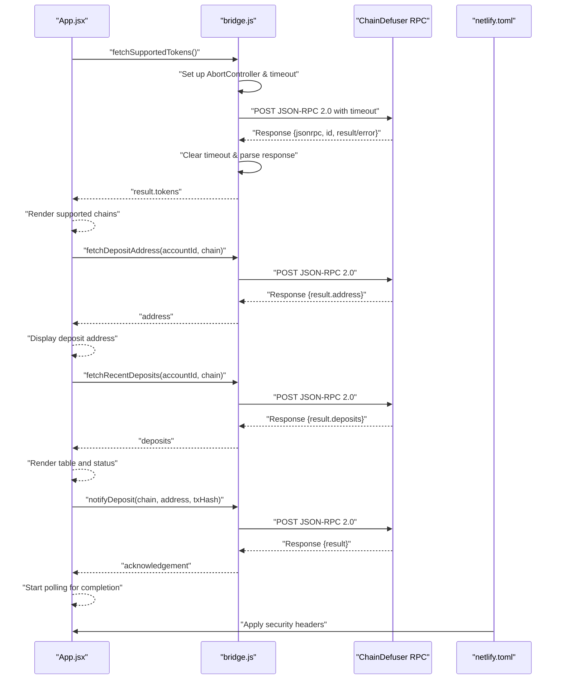
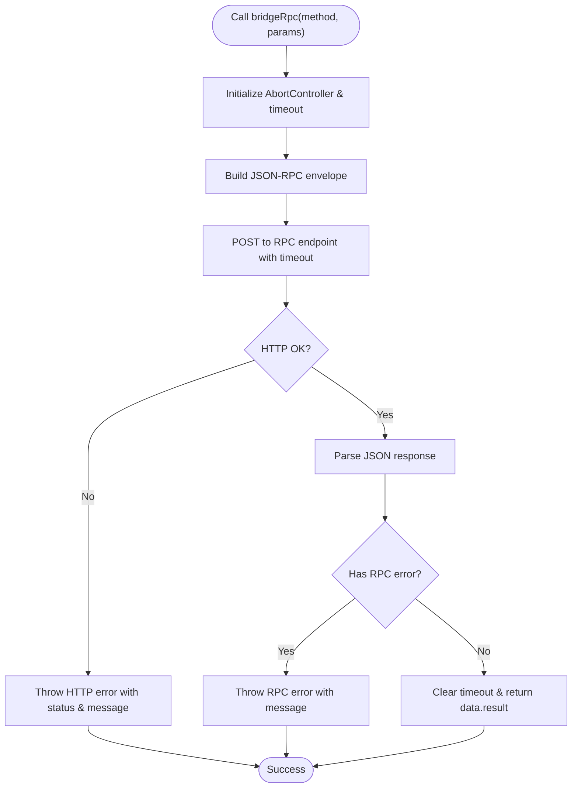
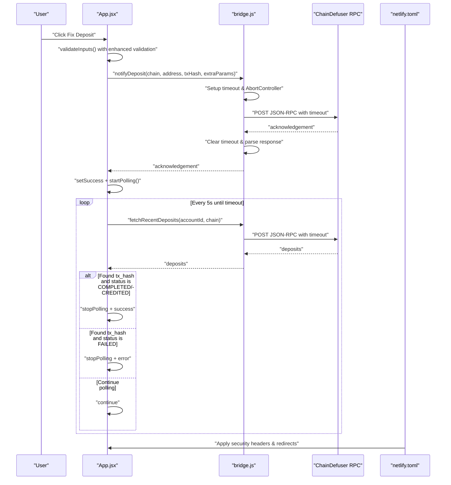
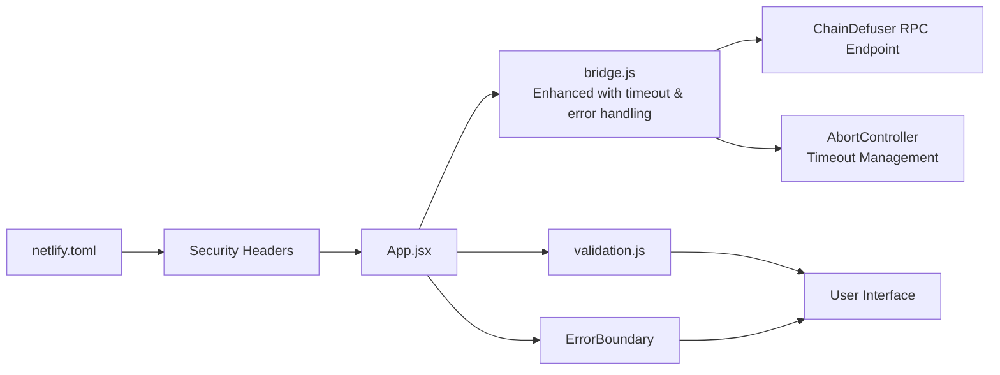

# API Integration Layer

<cite>
**Referenced Files in This Document**
- [bridge.js](file://src/api/bridge.js)
- [validation.js](file://src/utils/validation.js)
- [App.jsx](file://src/App.jsx)
- [main.jsx](file://src/main.jsx)
- [package.json](file://package.json)
- [netlify.toml](file://netlify.toml)
- [index.html](file://index.html)
</cite>

## Update Summary
**Changes Made**
- Enhanced bridge.js module documentation with comprehensive error handling and timeout management
- Added documentation for the new fetchWithdrawalStatus() API function
- Updated API function signatures with improved parameter handling
- Documented enhanced UI integration patterns and security configurations
- Added comprehensive error handling strategies and timeout management

## Table of Contents
1. [Introduction](#introduction)
2. [Project Structure](#project-structure)
3. [Core Components](#core-components)
4. [Architecture Overview](#architecture-overview)
5. [Detailed Component Analysis](#detailed-component-analysis)
6. [Dependency Analysis](#dependency-analysis)
7. [Performance Considerations](#performance-considerations)
8. [Security Configurations](#security-configurations)
9. [Troubleshooting Guide](#troubleshooting-guide)
10. [Conclusion](#conclusion)

## Introduction
This document describes the RPC communication layer used by Bridge Fixer to interact with the ChainDefuser bridge service. The system has been enhanced with improved JSON-RPC client capabilities, comprehensive error handling, and professional documentation. It focuses on the five primary API functions:
- fetchSupportedTokens(): retrieves supported blockchain networks and tokens
- fetchDepositAddress(): generates a deposit address for a given account and chain
- fetchRecentDeposits(): checks recent deposit statuses for an account
- notifyDeposit(): triggers recovery processes for problematic deposits
- fetchWithdrawalStatus(): retrieves withdrawal status information

The enhanced implementation provides robust timeout management, comprehensive error handling, and improved parameter validation for a professional-grade API integration layer.

## Project Structure
The application is a React-based frontend that communicates with the ChainDefuser RPC endpoint. The API layer encapsulates JSON-RPC requests with enhanced error handling and timeout management, exposing higher-level functions for UI components.

```mermaid
graph TB
subgraph "Frontend"
UI["App.jsx<br/>Enhanced UI orchestration"]
Valid["validation.js<br/>Comprehensive input validation"]
Error["ErrorBoundary<br/>Error handling"]
End
subgraph "API Layer"
Bridge["bridge.js<br/>Enhanced JSON-RPC client<br/>86 lines with timeout & error handling"]
End
subgraph "External Service"
RPC["ChainDefuser RPC Endpoint<br/>https://bridge.chaindefuser.com/rpc"]
End
subgraph "Security Layer"
Headers["netlify.toml<br/>Security headers & redirects"]
End
UI --> Valid
UI --> Bridge
UI --> Error
Bridge --> RPC
Headers --> UI
```

**Diagram sources**
- [App.jsx:1-489](file://src/App.jsx#L1-L489)
- [validation.js:1-49](file://src/utils/validation.js#L1-L49)
- [bridge.js:1-86](file://src/api/bridge.js#L1-L86)
- [netlify.toml:1-16](file://netlify.toml#L1-L16)

**Section sources**
- [main.jsx:1-13](file://src/main.jsx#L1-L13)
- [package.json:1-21](file://package.json#L1-L21)
- [netlify.toml:1-16](file://netlify.toml#L1-L16)
- [index.html:1-14](file://index.html#L1-L14)

## Core Components
- **Enhanced JSON-RPC client**: Implements a robust wrapper around fetch with timeout management, comprehensive error handling, and automatic request ID incrementing
- **Extended API functions**: Expose typed functions for supported tokens, deposit address, recent deposits, deposit notifications, and withdrawal status
- **Advanced validation utilities**: Provide comprehensive input validation for addresses, account IDs, transaction hashes, and chain-specific formats
- **Professional UI integration**: Orchestrates polling, error/success messaging, user-triggered actions, and sophisticated form handling
- **Security configurations**: Implements proper HTTP headers and redirect policies for production deployment

Key responsibilities:
- Build JSON-RPC envelopes with method and params including timeout management
- Send HTTP POST requests with Content-Type: application/json and proper headers
- Parse and validate responses with comprehensive error handling
- Surface errors consistently to the UI with graceful degradation
- Manage timeouts and abort signals for reliable network operations

**Section sources**
- [bridge.js:1-86](file://src/api/bridge.js#L1-L86)
- [validation.js:1-49](file://src/utils/validation.js#L1-L49)
- [App.jsx:1-489](file://src/App.jsx#L1-L489)

## Architecture Overview
The system follows a professional client-server model with enhanced error handling and timeout management:
- The UI invokes API functions exposed by the enhanced API module
- The API module constructs a JSON-RPC envelope with timeout management and posts it to the ChainDefuser RPC endpoint
- The server responds with a JSON-RPC result or error object
- The UI parses the result and updates state accordingly with comprehensive error handling
- Security headers and redirect policies protect the application in production



**Diagram sources**
- [bridge.js:6-38](file://src/api/bridge.js#L6-L38)
- [App.jsx:123-151](file://src/App.jsx#L123-L151)
- [netlify.toml:5-11](file://netlify.toml#L5-L11)

## Detailed Component Analysis

### Enhanced JSON-RPC Client (bridge.js)
The enhanced JSON-RPC client provides comprehensive error handling, timeout management, and robust network operations:
- **Endpoint**: https://bridge.chaindefuser.com/rpc
- **Protocol**: JSON-RPC 2.0 over HTTP POST with timeout management
- **Request envelope**: { jsonrpc: "2.0", id, method, params }
- **Timeout management**: 30-second request timeout with AbortController
- **Response handling**:
  - Throws on HTTP error status with detailed error messages
  - Throws on RPC error field presence with error message extraction
  - Returns data.result on success
  - Clears timeout on successful response

Important behaviors:
- Automatic request ID increment for unique identification
- Comprehensive error propagation with HTTP status codes
- Robust timeout handling with AbortController
- Minimal payload construction with timeout safety
- Support for extra parameters in notifyDeposit()



**Diagram sources**
- [bridge.js:6-38](file://src/api/bridge.js#L6-L38)

**Section sources**
- [bridge.js:1-86](file://src/api/bridge.js#L1-L86)

### Enhanced API Functions

#### fetchSupportedTokens(chains?)
Purpose: Retrieve supported blockchain networks and tokens.
- **Method**: supported_tokens
- **Params**:
  - Optional chains: array of chain identifiers
- **Response**: result.tokens (array of token descriptors)
- **Typical usage**: populate chain selection dropdown
- **Enhanced behavior**: Supports optional chains parameter for filtering

Behavior:
- If chains provided, attaches to params.chains
- Returns raw tokens array for UI to derive chain list
- Handles empty chains array gracefully

**Section sources**
- [bridge.js:40-46](file://src/api/bridge.js#L40-L46)
- [App.jsx:123-151](file://src/App.jsx#L123-L151)

#### fetchDepositAddress(accountId, chain)
Purpose: Generate a deposit address for the given account and chain.
- **Method**: deposit_address
- **Params**:
  - account_id: string
  - chain: string
- **Response**: result.address (string)
- **Enhanced behavior**: Comprehensive input validation and error handling

Behavior:
- Validates inputs before calling API
- Displays success or error message in UI
- Handles timeout and network errors gracefully

**Section sources**
- [bridge.js:48-53](file://src/api/bridge.js#L48-L53)
- [App.jsx:198-220](file://src/App.jsx#L198-L220)

#### fetchRecentDeposits(accountId, chain?, status?, limit?, offset?)
Purpose: Check recent deposit statuses for an account.
- **Method**: recent_deposits
- **Params**:
  - account_id: string
  - Optional chain: string
  - Optional status: string
  - Optional limit: number (default: 20)
  - Optional offset: number (default: 0)
- **Response**: result.deposits (array of deposit records)
- **Enhanced behavior**: Default values for limit and offset parameters

Behavior:
- Builds params dynamically based on provided arguments
- Uses sensible defaults for pagination parameters
- Used for manual check and auto-polling
- Handles timeout and network errors gracefully

**Section sources**
- [bridge.js:55-64](file://src/api/bridge.js#L55-L64)
- [App.jsx:222-242](file://src/App.jsx#L222-L242)
- [App.jsx:166-196](file://src/App.jsx#L166-L196)

#### notifyDeposit(chain, depositAddress, txHash, extraParams?)
Purpose: Trigger recovery processes for a problematic deposit.
- **Method**: notify_deposit
- **Params**:
  - chain: string
  - deposit_address: string
  - tx_hash: string
  - Optional extraParams: object containing:
    - near_sender_account: string (for NEAR deposits)
    - memo: string (for Stellar deposits)
- **Response**: result (service-defined)
- **Enhanced behavior**: Support for chain-specific extra parameters

Behavior:
- Validates inputs before calling API
- Supports optional extra parameters for chain-specific requirements
- Initiates auto-polling for status completion
- Handles timeout and network errors gracefully

**Section sources**
- [bridge.js:66-79](file://src/api/bridge.js#L66-L79)
- [App.jsx:244-273](file://src/App.jsx#L244-L273)

#### fetchWithdrawalStatus(withdrawalHash)
Purpose: Retrieve withdrawal status information.
- **Method**: withdrawal_status
- **Params**:
  - withdrawal_hash: string
- **Response**: result (service-defined withdrawal status)
- **New addition**: Complete withdrawal status monitoring capability

Behavior:
- Provides comprehensive withdrawal status tracking
- Supports all withdrawal-related operations
- Integrates seamlessly with existing polling infrastructure

**Section sources**
- [bridge.js:81-85](file://src/api/bridge.js#L81-L85)

### Advanced Parameter Validation (validation.js)
Enhanced validation utilities ensure inputs conform to expected formats with comprehensive error handling:
- **validateAddress(address, chain)**:
  - EVM-like chains require 0x prefix and 42-character length
  - TRON requires T prefix
  - BTC supports legacy (1, 3) and Bech32 (bc1) prefixes
  - Returns null for valid addresses or descriptive error messages
- **validateAccountId(accountId)**:
  - Non-empty string required
  - Returns null for valid account IDs or descriptive error messages
- **validateTxHash(txHash)**:
  - Non-empty string required
  - Returns null for valid transaction hashes or descriptive error messages
- **canFixDeposit(status)**:
  - Allows fixing when status is NOT_FOUND or FAILED
  - Prevents unnecessary operations on completed deposits

These validators are used in UI handlers to prevent invalid requests and provide immediate feedback.

**Section sources**
- [validation.js:1-49](file://src/utils/validation.js#L1-L49)
- [App.jsx:244-273](file://src/App.jsx#L244-L273)

### Professional UI Orchestration (App.jsx)
The enhanced UI integrates the API layer with sophisticated user interactions and comprehensive error handling:
- **Loading supported chains on mount**: Enhanced loading states and error handling
- **Fetch deposit addresses**: Comprehensive validation and user feedback
- **Manual and auto-polling for deposit status**: Sophisticated polling with timeout management
- **Triggering fixes with extra parameters**: Support for chain-specific requirements
- **Handling outcomes**: Graceful error handling and user feedback
- **Enhanced polling configuration**:
  - Interval: 5000 ms (balanced responsiveness)
  - Timeout: 60000 ms (60 seconds) with timeout message
  - Graceful cleanup on unmount with proper cleanup
  - Error boundary for unexpected errors



**Diagram sources**
- [App.jsx:166-196](file://src/App.jsx#L166-L196)
- [App.jsx:244-273](file://src/App.jsx#L244-L273)
- [bridge.js:6-38](file://src/api/bridge.js#L6-L38)
- [netlify.toml:5-11](file://netlify.toml#L5-L11)

**Section sources**
- [App.jsx:1-489](file://src/App.jsx#L1-L489)

## Dependency Analysis
- **App.jsx** depends on:
  - bridge.js for enhanced RPC calls with timeout management
  - validation.js for comprehensive input validation
  - ErrorBoundary for professional error handling
- **bridge.js** depends on:
  - fetch for HTTP transport with AbortController
  - RPC endpoint URL with timeout configuration
  - No external runtime dependencies
- **Package.json** declares minimal dependencies:
  - React 18.3.1 for UI framework
  - React DOM for rendering
  - Vite for development and build
- **Netlify.toml** provides production security:
  - X-Frame-Options: DENY for clickjacking protection
  - X-Content-Type-Options: nosniff for MIME type sniffing prevention
  - Referrer-Policy: strict-origin-when-cross-origin for privacy
  - SPA routing with catch-all redirects



**Diagram sources**
- [App.jsx:1-13](file://src/App.jsx#L1-L13)
- [bridge.js:1-3](file://src/api/bridge.js#L1-L3)
- [netlify.toml:5-11](file://netlify.toml#L5-L11)

**Section sources**
- [package.json:11-20](file://package.json#L11-L20)

## Performance Considerations
- **Enhanced polling cadence**: 5000 ms interval balances responsiveness with minimal network overhead
- **Professional polling timeout**: 60000 ms prevents indefinite polling loops with clear timeout messages
- **Robust request management**: Single POST per operation with timeout safety
- **Network efficiency**: Minimal JSON-RPC envelopes with comprehensive error handling
- **UI responsiveness**: Errors during polling are caught and ignored to keep the polling loop alive for transient failures
- **Timeout safety**: AbortController ensures requests don't hang indefinitely
- **Memory management**: Proper cleanup of polling intervals and timeout references
- **Graceful degradation**: Error boundaries prevent application crashes

## Security Configurations
The application implements comprehensive security measures for production deployment:
- **Content Security**: X-Frame-Options: DENY prevents clickjacking attacks
- **MIME Type Protection**: X-Content-Type-Options: nosniff prevents MIME type sniffing
- **Privacy Protection**: Referrer-Policy: strict-origin-when-cross-origin limits information leakage
- **SPA Routing**: Catch-all redirects ensure proper client-side routing
- **Production Ready**: All security headers applied to all routes
- **Error Boundary**: Professional error handling prevents cascading failures

**Section sources**
- [netlify.toml:5-11](file://netlify.toml#L5-L11)

## Troubleshooting Guide

### Common Error Scenarios and Enhanced Handling
- **HTTP error responses**:
  - Symptom: Generic HTTP error with status and detailed message
  - Handling: UI displays user-friendly error message with specific status code
  - Timeout: Requests automatically abort after 30 seconds with AbortError
- **RPC error responses**:
  - Symptom: Response contains an error field with message
  - Handling: Error is thrown with extracted message or serialized error details
  - Timeout: RPC errors still respect timeout management
- **Missing result fields**:
  - Symptom: Unexpected response shape or malformed JSON
  - Handling: The client expects result; missing result indicates server issues
  - Timeout: Timeout management ensures graceful failure
- **Input validation failures**:
  - Symptom: Immediate UI error before making RPC call with detailed messages
  - Handling: Validators return descriptive messages for specific validation failures
- **Network timeout failures**:
  - Symptom: Request takes longer than 30 seconds
  - Handling: AbortController triggers timeout with clear error message
  - Cleanup: Timeout references are cleared appropriately

### Timeout and Retry Strategies
- **Auto-poll timeout**: After 60 seconds, polling stops and a timeout message is shown
- **Request timeout**: 30-second timeout for individual RPC calls with AbortController
- **Graceful cleanup**: Polling intervals and timeout references are cleared on component unmount
- **Transient error handling**: Transient errors during polling are swallowed to continue polling
- **Professional error boundaries**: Application-level error handling prevents crashes

### Rate Limiting and Backoff Considerations
- **No explicit rate-limiting headers**: Not implemented in current client
- **Recommendations**:
  - Increase polling interval if encountering throttling
  - Implement exponential backoff on repeated failures
  - Debounce user-triggered actions
  - Monitor network performance and adjust timeouts accordingly

**Section sources**
- [bridge.js:15-38](file://src/api/bridge.js#L15-L38)
- [App.jsx:166-196](file://src/App.jsx#L166-L196)

## Conclusion
Bridge Fixer's enhanced API integration layer provides a professional, robust, and secure interface to the ChainDefuser bridge service. The redesigned bridge.js module with 86 lines of comprehensive error handling, timeout management, and enhanced functionality delivers a superior developer experience. The system emphasizes reliability, security, and user-friendly feedback through sophisticated error handling, timeout management, and comprehensive validation. The addition of fetchWithdrawalStatus() completes the API coverage for both deposit and withdrawal operations. Future enhancements could include configurable retries, exponential backoff, optional caching for improved resilience under load, and enhanced monitoring capabilities for production environments.