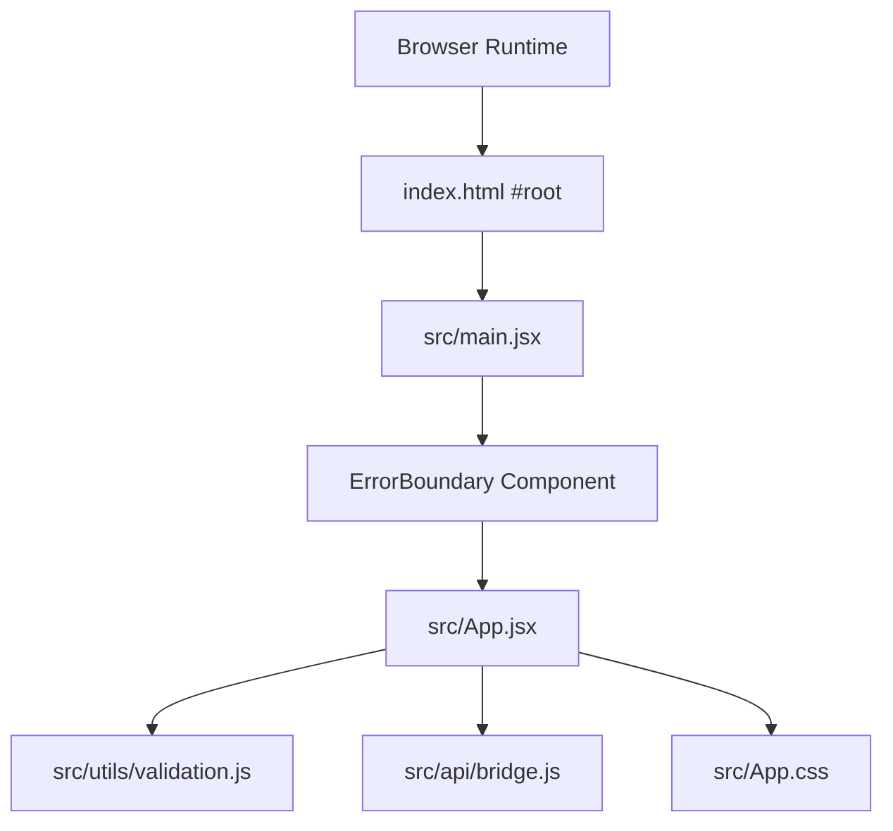
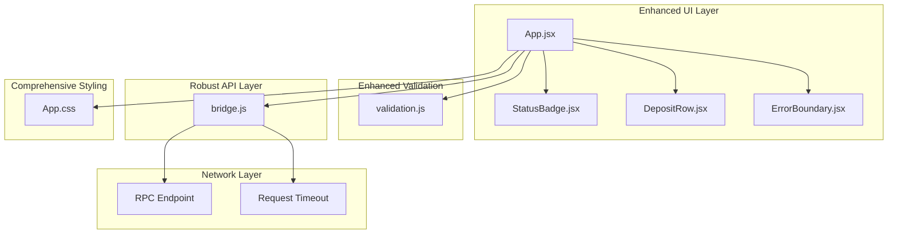
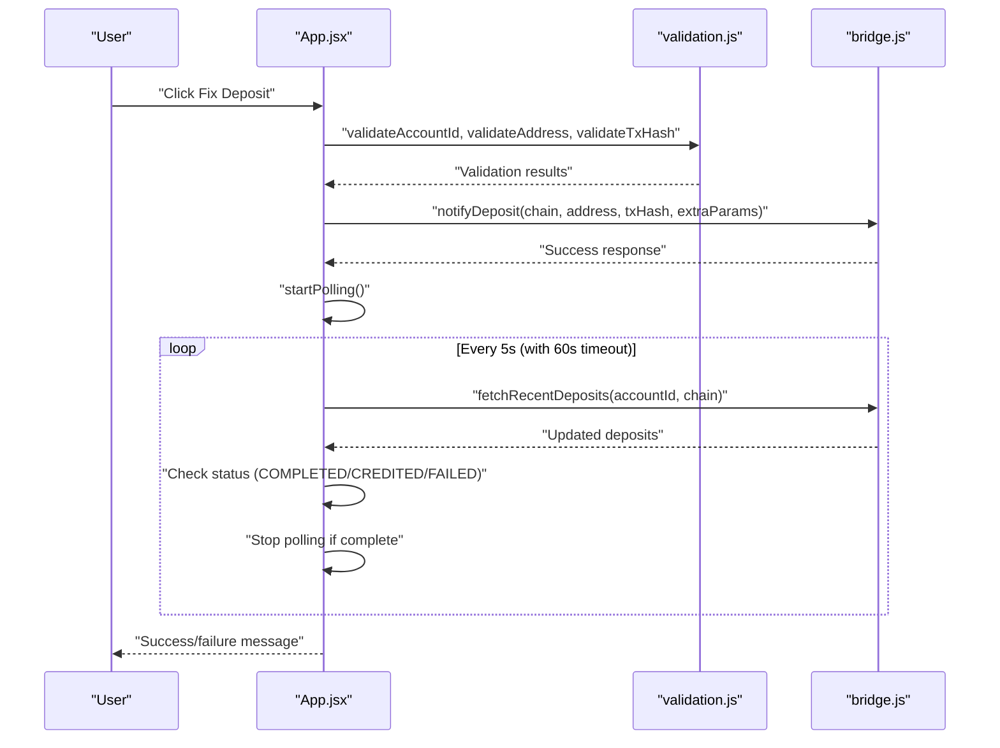
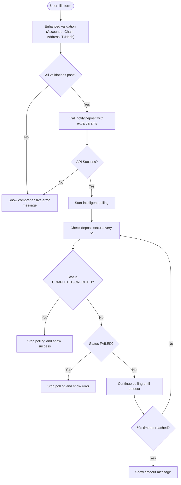
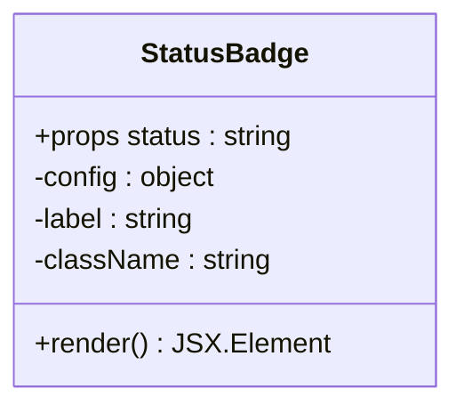
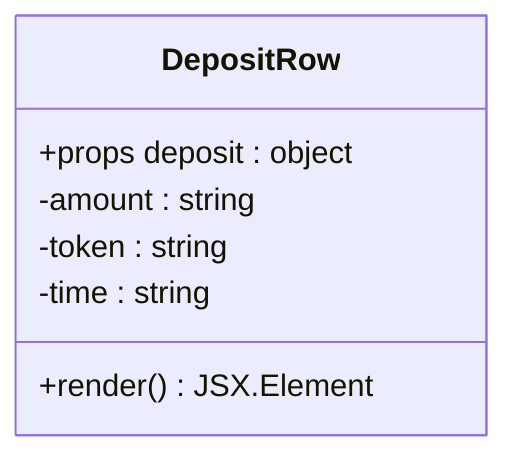
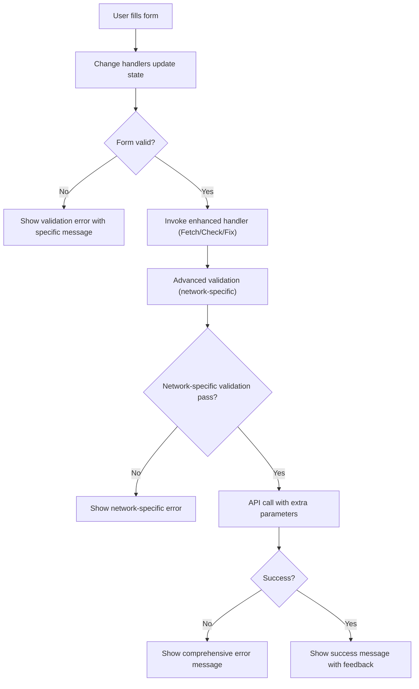
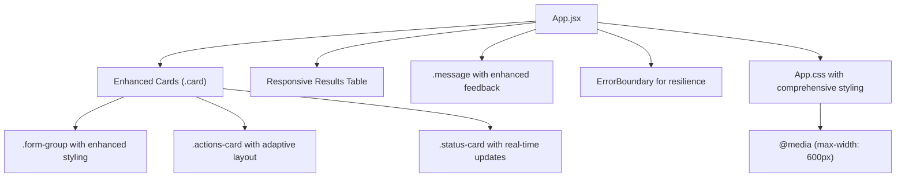
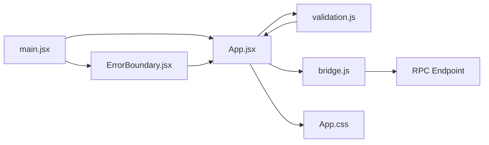

# Application Components

<cite>
**Referenced Files in This Document**
- [App.jsx](file://src/App.jsx)
- [App.css](file://src/App.css)
- [main.jsx](file://src/main.jsx)
- [bridge.js](file://src/api/bridge.js)
- [validation.js](file://src/utils/validation.js)
- [index.html](file://index.html)
- [package.json](file://package.json)
- [vite.config.js](file://vite.config.js)
</cite>

## Update Summary
**Changes Made**
- Updated App component documentation to reflect the new 489-line implementation with enhanced functionality
- Added comprehensive coverage of the new ErrorBoundary component
- Enhanced polling mechanism documentation with improved timeout handling
- Updated helper components documentation with expanded chain support
- Added new form validation features for NEAR and Stellar networks
- Updated architecture diagrams to reflect the complete component hierarchy

## Table of Contents
1. [Introduction](#introduction)
2. [Project Structure](#project-structure)
3. [Core Components](#core-components)
4. [Architecture Overview](#architecture-overview)
5. [Detailed Component Analysis](#detailed-component-analysis)
6. [Dependency Analysis](#dependency-analysis)
7. [Performance Considerations](#performance-considerations)
8. [Troubleshooting Guide](#troubleshooting-guide)
9. [Conclusion](#conclusion)

## Introduction
This document describes the React component architecture of Bridge Fixer, a comprehensive deposit recovery tool for NEAR Intents. The application has undergone a significant migration to a modern React architecture featuring enhanced functionality, improved error handling, and sophisticated polling mechanisms. The main App component orchestrates state management, UI composition, API interactions, and user workflows for deposit recovery across multiple blockchain networks.

## Project Structure
The application is a Vite-powered React single-page application with a well-structured modular architecture:
- Entry point renders the App component wrapped in an ErrorBoundary and applies global styles
- App component serves as the central orchestrator with comprehensive state management
- Utility modules encapsulate API calls and validation logic for different blockchain networks
- Styles are centralized in a single CSS file with responsive design and accessibility features
- Error boundaries provide robust error handling and recovery mechanisms

**Diagram sources**
- [index.html:8-12](file://index.html#L8-L12)
- [main.jsx:6-12](file://src/main.jsx#L6-L12)
- [App.jsx:458-489](file://src/App.jsx#L458-L489)
- [validation.js:1-49](file://src/utils/validation.js#L1-L49)
- [bridge.js:1-86](file://src/api/bridge.js#L1-L86)
- [App.css:1-309](file://src/App.css#L1-L309)

**Section sources**
- [index.html:1-14](file://index.html#L1-L14)
- [main.jsx:1-13](file://src/main.jsx#L1-L13)
- [package.json:1-21](file://package.json#L1-L21)
- [vite.config.js:1-7](file://vite.config.js#L1-L7)

## Core Components
This section documents the main App component and its enhanced helper components, including props, state, rendering logic, and styling.

### App Component (Enhanced)
- **Purpose**: Central orchestration of UI, state, API calls, and user interactions for deposit recovery
- **Hooks used**:
  - useState: Manages comprehensive form inputs, lists, flags, and messages
  - useEffect: Handles initialization, polling cleanup, and component lifecycle
  - useRef: Stores polling timer and start time references
  - useCallback: Memoizes stop/start polling functions and event handlers
- **Lifecycle patterns**:
  - Loads supported chains on mount with comprehensive error handling
  - Implements sophisticated polling mechanism with timeout and retry logic
  - Provides automatic cleanup of timers and resources
- **Props**: None (no external props passed)
- **Rendering logic**:
  - Renders comprehensive header, form section with conditional inputs
  - Displays status cards, action buttons with dynamic states
  - Shows detailed results table with enhanced formatting
  - Integrates error boundary for robust error handling
- **Enhanced Features**:
  - Supports 48+ blockchain networks with custom chain labels
  - Implements specialized validation for NEAR and Stellar networks
  - Provides real-time polling with visual feedback
  - Includes comprehensive error handling and user feedback

### StatusBadge (Enhanced Helper)
- **Purpose**: Render a status indicator with comprehensive color-coded badges
- **Props**:
  - status: String representing the deposit status (NOT_FOUND, PENDING, CREDITED, COMPLETED, FAILED)
- **Enhanced Styling classes**:
  - Base class: status-badge
  - Variant classes: status-not-found, status-pending, status-completed, status-unknown
- **Rendering logic**:
  - Maps status to comprehensive labels and variant classes
  - Provides fallback handling for unknown statuses
  - Uses consistent color schemes for visual status indication

### DepositRow (Enhanced Helper)
- **Purpose**: Render a single row in the recent deposits table with enhanced formatting
- **Props**:
  - deposit: Object containing amount, decimals, defuse_asset_identifier, created_at, status, chain, tx_hash
- **Enhanced Rendering logic**:
  - Formats amounts with decimal precision and token identifier truncation
  - Displays status via enhanced StatusBadge component
  - Provides tooltip support for long transaction hashes
  - Converts timestamps to localized time strings
  - Includes chain label formatting with ID display

### ErrorBoundary (New Component)
- **Purpose**: Provide robust error handling and recovery for the entire application
- **Features**:
  - Catches and handles JavaScript errors in the component tree
  - Displays user-friendly error messages with recovery options
  - Provides automatic page reload functionality
  - Maintains application stability during unexpected errors

**Section sources**
- [App.jsx:97-456](file://src/App.jsx#L97-L456)
- [App.jsx:60-70](file://src/App.jsx#L60-L70)
- [App.jsx:72-95](file://src/App.jsx#L72-L95)
- [App.jsx:458-489](file://src/App.jsx#L458-L489)

## Architecture Overview
The enhanced App component follows a sophisticated unidirectional data flow with comprehensive error handling:
- State is declared locally with comprehensive management of form inputs and UI states
- Validation helpers enforce strict preconditions before API calls
- API module abstracts RPC requests to the bridge service with timeout handling
- Enhanced polling mechanism provides real-time status updates
- Error boundary component ensures application resilience
- UI updates trigger side effects with proper cleanup and resource management

**Diagram sources**
- [App.jsx:1-456](file://src/App.jsx#L1-L456)
- [validation.js:1-49](file://src/utils/validation.js#L1-L49)
- [bridge.js:1-86](file://src/api/bridge.js#L1-L86)
- [App.css:1-309](file://src/App.css#L1-L309)

## Detailed Component Analysis

### Enhanced App Component Analysis
Key aspects of the comprehensive implementation:

#### State Management
- **Form inputs**: accountId, chain, depositAddress, txHash, nearSenderAccount, stellarMemo
- **Lists and flags**: chains, deposits, loading states, fixing flag, fetchingAddress flag, polling flag
- **Messages**: error, success with comprehensive feedback
- **References**: pollTimerRef, pollStartRef for polling management
- **Chain support**: Comprehensive mapping for 48+ blockchain networks

#### Lifecycle and Enhanced Side Effects
- **Initialization**: Loads supported chains with Set-based deduplication and sorting
- **Polling mechanism**: Sophisticated interval-based checking with 60-second timeout
- **Resource cleanup**: Automatic timer cleanup on component unmount
- **Error handling**: Comprehensive try-catch blocks with user feedback

#### Enhanced Event Handlers
- **handleFetchAddress**: Validates inputs, handles NEAR/Stellar special cases, provides loading states
- **handleCheckDeposit**: Comprehensive deposit listing with error handling
- **handleFixDeposit**: Advanced deposit notification with extra parameters for NEAR/Stellar
- **startPolling**: Intelligent polling with status detection and automatic stopping
- **stopPolling**: Graceful timer management with cleanup

#### Enhanced Computed Values
- **overallStatus**: Dynamic status determination with comprehensive matching
- **fixAllowed**: Enhanced validation logic for deposit fixing eligibility
- **Chain labeling**: Custom labels with chain ID display for user clarity

**Diagram sources**
- [App.jsx:244-273](file://src/App.jsx#L244-L273)
- [App.jsx:166-196](file://src/App.jsx#L166-L196)
- [validation.js:1-49](file://src/utils/validation.js#L1-L49)
- [bridge.js:66-79](file://src/api/bridge.js#L66-L79)

**Diagram sources**
- [App.jsx:244-273](file://src/App.jsx#L244-L273)
- [App.jsx:166-196](file://src/App.jsx#L166-L196)
- [validation.js:1-49](file://src/utils/validation.js#L1-L49)
- [bridge.js:66-79](file://src/api/bridge.js#L66-L79)

**Section sources**
- [App.jsx:97-456](file://src/App.jsx#L97-L456)

### Enhanced Helper Components Analysis

#### StatusBadge Component
- **Props**:
  - status: String indicating the deposit status with comprehensive mapping
- **Enhanced Styling**:
  - Base class: status-badge with consistent sizing
  - Variant classes: status-not-found (red), status-pending (yellow), status-completed (green), status-unknown (gray)
- **Behavior**:
  - Maps status to descriptive labels with proper categorization
  - Provides fallback handling for unknown statuses
  - Maintains consistent visual hierarchy

**Diagram sources**
- [App.jsx:60-70](file://src/App.jsx#L60-L70)

**Section sources**
- [App.jsx:60-70](file://src/App.jsx#L60-L70)

#### DepositRow Component
- **Props**:
  - deposit: Object with comprehensive field support
- **Enhanced Rendering logic**:
  - Amount formatting with decimal precision calculation
  - Token identifier truncation with ellipsis for long identifiers
  - Status display via enhanced StatusBadge
  - Tooltip support for transaction hash truncation
  - Localized timestamp formatting
  - Chain label formatting with ID display

**Diagram sources**
- [App.jsx:72-95](file://src/App.jsx#L72-L95)

**Section sources**
- [App.jsx:72-95](file://src/App.jsx#L72-L95)

### Enhanced Form Components and Interaction Patterns
- **Inputs**:
  - Account ID: Text input with basic validation
  - Chain: Select dropdown with 48+ network support and custom labels
  - Deposit Address: Text input with network-specific validation
  - Transaction Hash: Text input with required field validation
  - NEAR Sender Account: Specialized input for NEAR network deposits
  - Stellar Memo: Specialized input with 32-character limit for Stellar deposits
- **Buttons**:
  - Fetch Address: Enabled with comprehensive validation, shows loading state
  - Check Deposit: Enabled with validation, shows loading state during API calls
  - Fix Deposit: Dynamically enabled/disabled based on fix eligibility
- **Messages**:
  - Comprehensive error and success messages with distinct styling
  - Real-time feedback for all user actions
  - Timeout messages for polling operations

**Diagram sources**
- [App.jsx:244-273](file://src/App.jsx#L244-L273)
- [validation.js:1-49](file://src/utils/validation.js#L1-L49)
- [bridge.js:66-79](file://src/api/bridge.js#L66-L79)

**Section sources**
- [App.jsx:292-448](file://src/App.jsx#L292-L448)
- [validation.js:1-49](file://src/utils/validation.js#L1-L49)

### Enhanced Card-Based Layout and Responsive Design
- **Card-based layout**:
  - Comprehensive card system with rounded corners and consistent spacing
  - Distinct styling for form cards, status cards, and action cards
  - Responsive grid system with flexible layouts
- **Enhanced responsive design**:
  - Mobile-first approach with 600px breakpoint
  - Flexible input arrangements with stacked layouts on small screens
  - Adaptive button layouts with full-width options
  - Optimized table layouts with horizontal scrolling
- **Accessibility considerations**:
  - Proper form labeling with htmlFor attributes
  - Focus management for interactive elements
  - Color contrast compliance for status indicators
  - Screen reader friendly status descriptions

**Diagram sources**
- [App.jsx:283-455](file://src/App.jsx#L283-L455)
- [App.css:14-309](file://src/App.css#L14-L309)

**Section sources**
- [App.jsx:283-455](file://src/App.jsx#L283-L455)
- [App.css:1-309](file://src/App.css#L1-L309)

### Enhanced Component Communication and Prop Drilling
- **Data flow patterns**:
  - App component passes status to StatusBadge via props
  - App component passes deposit data to DepositRow via props
  - ErrorBoundary wraps entire application for comprehensive error handling
- **State synchronization**:
  - Polling updates deposits list with automatic UI updates
  - Success and error messages are cleared before each operation
  - Chain selection triggers conditional input rendering
- **Event handling**:
  - Callback functions are memoized to prevent unnecessary re-renders
  - Form validation prevents invalid API calls
  - Loading states provide user feedback during asynchronous operations

**Section sources**
- [App.jsx:60-95](file://src/App.jsx#L60-L95)
- [App.jsx:458-489](file://src/App.jsx#L458-L489)
- [App.jsx:153-196](file://src/App.jsx#L153-L196)

## Dependency Analysis
- **Internal dependencies**:
  - App.jsx depends on validation.js for comprehensive input validation
  - App.jsx depends on bridge.js for robust API communication
  - App.jsx renders StatusBadge, DepositRow, and ErrorBoundary components
- **External dependencies**:
  - React 18.3.1 for component framework and hooks
  - ReactDOM 18.3.1 for client-side rendering
  - Vite 6.0.0 with @vitejs/plugin-react for development and build
- **Entry point integration**:
  - main.jsx renders App wrapped in ErrorBoundary with StrictMode
  - Applies comprehensive CSS styling globally

**Diagram sources**
- [main.jsx:6-12](file://src/main.jsx#L6-L12)
- [App.jsx:1-456](file://src/App.jsx#L1-L456)
- [validation.js:1-49](file://src/utils/validation.js#L1-L49)
- [bridge.js:1-86](file://src/api/bridge.js#L1-L86)
- [App.css:1-309](file://src/App.css#L1-L309)

**Section sources**
- [main.jsx:1-13](file://src/main.jsx#L1-L13)
- [package.json:11-20](file://package.json#L11-L20)
- [vite.config.js:1-7](file://vite.config.js#L1-L7)

## Performance Considerations
- **Enhanced polling optimization**:
  - 5-second polling interval with 60-second timeout prevents resource exhaustion
  - Memoized callback functions prevent unnecessary re-renders
  - Efficient Set-based chain deduplication reduces memory usage
- **Smart resource management**:
  - Automatic timer cleanup prevents memory leaks
  - Conditional rendering reduces DOM complexity
  - Request timeout handling prevents hanging operations
- **Network efficiency**:
  - Comprehensive validation prevents invalid API calls
  - Batched operations reduce network overhead
  - Error boundaries prevent cascading failures

## Troubleshooting Guide
- **Common issues and remedies**:
  - Missing account ID or chain: Comprehensive validation provides specific error messages
  - Invalid deposit address: Network-specific validation with detailed error descriptions
  - RPC timeout errors: Request timeout handling with automatic retry suggestions
  - Stuck polling: 60-second timeout with automatic cleanup
  - Disabled buttons: Dynamic enable/disable logic based on form validity
- **Enhanced error handling**:
  - ErrorBoundary provides graceful degradation
  - Comprehensive error messages aid debugging
  - Automatic state cleanup prevents inconsistent states
- **Network troubleshooting**:
  - Request timeout at 30 seconds prevents hanging operations
  - Detailed error messages from RPC endpoint
  - Automatic polling cleanup on component unmount

**Section sources**
- [App.jsx:198-273](file://src/App.jsx#L198-L273)
- [validation.js:1-49](file://src/utils/validation.js#L1-L49)
- [bridge.js:15-38](file://src/api/bridge.js#L15-L38)

## Conclusion
Bridge Fixer's enhanced App component demonstrates a sophisticated, production-ready React architecture with comprehensive state management, robust validation, intelligent polling mechanisms, and resilient error handling. The migration to a 489-line implementation showcases modern development practices including enhanced component composition, sophisticated error boundaries, and comprehensive user experience features. The application provides a reliable, accessible, and scalable solution for deposit recovery across 48+ blockchain networks with professional-grade error handling and user feedback systems.