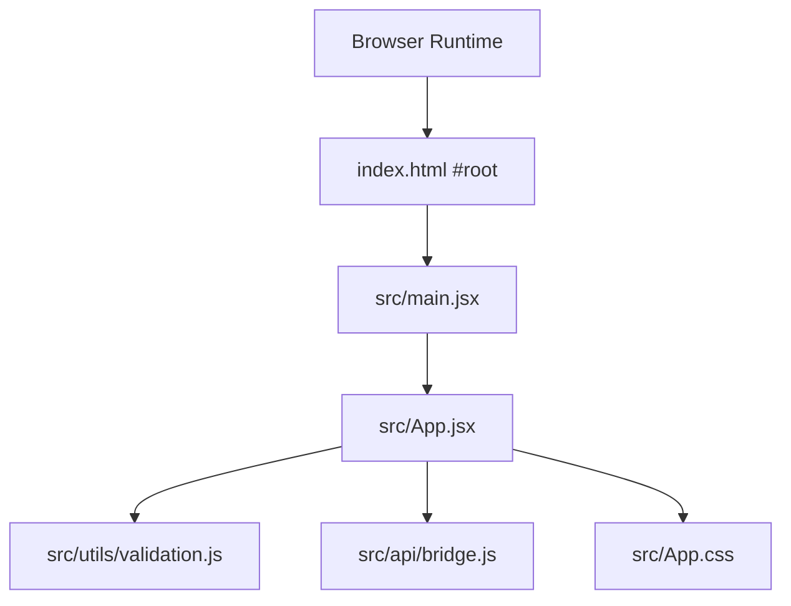
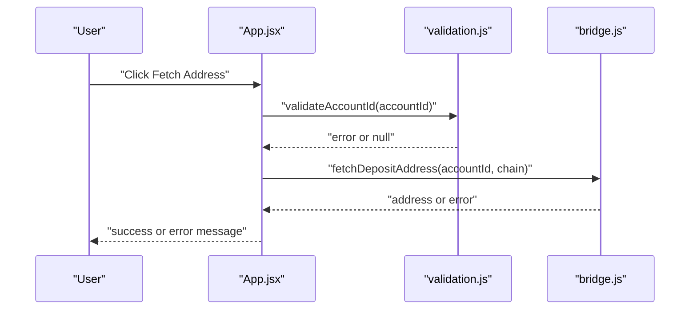
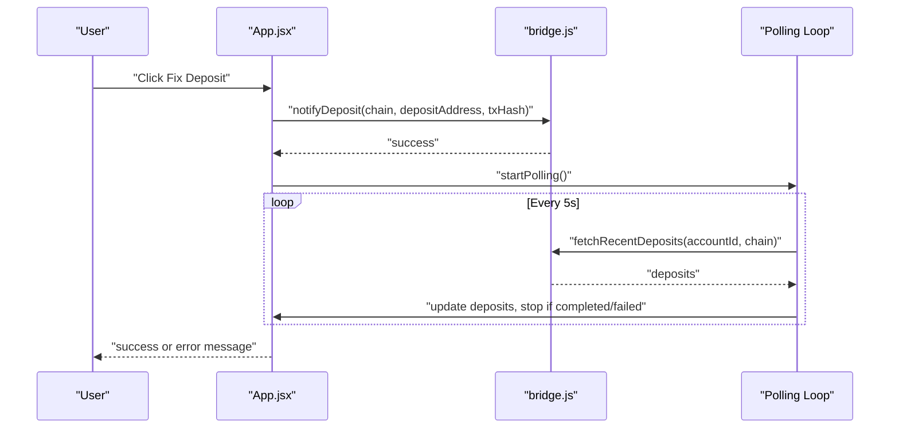
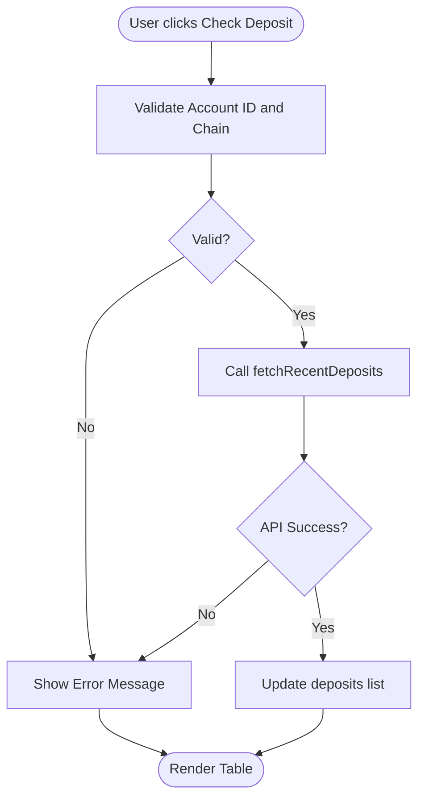
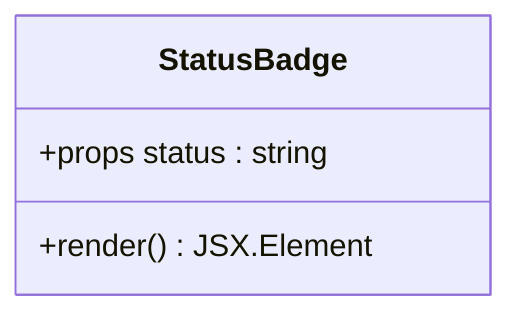
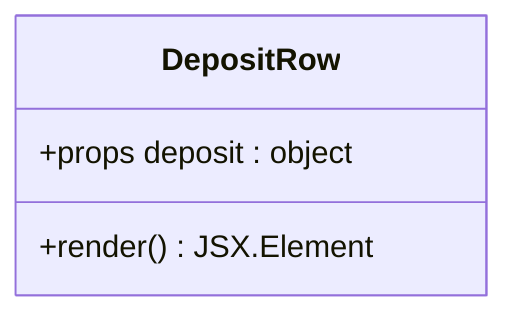
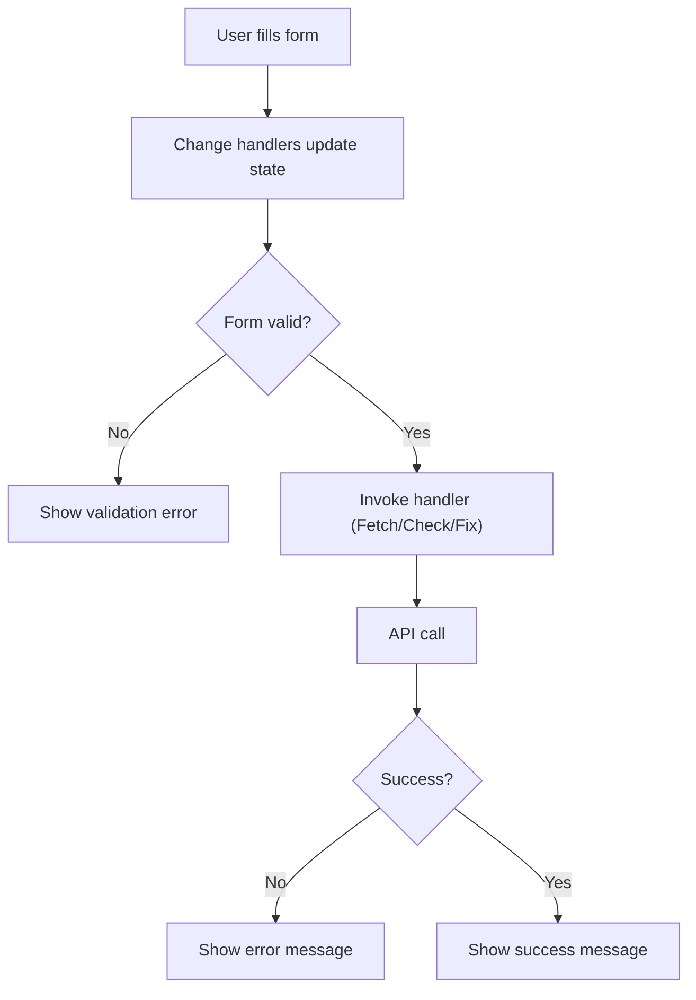
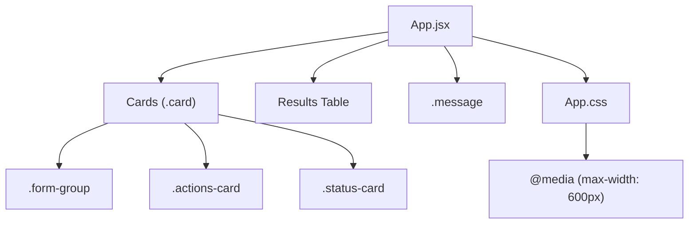
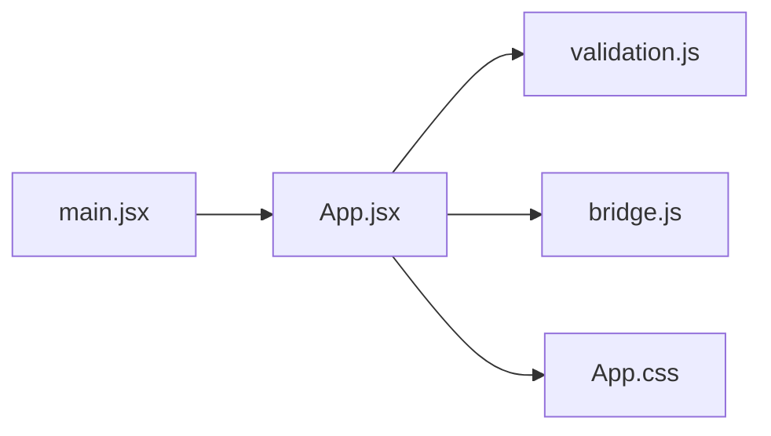

# Application Components

<cite>
**Referenced Files in This Document**
- [App.jsx](file://src/App.jsx)
- [App.css](file://src/App.css)
- [main.jsx](file://src/main.jsx)
- [bridge.js](file://src/api/bridge.js)
- [validation.js](file://src/utils/validation.js)
- [index.html](file://index.html)
- [package.json](file://package.json)
- [vite.config.js](file://vite.config.js)
</cite>

## Table of Contents
1. [Introduction](#introduction)
2. [Project Structure](#project-structure)
3. [Core Components](#core-components)
4. [Architecture Overview](#architecture-overview)
5. [Detailed Component Analysis](#detailed-component-analysis)
6. [Dependency Analysis](#dependency-analysis)
7. [Performance Considerations](#performance-considerations)
8. [Troubleshooting Guide](#troubleshooting-guide)
9. [Conclusion](#conclusion)

## Introduction
This document describes the React component architecture of Bridge Fixer, focusing on the main App component and its helper components. It explains state management with React hooks, component lifecycle patterns, UI composition, form validation, card-based layout, responsive design, accessibility considerations, component communication, and error handling. The goal is to help developers understand how the application works and how to extend or maintain it effectively.

## Project Structure
The application is a Vite-powered React single-page app with a minimal file structure:
- Entry point renders the App component and applies global styles.
- App component orchestrates state, UI, and API interactions.
- Utility modules encapsulate API calls and validation logic.
- Styles are centralized in a single CSS file with responsive breakpoints.



**Diagram sources**
- [index.html:8-10](file://index.html#L8-L10)
- [main.jsx:6-10](file://src/main.jsx#L6-L10)
- [App.jsx:1-14](file://src/App.jsx#L1-L14)
- [validation.js:1-49](file://src/utils/validation.js#L1-L49)
- [bridge.js:1-72](file://src/api/bridge.js#L1-L72)
- [App.css:1-303](file://src/App.css#L1-L303)

**Section sources**
- [index.html:1-13](file://index.html#L1-L13)
- [main.jsx:1-11](file://src/main.jsx#L1-L11)
- [package.json:1-20](file://package.json#L1-L20)
- [vite.config.js:1-7](file://vite.config.js#L1-L7)

## Core Components
This section documents the main App component and its helper components, including props, state, rendering logic, and styling.

- App (default export)
  - Purpose: Central orchestration of UI, state, API calls, and user interactions.
  - Hooks used:
    - useState: Manages form inputs, lists, flags, and messages.
    - useEffect: Handles initialization and cleanup of polling timers.
    - useRef: Stores polling timer and start time references.
    - useCallback: Memoizes stop/start polling functions to prevent unnecessary re-renders.
  - Lifecycle patterns:
    - Loads supported chains on mount.
    - Starts and stops polling for recent deposits with timeout.
    - Cleans up timers on unmount.
  - Props: None (no external props passed).
  - Rendering logic:
    - Renders a header, a form section, optional status card, action buttons, messages, and a results table.
    - Uses helper components for status badges and row rendering.
  - Styling: Uses card-based layout with consistent spacing and typography from App.css.

- StatusBadge (helper)
  - Purpose: Render a status indicator with a label and color-coded badge.
  - Props:
    - status: String representing the deposit status (e.g., NOT_FOUND, PENDING, CREDITED, COMPLETED, FAILED).
  - Styling classes:
    - Base class: status-badge
    - Variant classes: status-not-found, status-pending, status-completed, status-unknown
  - Rendering logic:
    - Selects label and variant class based on status mapping.
    - Falls back to Unknown label if status is missing.

- DepositRow (helper)
  - Purpose: Render a single row in the recent deposits table.
  - Props:
    - deposit: Object containing fields like amount, decimals, defuse_asset_identifier, created_at, status, chain, tx_hash.
  - Rendering logic:
    - Formats amount to fixed decimals and token identifier shortening.
    - Displays status via StatusBadge.
    - Truncates long transaction hashes with ellipsis and tooltip via title attribute.
    - Converts timestamps to local time strings.

**Section sources**
- [App.jsx:53-372](file://src/App.jsx#L53-L372)
- [App.jsx:18-28](file://src/App.jsx#L18-L28)
- [App.jsx:30-51](file://src/App.jsx#L30-L51)

## Architecture Overview
The App component follows a unidirectional data flow:
- State is declared locally and updated by event handlers.
- Validation helpers enforce preconditions before API calls.
- API module abstracts RPC requests to the bridge service.
- UI updates trigger side effects (polling) and render messages.

```mermaid
graph TB
subgraph "UI Layer"
App["App.jsx"]
StatusBadge["StatusBadge.jsx"]
DepositRow["DepositRow.jsx"]
end
subgraph "Validation"
Validation["validation.js"]
end
subgraph "API"
Bridge["bridge.js"]
end
subgraph "Styling"
Styles["App.css"]
end
App --> Validation
App --> Bridge
App --> StatusBadge
App --> DepositRow
App --> Styles
```

**Diagram sources**
- [App.jsx:1-14](file://src/App.jsx#L1-L14)
- [validation.js:1-49](file://src/utils/validation.js#L1-L49)
- [bridge.js:1-72](file://src/api/bridge.js#L1-L72)
- [App.css:1-303](file://src/App.css#L1-L303)

## Detailed Component Analysis

### App Component Analysis
Key aspects:
- State management
  - Form inputs: accountId, chain, depositAddress, txHash.
  - Lists and flags: chains, deposits, loading flags, fixing flag, fetchingAddress flag, polling flag.
  - Messages: error, success.
  - References: pollTimerRef, pollStartRef.
- Lifecycle and side effects
  - On mount, loads supported chains and sets loading state.
  - Polling loop checks recent deposits periodically until completion or failure, with a timeout.
  - Cleanup clears intervals on unmount.
- Event handlers
  - handleFetchAddress: validates account ID and chain, fetches deposit address, updates success/error messages.
  - handleCheckDeposit: validates inputs, fetches recent deposits, updates list and checked flag.
  - handleFixDeposit: validates inputs, notifies deposit, starts polling, and updates success message.
- Computed values
  - overallStatus: derived from matched deposit or NOT_FOUND when checked.
  - fixAllowed: computed via canFixDeposit based on overallStatus.



**Diagram sources**
- [App.jsx:148-170](file://src/App.jsx#L148-L170)
- [validation.js:32-37](file://src/utils/validation.js#L32-L37)
- [bridge.js:41-46](file://src/api/bridge.js#L41-L46)



**Diagram sources**
- [App.jsx:194-216](file://src/App.jsx#L194-L216)
- [bridge.js:48-57](file://src/api/bridge.js#L48-L57)
- [App.jsx:116-146](file://src/App.jsx#L116-L146)



**Diagram sources**
- [App.jsx:172-192](file://src/App.jsx#L172-L192)
- [validation.js:32-37](file://src/utils/validation.js#L32-L37)
- [bridge.js:48-57](file://src/api/bridge.js#L48-L57)

**Section sources**
- [App.jsx:53-372](file://src/App.jsx#L53-L372)

### Helper Components Analysis

#### StatusBadge
- Props:
  - status: String indicating the deposit status.
- Styling:
  - Base class: status-badge
  - Variant classes: status-not-found, status-pending, status-completed, status-unknown
- Behavior:
  - Maps status to label and variant class.
  - Defaults to Unknown label if status is missing.



**Diagram sources**
- [App.jsx:18-28](file://src/App.jsx#L18-L28)

**Section sources**
- [App.jsx:18-28](file://src/App.jsx#L18-L28)

#### DepositRow
- Props:
  - deposit: Object with amount, decimals, defuse_asset_identifier, created_at, status, chain, tx_hash.
- Rendering logic:
  - Formats amount and token identifier.
  - Displays status via StatusBadge.
  - Truncates tx_hash with ellipsis and tooltip via title attribute.
  - Converts timestamps to local time strings.



**Diagram sources**
- [App.jsx:30-51](file://src/App.jsx#L30-L51)

**Section sources**
- [App.jsx:30-51](file://src/App.jsx#L30-L51)

### Form Components and Interaction Patterns
- Inputs:
  - Account ID: text input validated by validateAccountId.
  - Chain: select dropdown populated from supported chains.
  - Deposit Address: text input validated by validateAddress based on chain prefix.
  - Transaction Hash: text input validated by validateTxHash.
- Buttons:
  - Fetch Address: enabled when account ID and chain are present; shows fetching state during network call.
  - Check Deposit: enabled when account ID and chain are present; shows checking state while loading.
  - Fix Deposit: enabled only when fix is allowed and all required fields are filled; triggers notifyDeposit and starts polling.
- Messages:
  - Error and success messages are shown conditionally and cleared before each operation.



**Diagram sources**
- [App.jsx:240-293](file://src/App.jsx#L240-L293)
- [validation.js:1-49](file://src/utils/validation.js#L1-L49)
- [bridge.js:41-65](file://src/api/bridge.js#L41-L65)

**Section sources**
- [App.jsx:234-330](file://src/App.jsx#L234-L330)
- [validation.js:1-49](file://src/utils/validation.js#L1-L49)

### Card-Based Layout and Responsive Design
- Card-based layout:
  - Each major section is wrapped in a card with rounded corners, border, and padding.
  - Consistent typography and spacing for headings and form groups.
- Responsive design:
  - Media query at 600px adjusts padding, stacks input rows and action buttons vertically, and reduces table font sizes.
- Accessibility considerations:
  - Proper labels associated with inputs via htmlFor.
  - Focus states for inputs and buttons.
  - Disabled states for buttons when operations are not permitted.



**Diagram sources**
- [App.jsx:226-371](file://src/App.jsx#L226-L371)
- [App.css:14-57](file://src/App.css#L14-L57)
- [App.css:278-302](file://src/App.css#L278-L302)

**Section sources**
- [App.jsx:226-371](file://src/App.jsx#L226-L371)
- [App.css:1-303](file://src/App.css#L1-L303)

### Component Communication and Prop Drilling
- App component passes data down:
  - StatusBadge receives status prop.
  - DepositRow receives deposit prop.
- No prop drilling beyond immediate children; helpers are simple presentational components.
- State synchronization:
  - Polling updates deposits list, which re-renders the table and recalculates overallStatus and fixAllowed.
  - Success and error messages are cleared before each operation to avoid stale feedback.

**Section sources**
- [App.jsx:30-51](file://src/App.jsx#L30-L51)
- [App.jsx:18-28](file://src/App.jsx#L18-L28)
- [App.jsx:218-224](file://src/App.jsx#L218-L224)

## Dependency Analysis
- Internal dependencies:
  - App.jsx depends on validation.js and bridge.js for business logic and API calls.
  - App.jsx renders StatusBadge and DepositRow helpers.
- External dependencies:
  - React and ReactDOM for rendering.
  - Vite plugin for React for development and build.
- Entry point:
  - main.jsx renders App inside StrictMode and applies App.css.



**Diagram sources**
- [main.jsx:6-10](file://src/main.jsx#L6-L10)
- [App.jsx:1-14](file://src/App.jsx#L1-L14)
- [validation.js:1-49](file://src/utils/validation.js#L1-L49)
- [bridge.js:1-72](file://src/api/bridge.js#L1-L72)
- [App.css:1-303](file://src/App.css#L1-L303)

**Section sources**
- [main.jsx:1-11](file://src/main.jsx#L1-L11)
- [package.json:11-18](file://package.json#L11-L18)
- [vite.config.js:1-7](file://vite.config.js#L1-L7)

## Performance Considerations
- Polling interval and timeout:
  - Polling runs every 5 seconds with a 60-second timeout to avoid indefinite loops.
- Memoization:
  - stopPolling and startPolling are memoized to prevent unnecessary re-renders.
- Conditional rendering:
  - Chains and results are only rendered when data is available, reducing DOM overhead.
- Network efficiency:
  - API calls are made only when validations pass, minimizing unnecessary requests.

[No sources needed since this section provides general guidance]

## Troubleshooting Guide
- Common issues and remedies:
  - Missing account ID or chain: Ensure both are provided before invoking handlers.
  - Invalid deposit address: Verify address format according to chain prefix (EVM, TRON, BTC).
  - RPC errors: Inspect network connectivity and endpoint availability.
  - Stuck polling: Timeout will stop polling after 60 seconds; manual refresh recommended.
  - Disabled buttons: Buttons are disabled when inputs are invalid or when fix is not allowed.
- Error and success messages:
  - Clear messages before each operation to avoid confusion.
  - Use distinct classes for error and success styling to aid visual feedback.

**Section sources**
- [App.jsx:148-216](file://src/App.jsx#L148-L216)
- [validation.js:1-49](file://src/utils/validation.js#L1-L49)
- [bridge.js:20-31](file://src/api/bridge.js#L20-L31)

## Conclusion
Bridge Fixer’s App component demonstrates a clean, modular React architecture with explicit state management, robust validation, and a responsive card-based UI. Helper components encapsulate presentation concerns, while the API and validation modules isolate cross-cutting concerns. The polling mechanism, combined with clear user feedback and accessibility-friendly markup, provides a reliable user experience for deposit recovery workflows.