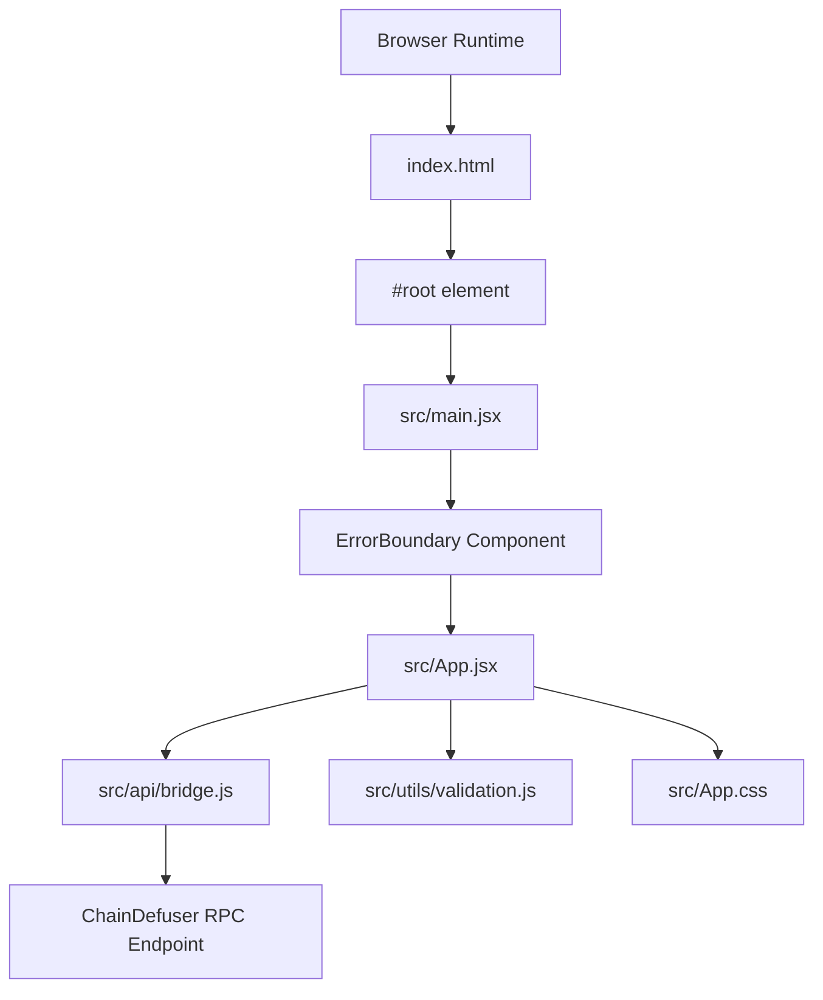
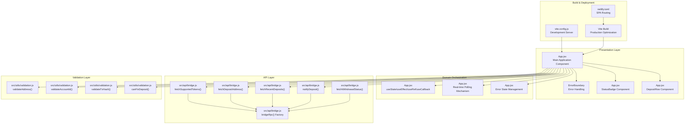
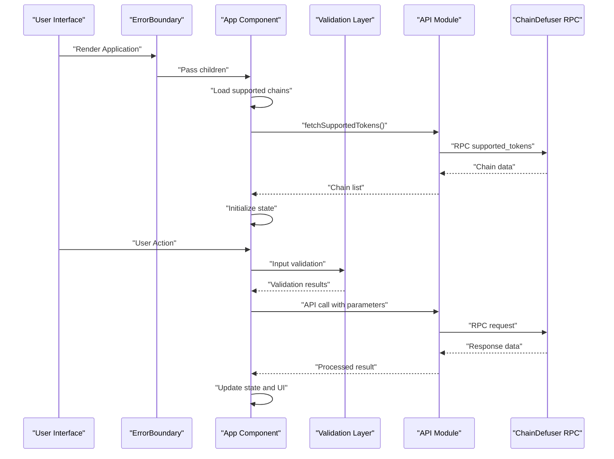
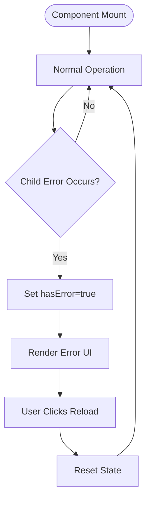
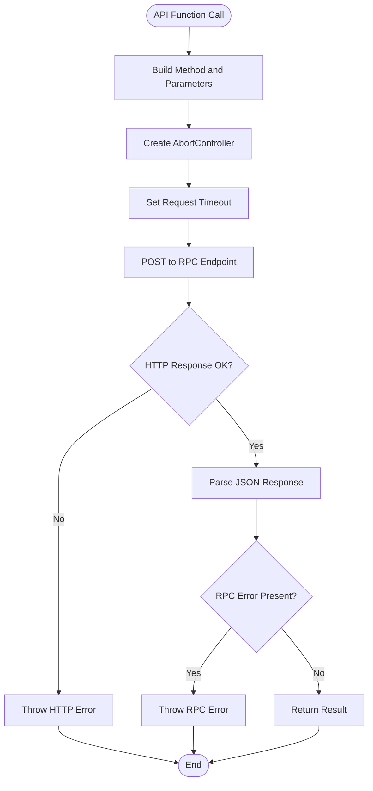
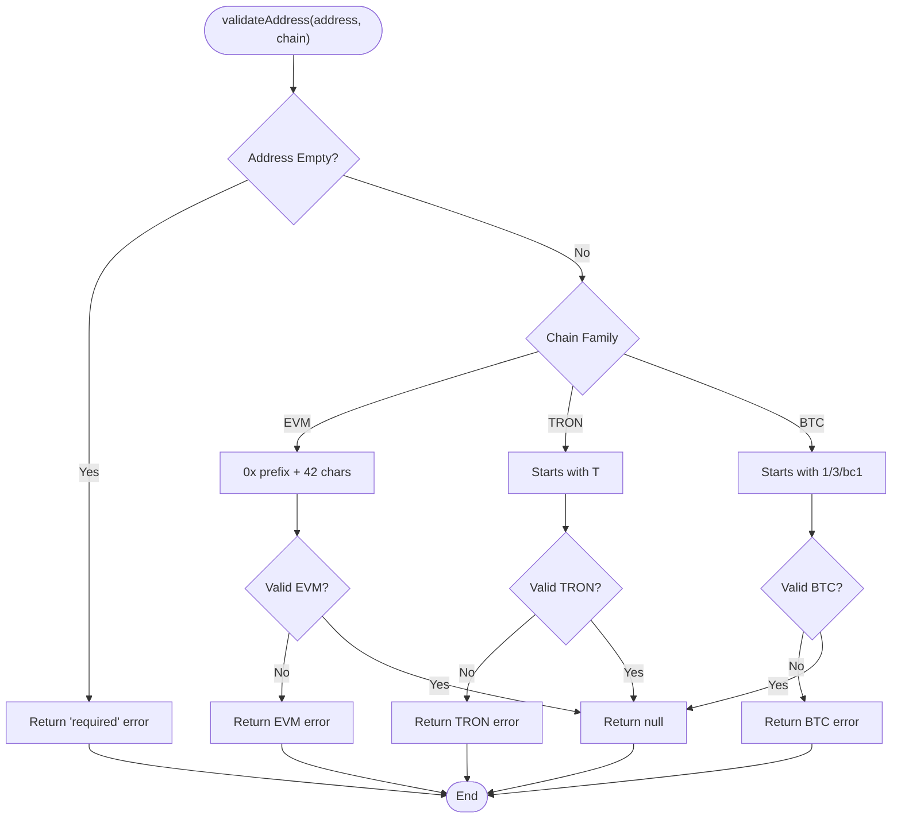
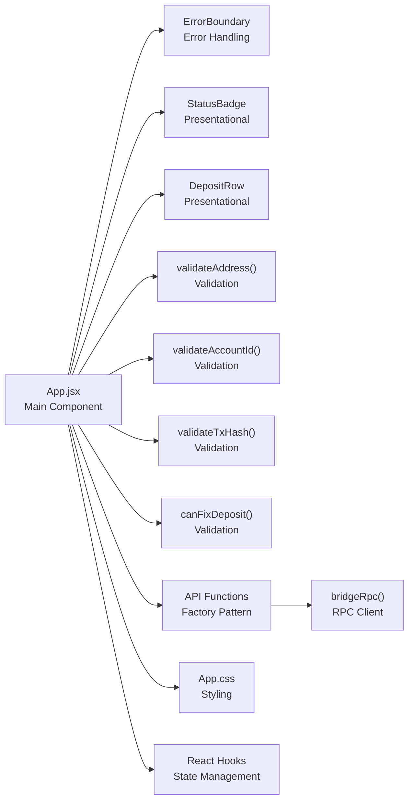
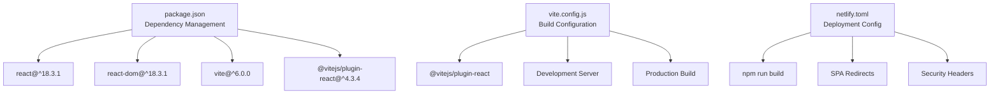

# Technical Architecture

<cite>
**Referenced Files in This Document**
- [src/App.jsx](file://src/App.jsx)
- [src/main.jsx](file://src/main.jsx)
- [src/api/bridge.js](file://src/api/bridge.js)
- [src/utils/validation.js](file://src/utils/validation.js)
- [src/App.css](file://src/App.css)
- [index.html](file://index.html)
- [package.json](file://package.json)
- [vite.config.js](file://vite.config.js)
- [netlify.toml](file://netlify.toml)
</cite>

## Update Summary
**Changes Made**
- Updated to reflect modern Vite build system integration
- Enhanced component architecture documentation with ErrorBoundary pattern
- Added comprehensive hook-driven state management analysis
- Documented professional development practices and SPA routing
- Updated build configuration and deployment pipeline documentation

## Table of Contents
1. [Introduction](#introduction)
2. [Project Structure](#project-structure)
3. [Core Components](#core-components)
4. [Architecture Overview](#architecture-overview)
5. [Detailed Component Analysis](#detailed-component-analysis)
6. [Dependency Analysis](#dependency-analysis)
7. [Performance Considerations](#performance-considerations)
8. [Troubleshooting Guide](#troubleshooting-guide)
9. [Conclusion](#conclusion)

## Introduction
This document describes the technical architecture of Bridge Fixer, a modern React-based single-page application designed to help users recover bridged deposits through a ChainDefuser service. The system follows a clean separation of concerns with professional development practices:

- **Modern Build System**: Vite-powered development server with React Fast Refresh and production builds
- **Component-Based Architecture**: React functional components with hook-driven state management
- **Professional Error Handling**: ErrorBoundary pattern for graceful error recovery
- **API Layer Pattern**: Factory-style RPC communication with ChainDefuser service
- **Validation Utilities**: Comprehensive multi-chain address format validation
- **SPA Routing**: Netlify-based deployment with client-side routing support

The application implements observable patterns for real-time polling, factory-like API functions for RPC calls, and follows React best practices with proper state management and lifecycle handling.

## Project Structure
The project is organized into a modern, scalable architecture with clear separation of concerns:

**Diagram sources**
- [index.html:1-14](file://index.html#L1-L14)
- [src/main.jsx:1-13](file://src/main.jsx#L1-L13)
- [src/App.jsx:458-489](file://src/App.jsx#L458-L489)
- [src/App.jsx:97-456](file://src/App.jsx#L97-L456)
- [src/api/bridge.js:1-86](file://src/api/bridge.js#L1-L86)
- [src/utils/validation.js:1-49](file://src/utils/validation.js#L1-L49)
- [src/App.css:1-309](file://src/App.css#L1-L309)

**Section sources**
- [index.html:1-14](file://index.html#L1-L14)
- [src/main.jsx:1-13](file://src/main.jsx#L1-L13)
- [src/App.jsx:97-456](file://src/App.jsx#L97-L456)
- [src/api/bridge.js:1-86](file://src/api/bridge.js#L1-L86)
- [src/utils/validation.js:1-49](file://src/utils/validation.js#L1-L49)
- [src/App.css:1-309](file://src/App.css#L1-L309)
- [package.json:1-21](file://package.json#L1-L21)
- [vite.config.js:1-7](file://vite.config.js#L1-L7)
- [netlify.toml:1-16](file://netlify.toml#L1-L16)

## Core Components

### Application Architecture
- **App Component**: Central orchestrator managing form state, loading states, error/success messaging, and real-time polling. Renders child components for status badges and deposit rows, exposing action handlers for fetching addresses, checking deposits, and fixing deposits.
- **ErrorBoundary**: Professional error handling component that catches runtime errors and provides graceful degradation
- **API Module**: Factory-style RPC client providing named functions for supported tokens, deposit address, recent deposits, deposit notifications, and withdrawal status
- **Validation Utilities**: Chain-aware address validation, account ID validation, transaction hash validation, and predicates for determining fix eligibility
- **UI Components**: Presentational components for status badges and individual deposit rows with comprehensive styling

### Key Architectural Characteristics
- **Hook-Driven State Management**: Extensive use of useState, useEffect, useRef, and useCallback for local state, lifecycle management, timers, and memoization
- **Single-Page Application**: SPA routing handled by Netlify's redirect rules to serve index.html for all routes
- **Modern Build Pipeline**: Vite-based development server with React Fast Refresh and optimized production builds
- **Professional Dependencies**: React 18.3.1 with concurrent features, React DOM for rendering, and minimal external dependencies

**Section sources**
- [src/App.jsx:97-456](file://src/App.jsx#L97-L456)
- [src/App.jsx:458-489](file://src/App.jsx#L458-L489)
- [src/api/bridge.js:6-86](file://src/api/bridge.js#L6-L86)
- [src/utils/validation.js:1-49](file://src/utils/validation.js#L1-L49)

## Architecture Overview
The system follows a layered architecture with modern React patterns and professional development practices:

**Diagram sources**
- [src/App.jsx:97-456](file://src/App.jsx#L97-L456)
- [src/App.jsx:458-489](file://src/App.jsx#L458-L489)
- [src/api/bridge.js:6-86](file://src/api/bridge.js#L6-L86)
- [src/utils/validation.js:1-49](file://src/utils/validation.js#L1-L49)
- [vite.config.js:1-7](file://vite.config.js#L1-L7)
- [netlify.toml:12-16](file://netlify.toml#L12-L16)

## Detailed Component Analysis

### Modern React Application Architecture
The App component serves as a comprehensive React functional component that demonstrates modern React patterns:

- **State Management**: Multiple state variables for different UI contexts (chains, deposits, loading states, errors)
- **Lifecycle Management**: useEffect for initialization and cleanup, useCallback for stable function references
- **Error Boundary Integration**: Professional error handling with graceful fallback UI
- **Form Handling**: Controlled components with validation and conditional rendering
- **Conditional Logic**: Dynamic form fields based on chain selection (NEAR sender account, Stellar memo)

**Diagram sources**
- [src/App.jsx:124-151](file://src/App.jsx#L124-L151)
- [src/App.jsx:198-273](file://src/App.jsx#L198-L273)
- [src/api/bridge.js:40-85](file://src/api/bridge.js#L40-L85)
- [src/utils/validation.js:1-49](file://src/utils/validation.js#L1-L49)

**Section sources**
- [src/App.jsx:97-151](file://src/App.jsx#L97-L151)
- [src/App.jsx:153-196](file://src/App.jsx#L153-L196)
- [src/App.jsx:198-273](file://src/App.jsx#L198-L273)

### Advanced Error Handling Pattern
The ErrorBoundary component implements professional error handling:

- **Class Component Pattern**: Traditional React class component with lifecycle methods
- **Error Detection**: Static method to detect errors in child component trees
- **Graceful Degradation**: User-friendly error message with reload functionality
- **Integration**: Wrapped around the main App component for comprehensive coverage

**Diagram sources**
- [src/App.jsx:458-489](file://src/App.jsx#L458-L489)

**Section sources**
- [src/App.jsx:458-489](file://src/App.jsx#L458-L489)

### API Layer Pattern (Factory-Style RPC Communication)
The API module implements a sophisticated factory-style RPC client:

- **Shared RPC Client**: bridgeRpc() function handles JSON-RPC envelopes, request IDs, and error propagation
- **Timeout Management**: Built-in request timeout with AbortController for network reliability
- **Method-Specific Wrappers**: Named functions with parameter shaping for different RPC endpoints
- **Error Handling**: Comprehensive error handling for HTTP and RPC errors

**Diagram sources**
- [src/api/bridge.js:6-38](file://src/api/bridge.js#L6-L38)

**Section sources**
- [src/api/bridge.js:6-86](file://src/api/bridge.js#L6-L86)

### Validation Utilities (Multi-chain Address Formats)
The validation module provides comprehensive input validation:

- **Chain-Aware Validation**: Different validation rules for EVM, TRON, and BTC addresses
- **Input Sanitization**: Trim and validation of user inputs
- **Predicate Functions**: canFixDeposit() determines eligibility for deposit fixing
- **Comprehensive Coverage**: Validates account IDs, transaction hashes, and chain-specific addresses

**Diagram sources**
- [src/utils/validation.js:1-30](file://src/utils/validation.js#L1-L30)

**Section sources**
- [src/utils/validation.js:1-49](file://src/utils/validation.js#L1-L49)

### Component Relationships and Data Flow
The application demonstrates sophisticated component relationships and data flow patterns:

**Diagram sources**
- [src/App.jsx:60-95](file://src/App.jsx#L60-L95)
- [src/App.jsx:97-456](file://src/App.jsx#L97-L456)
- [src/api/bridge.js:6-86](file://src/api/bridge.js#L6-L86)
- [src/utils/validation.js:1-49](file://src/utils/validation.js#L1-L49)
- [src/App.css:140-236](file://src/App.css#L140-L236)

**Section sources**
- [src/App.jsx:60-95](file://src/App.jsx#L60-L95)
- [src/App.jsx:97-456](file://src/App.jsx#L97-L456)
- [src/App.css:140-236](file://src/App.css#L140-L236)

## Dependency Analysis
The project follows modern dependency management practices:

### Runtime Dependencies
- **React 18.3.1**: Latest React with concurrent features and improved performance
- **React DOM 18.3.1**: DOM rendering capabilities for React applications
- **ES Modules**: Native ES module support for modern JavaScript features

### Development Dependencies  
- **Vite 6.0.0**: Next-generation frontend tooling with fast dev server and optimized builds
- **@vitejs/plugin-react 4.3.4**: Official React plugin for Vite with automatic JSX transform
- **Fast Refresh**: Hot module replacement for instant feedback during development

### Build and Deployment Pipeline
- **SPA Routing**: Netlify redirects all routes to index.html for client-side routing
- **Security Headers**: X-Frame-Options, X-Content-Type-Options, and Referrer-Policy headers
- **Production Optimization**: Vite's production build with tree-shaking and minification

**Diagram sources**
- [package.json:11-19](file://package.json#L11-L19)
- [vite.config.js:1-7](file://vite.config.js#L1-L7)
- [netlify.toml:1-16](file://netlify.toml#L1-L16)

**Section sources**
- [package.json:1-21](file://package.json#L1-L21)
- [vite.config.js:1-7](file://vite.config.js#L1-L7)
- [netlify.toml:1-16](file://netlify.toml#L1-L16)

## Performance Considerations

### Modern Build System Benefits
- **Vite Development Server**: Lightning-fast hot module replacement and instant server start
- **Tree Shaking**: Automatic dead code elimination in production builds
- **Code Splitting**: Optimized bundle splitting for better loading performance
- **ES Module Support**: Native ES modules for better optimization

### Application-Level Optimizations
- **Polling Management**: Configurable intervals with timeout protection to prevent resource exhaustion
- **Memoization**: useCallback for stable function references in event handlers
- **Conditional Rendering**: Dynamic component rendering based on chain selection reduces unnecessary DOM nodes
- **State Optimization**: Separate state variables prevent unnecessary re-renders across different UI sections

### Network Performance
- **Request Timeouts**: 30-second timeout prevents hanging requests
- **AbortController**: Proper cancellation of network requests on component unmount
- **Error Boundaries**: Prevent cascading failures and improve user experience

## Troubleshooting Guide

### Common Issues and Solutions

#### Build and Development Issues
- **Vite Dev Server Problems**: Ensure Node.js version compatibility and check port availability
- **Hot Reload Not Working**: Verify @vitejs/plugin-react installation and check browser console for errors
- **Import Errors**: Ensure ES module syntax and proper file extensions (.jsx)

#### Runtime Application Issues
- **RPC Errors**: The bridgeRpc() function throws on HTTP or RPC errors; implement proper error handling in calling components
- **Validation Failures**: Address, account ID, and transaction hash validations return specific errors; display user-friendly messages
- **Polling Timeouts**: If polling exceeds 60 seconds, automatically stops and shows error message; users can retry manually
- **SPA Routing Issues**: Ensure Netlify redirects are configured correctly so deep links render index.html

#### Error Boundary Behavior
- **Application Crashes**: ErrorBoundary component catches errors and displays friendly error message with reload option
- **State Reset**: On reload, application state is reset to initial values

**Section sources**
- [src/api/bridge.js:27-38](file://src/api/bridge.js#L27-L38)
- [src/App.jsx:172-196](file://src/App.jsx#L172-L196)
- [src/App.jsx:116-118](file://src/App.jsx#L116-L118)
- [netlify.toml:12-16](file://netlify.toml#L12-L16)
- [src/App.jsx:458-489](file://src/App.jsx#L458-L489)

## Conclusion
Bridge Fixer exemplifies modern React application architecture with professional development practices:

### Technical Excellence
- **Modern Build System**: Vite provides fast development experience with optimized production builds
- **Clean Architecture**: Clear separation of concerns between presentation, domain, API, and validation layers
- **Professional Error Handling**: ErrorBoundary pattern ensures graceful error recovery
- **Hook-Driven State Management**: Comprehensive use of React hooks for optimal state management
- **SPA Best Practices**: Proper routing configuration with Netlify for seamless navigation

### Scalability and Maintainability
- **Component Modularity**: Well-defined components with single responsibilities
- **API Abstraction**: Factory pattern for RPC communication simplifies API usage
- **Validation Layer**: Comprehensive input validation ensures data integrity
- **Performance Optimization**: Modern build tools and React best practices for optimal performance

### Developer Experience
- **Fast Development**: Vite's hot module replacement provides instant feedback
- **Type Safety**: ES modules and modern JavaScript features improve code quality
- **Professional Standards**: Error boundaries, proper error handling, and security headers demonstrate enterprise-grade development practices

This architecture enables maintainability, testability, and scalability while providing a responsive, user-friendly interface for deposit recovery operations.