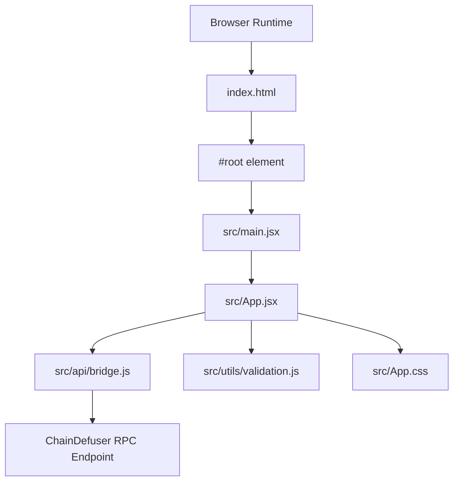
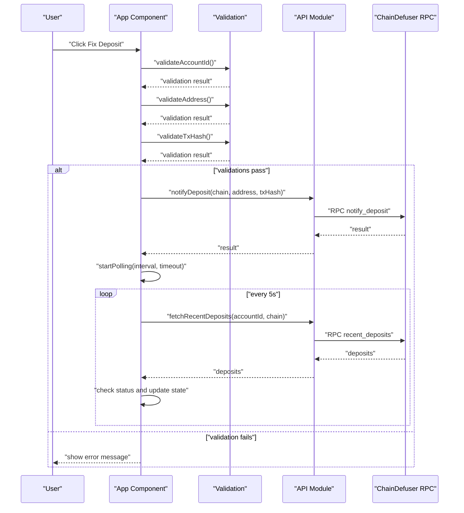
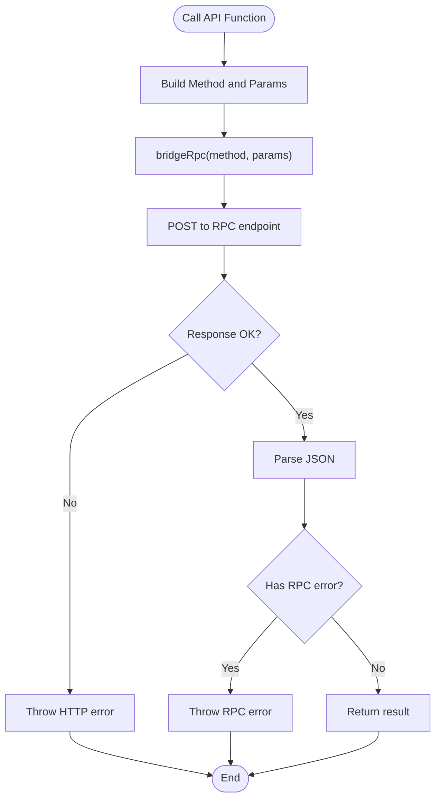
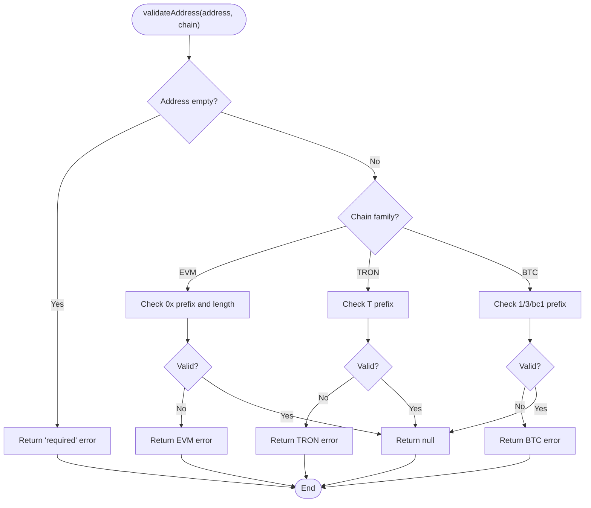
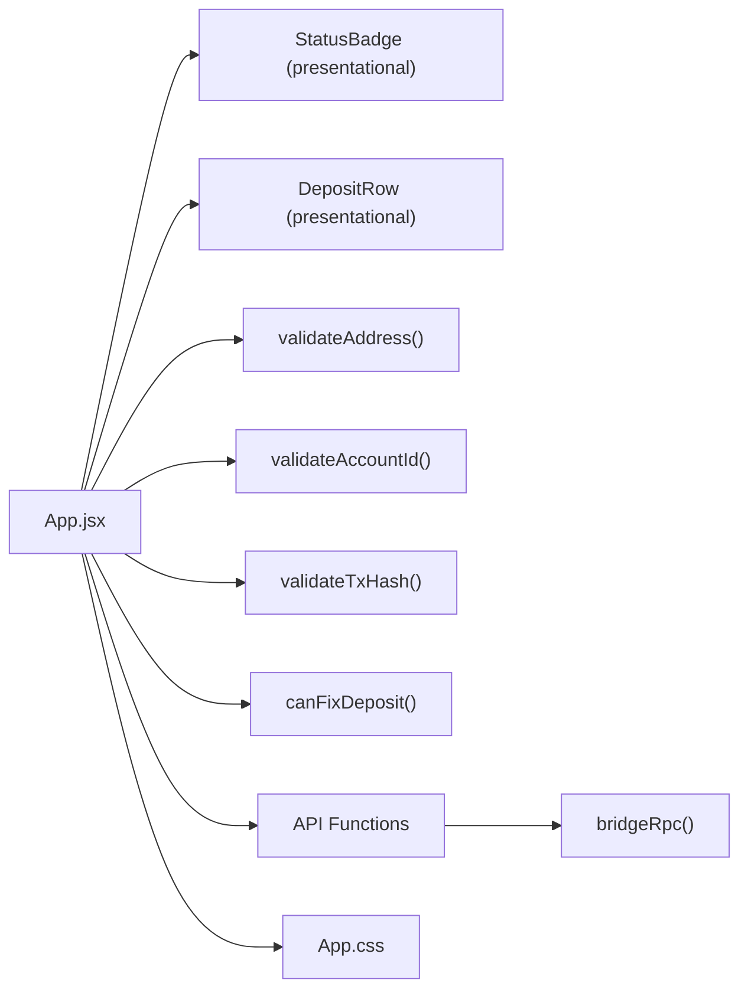
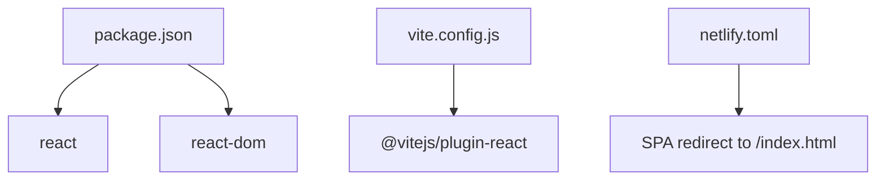

# Technical Architecture

<cite>
**Referenced Files in This Document**
- [src/App.jsx](file://src/App.jsx)
- [src/main.jsx](file://src/main.jsx)
- [src/api/bridge.js](file://src/api/bridge.js)
- [src/utils/validation.js](file://src/utils/validation.js)
- [src/App.css](file://src/App.css)
- [index.html](file://index.html)
- [package.json](file://package.json)
- [vite.config.js](file://vite.config.js)
- [netlify.toml](file://netlify.toml)
</cite>

## Table of Contents
1. [Introduction](#introduction)
2. [Project Structure](#project-structure)
3. [Core Components](#core-components)
4. [Architecture Overview](#architecture-overview)
5. [Detailed Component Analysis](#detailed-component-analysis)
6. [Dependency Analysis](#dependency-analysis)
7. [Performance Considerations](#performance-considerations)
8. [Troubleshooting Guide](#troubleshooting-guide)
9. [Conclusion](#conclusion)

## Introduction
This document describes the technical architecture of Bridge Fixer, a React-based single-page application designed to help users recover bridged deposits through a ChainDefuser service. The system follows a clean separation of concerns:
- UI components driven by React hooks for state management
- An API layer that encapsulates RPC communication with ChainDefuser
- Validation utilities for multi-chain address formats and input sanitization
- A minimal build and deployment pipeline using Vite and Netlify

The application implements observable patterns for real-time polling, factory-like API functions for RPC calls, and a straightforward routing strategy suitable for a SPA.

## Project Structure
The project is organized into a small, focused set of modules:
- Entry point initializes the React root and mounts the App component
- App component orchestrates UI, state, and orchestration of API calls
- API module encapsulates RPC communication with ChainDefuser
- Validation utilities provide cross-chain address validation and status checks
- Styles define responsive UI and status indicators
- Build and deployment configuration support SPA routing and static hosting

**Diagram sources**
- [index.html:1-13](file://index.html#L1-L13)
- [src/main.jsx:1-11](file://src/main.jsx#L1-L11)
- [src/App.jsx:1-373](file://src/App.jsx#L1-L373)
- [src/api/bridge.js:1-72](file://src/api/bridge.js#L1-L72)
- [src/utils/validation.js:1-49](file://src/utils/validation.js#L1-L49)
- [src/App.css:1-303](file://src/App.css#L1-L303)

**Section sources**
- [index.html:1-13](file://index.html#L1-L13)
- [src/main.jsx:1-11](file://src/main.jsx#L1-L11)
- [src/App.jsx:1-373](file://src/App.jsx#L1-L373)
- [src/api/bridge.js:1-72](file://src/api/bridge.js#L1-L72)
- [src/utils/validation.js:1-49](file://src/utils/validation.js#L1-L49)
- [src/App.css:1-303](file://src/App.css#L1-L303)
- [package.json:1-20](file://package.json#L1-L20)
- [vite.config.js:1-7](file://vite.config.js#L1-L7)
- [netlify.toml:1-9](file://netlify.toml#L1-L9)

## Core Components
- App component: Central orchestrator managing form state, loading states, error/success messaging, and real-time polling. It renders child components for status badges and deposit rows, and exposes action handlers for fetching addresses, checking deposits, and fixing deposits.
- API module: Provides a factory-style RPC client and named functions for supported tokens, deposit address, recent deposits, deposit notifications, and withdrawal status.
- Validation utilities: Offer chain-aware address validation, account ID validation, transaction hash validation, and a predicate to determine whether a deposit can be fixed based on status.
- UI helpers: Presentational components for status badges and individual deposit rows, styled via App.css.

Key architectural characteristics:
- Hook-driven state management: useState, useEffect, useRef, and useCallback are used extensively for local state, lifecycle, timers, and memoization.
- Single-page application: SPA routing is handled by Netlify’s redirect rule to serve index.html for all routes.
- Minimal external dependencies: Only React and ReactDOM are required; build tooling is Vite with React plugin.

**Section sources**
- [src/App.jsx:53-373](file://src/App.jsx#L53-L373)
- [src/api/bridge.js:5-72](file://src/api/bridge.js#L5-L72)
- [src/utils/validation.js:1-49](file://src/utils/validation.js#L1-L49)

## Architecture Overview
The system follows a layered architecture:
- Presentation Layer: App component and presentational components
- Domain Orchestration: App component coordinates user actions and manages polling
- API Layer: RPC client and named API functions
- Validation Layer: Utility functions for input sanitization
- Persistence/State: React hooks manage ephemeral UI state

```mermaid
graph TB
subgraph "Presentation Layer"
AppComp["App.jsx<br/>App component"]
StatusBadge["App.jsx<br/>StatusBadge component"]
DepositRow["App.jsx<br/>DepositRow component"]
end
subgraph "Domain Orchestration"
AppHooks["App.jsx<br/>useState/useEffect/useRef/useCallback"]
Polling["App.jsx<br/>Real-time polling"]
end
subgraph "API Layer"
RPCClient["src/api/bridge.js<br/>bridgeRpc()"]
APISupport["src/api/bridge.js<br/>fetchSupportedTokens()"]
APIAddr["src/api/bridge.js<br/>fetchDepositAddress()"]
APIDeposits["src/api/bridge.js<br/>fetchRecentDeposits()"]
APINotify["src/api/bridge.js<br/>notifyDeposit()"]
APIWithdraw["src/api/bridge.js<br/>fetchWithdrawalStatus()"]
end
subgraph "Validation Layer"
ValAddr["src/utils/validation.js<br/>validateAddress()"]
ValAcc["src/utils/validation.js<br/>validateAccountId()"]
ValTx["src/utils/validation.js<br/>validateTxHash()"]
CanFix["src/utils/validation.js<br/>canFixDeposit()"]
end
AppComp --> AppHooks
AppComp --> StatusBadge
AppComp --> DepositRow
AppComp --> Polling
AppComp --> APISupport
AppComp --> APIAddr
AppComp --> APIDeposits
AppComp --> APINotify
AppComp --> ValAddr
AppComp --> ValAcc
AppComp --> ValTx
AppComp --> CanFix
APISupport --> RPCClient
APIAddr --> RPCClient
APIDeposits --> RPCClient
APINotify --> RPCClient
APIWithdraw --> RPCClient
```

**Diagram sources**
- [src/App.jsx:18-51](file://src/App.jsx#L18-L51)
- [src/App.jsx:53-373](file://src/App.jsx#L53-L373)
- [src/api/bridge.js:5-72](file://src/api/bridge.js#L5-L72)
- [src/utils/validation.js:1-49](file://src/utils/validation.js#L1-L49)

## Detailed Component Analysis

### App Component and State Management
The App component is a React functional component that:
- Declares and manages multiple pieces of state for forms, loading, errors, success messages, and polling
- Implements lifecycle hooks to load supported chains on mount and to clean up polling timers on unmount
- Encapsulates three primary workflows:
  - Fetch deposit address
  - Check recent deposits
  - Fix deposit by notifying ChainDefuser and starting polling
- Uses a polling mechanism with configurable interval and timeout to observe deposit status changes

**Diagram sources**
- [src/App.jsx:148-216](file://src/App.jsx#L148-L216)
- [src/api/bridge.js:59-65](file://src/api/bridge.js#L59-L65)
- [src/utils/validation.js:32-44](file://src/utils/validation.js#L32-L44)

**Section sources**
- [src/App.jsx:53-114](file://src/App.jsx#L53-L114)
- [src/App.jsx:116-146](file://src/App.jsx#L116-L146)
- [src/App.jsx:148-216](file://src/App.jsx#L148-L216)

### API Layer Pattern (RPC Communication)
The API module implements a factory-like RPC client:
- A shared RPC client function handles JSON-RPC envelopes, request IDs, and error propagation
- Named functions wrap the RPC client with method-specific parameter shaping
- Exposes functions for supported tokens, deposit address, recent deposits, deposit notifications, and withdrawal status

**Diagram sources**
- [src/api/bridge.js:5-31](file://src/api/bridge.js#L5-L31)

**Section sources**
- [src/api/bridge.js:5-72](file://src/api/bridge.js#L5-L72)

### Validation Utilities (Multi-chain Address Formats)
The validation module enforces chain-aware input rules:
- Address validation supports EVM (checksummed), TRON, and BTC (legacy and Bech32) prefixes
- Account ID and transaction hash validations ensure non-empty inputs
- A predicate determines whether a deposit can be fixed based on its status

**Diagram sources**
- [src/utils/validation.js:1-30](file://src/utils/validation.js#L1-L30)

**Section sources**
- [src/utils/validation.js:1-49](file://src/utils/validation.js#L1-L49)

### Component Relationships and Data Flow
- App component composes presentational components (StatusBadge, DepositRow) and orchestrates API calls
- Data flows from user input through validation to API functions, then updates UI state and polling
- StatusBadge reflects normalized status values; DepositRow renders tabular deposit entries
- CSS defines styles for cards, buttons, status badges, and responsive layout

**Diagram sources**
- [src/App.jsx:18-51](file://src/App.jsx#L18-L51)
- [src/App.jsx:30-51](file://src/App.jsx#L30-L51)
- [src/App.jsx:53-373](file://src/App.jsx#L53-L373)
- [src/api/bridge.js:5-72](file://src/api/bridge.js#L5-L72)
- [src/utils/validation.js:1-49](file://src/utils/validation.js#L1-L49)
- [src/App.css:140-236](file://src/App.css#L140-L236)

**Section sources**
- [src/App.jsx:18-51](file://src/App.jsx#L18-L51)
- [src/App.jsx:30-51](file://src/App.jsx#L30-L51)
- [src/App.jsx:53-373](file://src/App.jsx#L53-L373)
- [src/App.css:140-236](file://src/App.css#L140-L236)

## Dependency Analysis
- Runtime dependencies: React and ReactDOM
- Build dependencies: Vite and @vitejs/plugin-react
- SPA routing: Netlify redirects all routes to index.html

**Diagram sources**
- [package.json:11-18](file://package.json#L11-L18)
- [vite.config.js:4-6](file://vite.config.js#L4-L6)
- [netlify.toml:5-8](file://netlify.toml#L5-L8)

**Section sources**
- [package.json:1-20](file://package.json#L1-L20)
- [vite.config.js:1-7](file://vite.config.js#L1-L7)
- [netlify.toml:1-9](file://netlify.toml#L1-L9)

## Performance Considerations
- Polling cadence and timeout: The polling interval is set to a fixed duration with a timeout to prevent indefinite loops. Consider making these configurable via environment variables or settings for flexibility.
- Debouncing and caching: For frequent user interactions (e.g., typing in inputs), consider debouncing API calls to reduce network overhead.
- Rendering optimization: Memoize derived values and use stable callbacks to minimize re-renders. The existing useCallback usage for stop/start polling is a good pattern.
- Network reliability: The API layer throws on HTTP or RPC errors; ensure callers handle these gracefully to avoid blocking the UI.

## Troubleshooting Guide
Common issues and remedies:
- RPC errors: The RPC client throws on HTTP errors or RPC errors; catch and surface user-friendly messages in the App component.
- Validation failures: Address, account ID, and transaction hash validations return specific errors; display these messages to guide users.
- Polling timeouts: If polling exceeds the configured timeout, the timer is stopped and an error message is shown; users can retry manually.
- SPA routing: Ensure Netlify redirects are configured so deep links render index.html; otherwise, refreshes or direct navigation may fail.

**Section sources**
- [src/api/bridge.js:20-31](file://src/api/bridge.js#L20-L31)
- [src/App.jsx:103-114](file://src/App.jsx#L103-L114)
- [src/App.jsx:121-145](file://src/App.jsx#L121-L145)
- [netlify.toml:5-8](file://netlify.toml#L5-L8)

## Conclusion
Bridge Fixer employs a clean, modular architecture:
- React hooks drive state and lifecycle management
- A factory-style RPC client encapsulates ChainDefuser communication
- Validation utilities enforce multi-chain address correctness
- A SPA design with Netlify redirects ensures seamless navigation
- The App component orchestrates user workflows, polling, and UI updates

This structure enables maintainability, testability, and scalability while keeping the UI responsive and user-friendly.