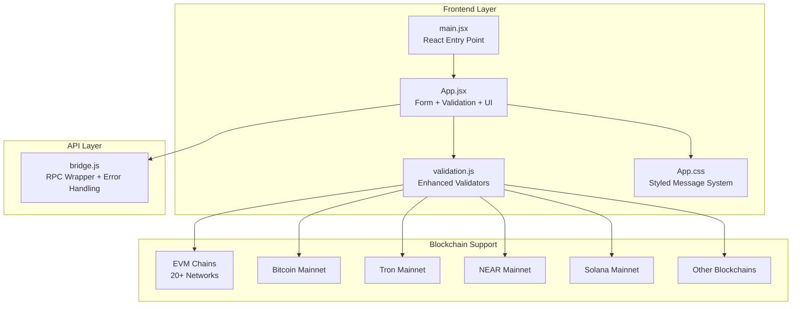
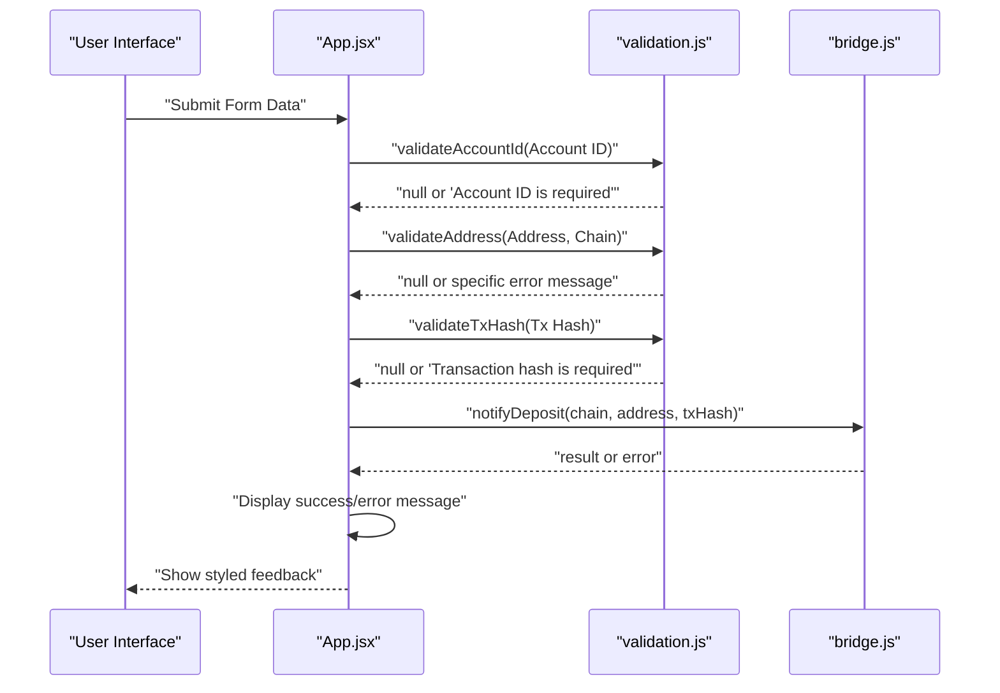
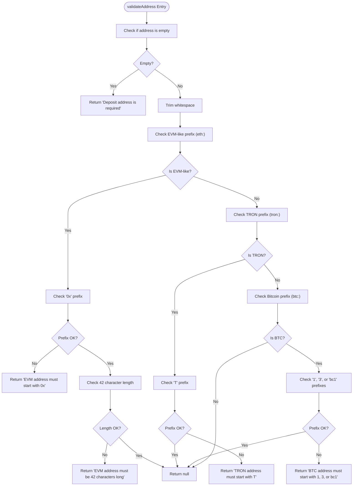
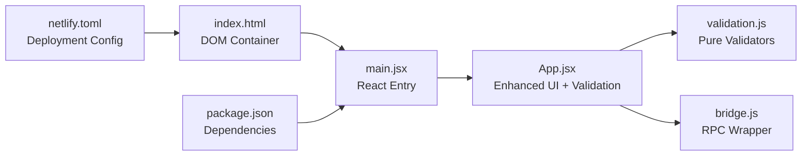

# Validation Utilities

<cite>
**Referenced Files in This Document**
- [validation.js](file://src/utils/validation.js)
- [App.jsx](file://src/App.jsx)
- [bridge.js](file://src/api/bridge.js)
- [main.jsx](file://src/main.jsx)
- [App.css](file://src/App.css)
- [package.json](file://package.json)
- [index.html](file://index.html)
- [netlify.toml](file://netlify.toml)
</cite>

## Update Summary
**Changes Made**
- Enhanced validation utilities with improved multi-chain address validation logic
- Added comprehensive error handling with descriptive error messages
- Expanded chain support to include 20+ blockchain networks
- Improved user feedback system with styled message blocks
- Strengthened input validation with stricter format requirements

## Table of Contents
1. [Introduction](#introduction)
2. [Project Structure](#project-structure)
3. [Core Components](#core-components)
4. [Architecture Overview](#architecture-overview)
5. [Detailed Component Analysis](#detailed-component-analysis)
6. [Dependency Analysis](#dependency-analysis)
7. [Performance Considerations](#performance-considerations)
8. [Troubleshooting Guide](#troubleshooting-guide)
9. [Conclusion](#conclusion)
10. [Appendices](#appendices)

## Introduction
This document explains the enhanced input validation system used by Bridge Fixer. The validation utilities have been significantly improved to provide robust multi-chain address validation, strict input validation, and comprehensive error handling. The system now supports 20+ blockchain networks including Ethereum, Bitcoin, Tron, NEAR, Solana, and others.

The validation system consists of four key validators:
- **validateAddress()**: Validates multi-chain addresses with chain-specific format rules for EVM-compatible chains, TRON, and Bitcoin
- **validateAccountId()**: Validates NEAR account identifiers with strict presence checking
- **validateTxHash()**: Validates transaction hashes with comprehensive error handling
- **canFixDeposit()**: Determines whether a deposit can be fixed based on its status

The system integrates seamlessly with the form validation and user feedback system, providing immediate error messages and enabling/disabling actions based on validation results.

## Project Structure
The validation utilities are organized in a dedicated module and are consumed by the main application component. The application integrates with a remote bridge service via an RPC wrapper, with comprehensive error handling throughout the validation pipeline.



**Diagram sources**
- [validation.js:1-49](file://src/utils/validation.js#L1-L49)
- [App.jsx:1-489](file://src/App.jsx#L1-L489)
- [bridge.js:1-86](file://src/api/bridge.js#L1-L86)
- [main.jsx:1-13](file://src/main.jsx#L1-L13)
- [App.css:212-230](file://src/App.css#L212-L230)

**Section sources**
- [validation.js:1-49](file://src/utils/validation.js#L1-L49)
- [App.jsx:1-489](file://src/App.jsx#L1-L489)
- [bridge.js:1-86](file://src/api/bridge.js#L1-L86)
- [main.jsx:1-13](file://src/main.jsx#L1-L13)
- [App.css:1-309](file://src/App.css#L1-L309)
- [package.json:1-21](file://package.json#L1-L21)
- [index.html:1-14](file://index.html#L1-L14)
- [netlify.toml:1-16](file://netlify.toml#L1-L16)

## Core Components

### Enhanced Validation Functions

#### validateAddress(address, chain)
**Purpose**: Enforce chain-specific address format rules with comprehensive error handling

**Behavior**:
- **Strict Presence Checking**: Rejects empty or whitespace-only inputs with descriptive error messages
- **Multi-chain Support**: Handles EVM-compatible chains, TRON, and Bitcoin with specific validation rules
- **Comprehensive Error Messages**: Provides detailed feedback for different validation failures
- **Chain Detection**: Uses chain prefix checks to route to appropriate validation logic

**Chain-specific Validation Rules**:
- **EVM-compatible chains** (`eth:*`):
  - Must start with '0x' prefix
  - Must be exactly 42 characters long
  - Validates Ethereum-style hex addresses
- **TRON chains** (`tron:*`):
  - Must start with 'T' character
  - Validates Tron address format
- **Bitcoin chains** (`btc:*`):
  - Must start with '1', '3', or 'bc1' prefixes
  - Supports legacy and SegWit Bitcoin addresses

**Return Values**:
- `null`: Address is valid for the specified chain
- `string`: Descriptive error message explaining validation failure

#### validateAccountId(accountId)
**Purpose**: Validates NEAR account identifiers with strict presence checking

**Behavior**:
- **Presence Validation**: Ensures Account ID is provided and not empty
- **Whitespace Handling**: Trims input before validation
- **Comprehensive Error Messages**: Provides clear feedback for missing inputs

**Return Values**:
- `null`: Account ID is present and valid
- `string`: Error message indicating missing Account ID

#### validateTxHash(txHash)
**Purpose**: Validates transaction hashes with strict input validation

**Behavior**:
- **Presence Validation**: Ensures Transaction Hash is provided
- **Whitespace Handling**: Trims input before validation
- **Consistent Error Handling**: Provides uniform error messaging

**Return Values**:
- `null`: Transaction hash is present and valid
- `string`: Error message indicating missing transaction hash

#### canFixDeposit(status)
**Purpose**: Determines whether a deposit can be fixed based on its current status

**Behavior**:
- **Status Evaluation**: Returns boolean based on deposit status
- **Fixable States**: Allows fixing for 'NOT_FOUND' and 'FAILED' statuses
- **Prevents Redundant Operations**: Blocks fixing for completed or pending deposits

**Return Values**:
- `true`: Deposit can be fixed (not found or failed)
- `false`: Deposit cannot be fixed (already completed/pending)

**Section sources**
- [validation.js:1-49](file://src/utils/validation.js#L1-L49)
- [App.jsx:18-489](file://src/App.jsx#L18-L489)

## Architecture Overview
The enhanced validation pipeline provides immediate feedback and prevents invalid operations. The system uses a layered approach with local validation before network requests, comprehensive error handling, and user-friendly feedback.



**Diagram sources**
- [App.jsx:244-273](file://src/App.jsx#L244-L273)
- [validation.js:1-49](file://src/utils/validation.js#L1-L49)
- [bridge.js:66-79](file://src/api/bridge.js#L66-L79)

## Detailed Component Analysis

### Enhanced Multi-chain Address Validation

The `validateAddress()` function has been significantly improved to handle complex multi-chain scenarios with comprehensive error handling:

**Validation Flow**:
1. **Input Sanitization**: Trims whitespace and performs presence checks
2. **Chain Detection**: Uses `chain.startsWith()` pattern matching for chain identification
3. **Chain-specific Validation**: Applies appropriate validation rules based on detected chain
4. **Error Reporting**: Returns descriptive error messages for specific validation failures

**Chain Detection Logic**:
```javascript
// EVM-compatible chains (20+ networks)
if (chain.startsWith('eth:')) {
  // Ethereum, BSC, Polygon, Optimism, etc.
}

// Tron networks
if (chain.startsWith('tron:')) {
  // Tron mainnet
}

// Bitcoin networks
if (chain.startsWith('btc:')) {
  // Bitcoin mainnet
}
```

**Error Message Strategy**:
- **Specificity**: Each validation failure returns a targeted error message
- **User Guidance**: Error messages explain exactly what is wrong and how to fix it
- **Consistency**: All validators follow the same pattern of returning null or error messages

**Section sources**
- [validation.js:1-30](file://src/utils/validation.js#L1-L30)
- [App.jsx:18-53](file://src/App.jsx#L18-L53)

### Comprehensive Input Validation System

The validation system has been enhanced with stricter input validation and comprehensive error handling:

**Validation Patterns**:
- **Presence Checks**: All validators check for non-empty inputs
- **Format Validation**: Chain-specific format requirements are enforced
- **Length Validation**: EVM addresses require exact length (42 characters)
- **Prefix Validation**: Addresses must start with required prefixes

**Error Handling Strategy**:
- **Early Exit**: Validation fails fast on first detected issue
- **Descriptive Messages**: Users receive clear guidance on corrections needed
- **Consistent API**: All validators return either null (valid) or string (error)

**Section sources**
- [validation.js:32-44](file://src/utils/validation.js#L32-L44)
- [App.jsx:198-273](file://src/App.jsx#L198-L273)

### Advanced Integration with Form Validation

The enhanced validation system integrates deeply with the React application's form validation and user feedback mechanisms:

**Form Integration Points**:
- **Fetch Address**: Validates Account ID and Chain before fetching addresses
- **Check Deposit**: Validates inputs before querying deposit status
- **Fix Deposit**: Comprehensive validation before attempting deposit fixes
- **Real-time Validation**: Immediate feedback as users type

**User Experience Features**:
- **Button Enablement**: Fix button disabled until all validations pass
- **Conditional Fields**: Chain-specific fields appear only when relevant
- **Status Indicators**: Visual feedback for validation states
- **Error Boundaries**: Application-level error handling

**Section sources**
- [App.jsx:198-273](file://src/App.jsx#L198-L273)
- [App.jsx:281-282](file://src/App.jsx#L281-L282)
- [App.jsx:404](file://src/App.jsx#L404)

### Enhanced Error Handling and User Feedback

The system provides comprehensive error handling and user feedback through styled message blocks:

**Message Types**:
- **Error Messages**: Red background with clear error descriptions
- **Success Messages**: Green background with positive confirmation
- **Hint Messages**: Gray hints for additional guidance
- **Status Messages**: Contextual feedback for deposit status

**Styling System**:
- **CSS Classes**: `.error-message`, `.success-message`, `.hint`
- **Visual Feedback**: Animated polling indicators and status badges
- **Responsive Design**: Mobile-friendly error display
- **Accessibility**: Clear color contrast and readable typography

**Section sources**
- [App.jsx:416-419](file://src/App.jsx#L416-L419)
- [App.css:212-230](file://src/App.css#L212-L230)
- [App.jsx:60-70](file://src/App.jsx#L60-L70)

### Multi-chain Address Format Detection and Validation Logic

The enhanced validator uses sophisticated chain prefix checks with comprehensive validation rules:



**Diagram sources**
- [validation.js:1-30](file://src/utils/validation.js#L1-L30)

**Section sources**
- [validation.js:1-30](file://src/utils/validation.js#L1-L30)

### Integration with Form Validation and User Feedback

The enhanced application component provides comprehensive integration between validation and user feedback:

**Validation Lifecycle**:
1. **User Input**: Form fields capture user input
2. **Immediate Validation**: Validators check input validity
3. **Feedback Display**: Error/success messages are shown
4. **Action Enablement**: Buttons are enabled/disabled based on validation results
5. **Network Operations**: Validated data triggers backend operations

**Advanced Features**:
- **Conditional Rendering**: Chain-specific form fields appear dynamically
- **Real-time Status**: Deposit status is continuously monitored
- **Auto-polling**: Background polling for status updates
- **Timeout Handling**: Graceful handling of long-running operations

**Section sources**
- [App.jsx:198-273](file://src/App.jsx#L198-L273)
- [App.jsx:166-196](file://src/App.jsx#L166-L196)
- [App.jsx:416-419](file://src/App.jsx#L416-L419)

## Dependency Analysis
The enhanced validation system maintains clean separation of concerns with clear dependencies:

**Internal Dependencies**:
- **App.jsx**: Depends on validation.js for input validation
- **App.jsx**: Integrates with bridge.js for RPC operations
- **validation.js**: Pure functions with no external dependencies
- **bridge.js**: Encapsulates network concerns independently

**External Dependencies**:
- **React**: UI framework for form handling and state management
- **CSS**: Styling system for user feedback and visual design
- **Browser APIs**: Fetch API for network operations



**Diagram sources**
- [App.jsx:1-14](file://src/App.jsx#L1-L14)
- [validation.js:1-49](file://src/utils/validation.js#L1-L49)
- [bridge.js:1-86](file://src/api/bridge.js#L1-L86)
- [main.jsx:1-13](file://src/main.jsx#L1-L13)
- [index.html:1-14](file://index.html#L1-L14)
- [package.json:1-21](file://package.json#L1-L21)
- [netlify.toml:1-16](file://netlify.toml#L1-L16)

**Section sources**
- [App.jsx:1-14](file://src/App.jsx#L1-L14)
- [validation.js:1-49](file://src/utils/validation.js#L1-L49)
- [bridge.js:1-86](file://src/api/bridge.js#L1-L86)
- [main.jsx:1-13](file://src/main.jsx#L1-L13)
- [index.html:1-14](file://index.html#L1-L14)
- [package.json:1-21](file://package.json#L1-L21)
- [netlify.toml:1-16](file://netlify.toml#L1-L16)

## Performance Considerations

### Optimization Strategies

**Local Validation Benefits**:
- **Zero Network Calls**: All validation runs client-side, preventing unnecessary API requests
- **Instant Feedback**: Users receive immediate validation results without server round-trips
- **Reduced Server Load**: Prevents redundant validation attempts on the backend

**Memory Management**:
- **Input Caching**: Consider caching validated inputs for the current session
- **State Optimization**: React's efficient re-rendering minimizes DOM updates
- **Event Handling**: Debounced input handlers prevent excessive validation calls

**Scalability Considerations**:
- **Chain Expansion**: Adding new chains requires minimal code changes
- **Validation Extension**: New validation rules can be added without affecting existing logic
- **Performance Monitoring**: Monitor validation performance as chain support grows

**Future Enhancements**:
- **Validation Caching**: Cache validation results keyed by input values
- **Batch Processing**: Handle multiple validation requests efficiently
- **Lazy Loading**: Load chain-specific validation rules on demand

## Troubleshooting Guide

### Common Validation Failures and Solutions

**Input Validation Issues**:
- **Missing Account ID**: Ensure Account ID field is filled before submission
- **Empty Chain Selection**: Select a valid blockchain network from the dropdown
- **Invalid Address Format**: Check that addresses match the expected format for the selected chain
- **Missing Transaction Hash**: Provide a valid transaction hash for the operation

**Chain-specific Issues**:
- **EVM Address Problems**:
  - Verify address starts with '0x' prefix
  - Ensure address is exactly 42 characters long
  - Check that the selected EVM chain matches the address format
- **TRON Address Issues**:
  - Confirm address starts with 'T' character
  - Verify TRON chain is selected for TRON addresses
- **Bitcoin Address Problems**:
  - Ensure address starts with '1', '3', or 'bc1' prefix
  - Verify Bitcoin chain is selected for Bitcoin addresses

**Fix Operation Issues**:
- **Fix Button Disabled**: The fix button is disabled for completed or pending deposits
- **Network Errors**: Check internet connection and retry failed operations
- **Timeout Issues**: Long-running operations may timeout after 60 seconds

**User Interface Problems**:
- **Error Messages Not Visible**: Check browser console for JavaScript errors
- **Form State Issues**: Refresh page to reset form state if validation appears stuck
- **Mobile Responsiveness**: Some features may require desktop browsers for optimal experience

**Debugging Steps**:
1. **Console Inspection**: Open browser developer tools to check for JavaScript errors
2. **Network Monitoring**: Use Network tab to verify API requests are being sent
3. **State Verification**: Check React DevTools to inspect component state
4. **Error Boundaries**: Application includes error boundary for graceful error handling

**Section sources**
- [validation.js:1-49](file://src/utils/validation.js#L1-L49)
- [App.jsx:416-419](file://src/App.jsx#L416-L419)
- [App.jsx:172-195](file://src/App.jsx#L172-L195)

## Conclusion

The enhanced validation utilities in Bridge Fixer provide a robust, extensible foundation for multi-chain input validation. The system has been significantly improved with comprehensive error handling, strict input validation, and seamless integration with the user interface.

**Key Improvements**:
- **Enhanced Multi-chain Support**: 20+ blockchain networks with specific validation rules
- **Comprehensive Error Handling**: Descriptive error messages for all validation failures
- **Improved User Experience**: Real-time feedback and styled message system
- **Extensible Architecture**: Easy addition of new blockchain networks and validation rules
- **Performance Optimization**: Client-side validation prevents unnecessary network calls

The validation system successfully balances strict input validation with user-friendly error messages, providing immediate feedback while preventing invalid operations. The modular design ensures easy maintenance and future expansion as new blockchain networks are added.

## Appendices

### Enhanced Validation Rules Summary

**validateAddress()**:
- **EVM-compatible chains** (`eth:*`): Must start with '0x' and be exactly 42 characters long
- **TRON chains** (`tron:*`): Must start with 'T' character
- **Bitcoin chains** (`btc:*`): Must start with '1', '3', or 'bc1' prefixes
- **Error Messages**: Specific, descriptive feedback for each validation failure

**validateAccountId()**:
- **Presence Validation**: Account ID must be provided and non-empty
- **Error Message**: 'Account ID is required' for missing inputs

**validateTxHash()**:
- **Presence Validation**: Transaction hash must be provided and non-empty
- **Error Message**: 'Transaction hash is required' for missing inputs

**canFixDeposit()**:
- **Logic**: Returns true for 'NOT_FOUND' and 'FAILED' statuses
- **Purpose**: Prevents fixing of already completed or pending deposits

**Section sources**
- [validation.js:1-49](file://src/utils/validation.js#L1-L49)

### Enhanced Extensibility Guide

**Adding New Blockchain Networks**:
1. **Chain Definition**: Add chain identifier to CHAIN_NAMES object in App.jsx
2. **Validation Logic**: Extend validateAddress() with new chain prefix and validation rules
3. **UI Integration**: Add chain selection option and conditional form fields
4. **Testing**: Create test cases for new chain validation rules

**Validation Rule Implementation**:
```javascript
// Example pattern for new chain support
if (chain.startsWith('NEW_CHAIN_PREFIX:')) {
  // Implement specific validation rules
  if (!addr.startsWith('REQUIRED_PREFIX')) {
    return 'NEW_CHAIN address must start with REQUIRED_PREFIX';
  }
  // Additional validation rules...
}
```

**Best Practices**:
- **Consistent Error Messages**: Follow established error message patterns
- **Chain-specific Testing**: Test with representative valid/invalid inputs
- **Performance Considerations**: Keep validation logic efficient and simple
- **Documentation**: Update documentation for new chain support

**Section sources**
- [validation.js:1-30](file://src/utils/validation.js#L1-L30)
- [App.jsx:18-53](file://src/App.jsx#L18-L53)

### Enhanced User Feedback System

**Message Types and Styling**:
- **Error Messages**: Red background with border, clear error description
- **Success Messages**: Green background with border, positive confirmation
- **Hint Messages**: Gray text with subtle styling for additional guidance
- **Status Badges**: Color-coded status indicators for deposit states

**Styling Implementation**:
- **CSS Classes**: `.error-message`, `.success-message`, `.hint`
- **Animation**: Subtle animations for polling indicators
- **Responsive Design**: Mobile-friendly message display
- **Accessibility**: Proper color contrast and readable typography

**Section sources**
- [App.jsx:416-419](file://src/App.jsx#L416-L419)
- [App.css:212-242](file://src/App.css#L212-L242)