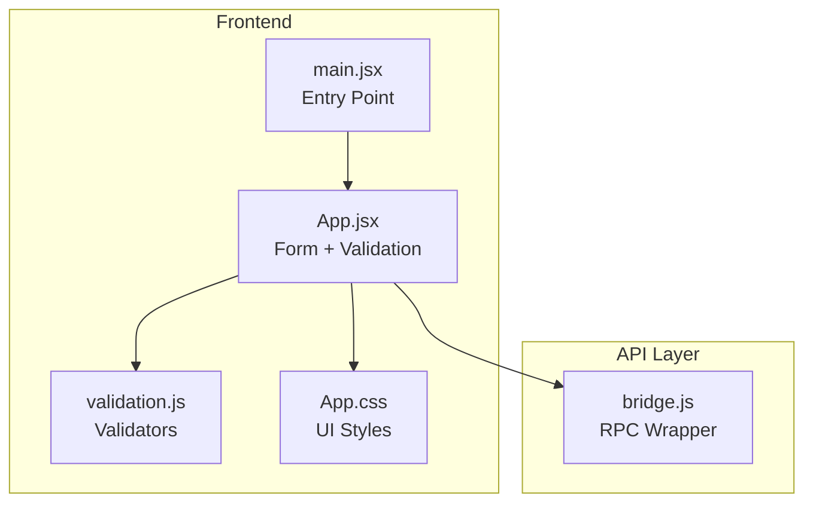
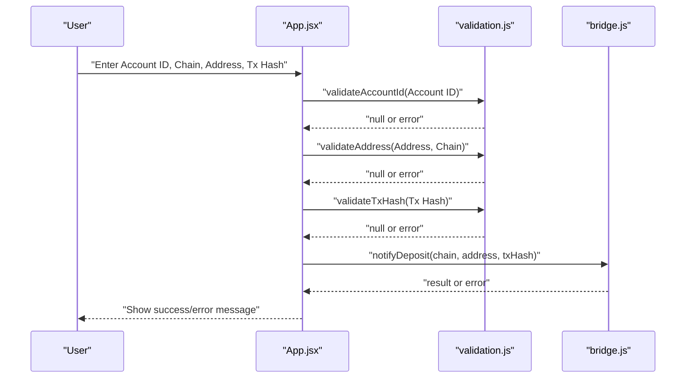
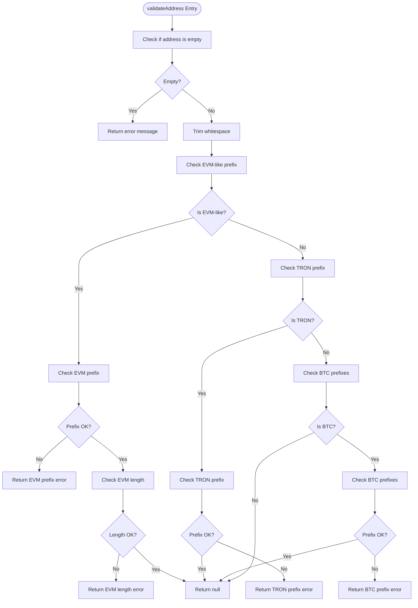
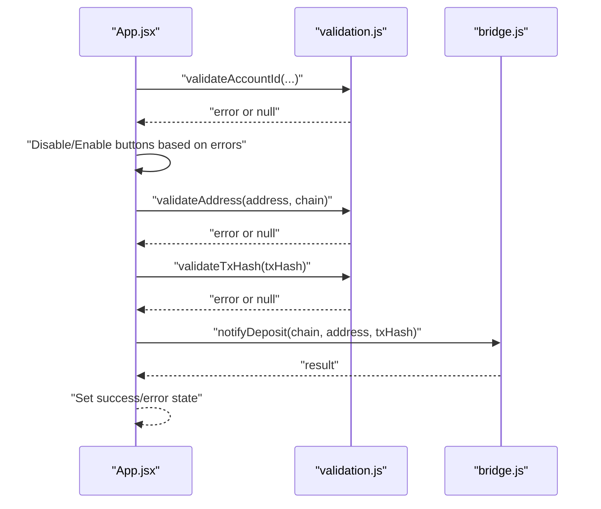
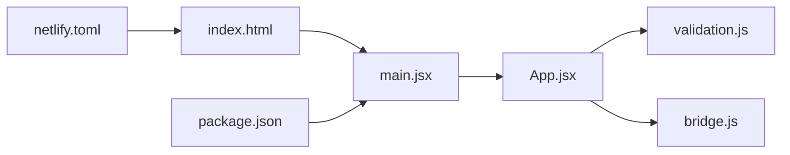

# Validation Utilities

<cite>
**Referenced Files in This Document**
- [validation.js](file://src/utils/validation.js)
- [App.jsx](file://src/App.jsx)
- [bridge.js](file://src/api/bridge.js)
- [main.jsx](file://src/main.jsx)
- [App.css](file://src/App.css)
- [package.json](file://package.json)
- [index.html](file://index.html)
- [netlify.toml](file://netlify.toml)
</cite>

## Table of Contents
1. [Introduction](#introduction)
2. [Project Structure](#project-structure)
3. [Core Components](#core-components)
4. [Architecture Overview](#architecture-overview)
5. [Detailed Component Analysis](#detailed-component-analysis)
6. [Dependency Analysis](#dependency-analysis)
7. [Performance Considerations](#performance-considerations)
8. [Troubleshooting Guide](#troubleshooting-guide)
9. [Conclusion](#conclusion)
10. [Appendices](#appendices)

## Introduction
This document explains the input validation system used by Bridge Fixer. It focuses on four key validators:
- validateAddress(): Validates multi-chain addresses for EVM-compatible chains, TRON, and Bitcoin.
- validateAccountId(): Validates NEAR account identifiers.
- validateTxHash(): Validates transaction hashes.
- canFixDeposit(): Determines whether a deposit can be fixed based on its status.

It also documents how these validators integrate with the form validation and user feedback system, along with performance considerations, extensibility for new chains, and troubleshooting guidance.

## Project Structure
The validation utilities live in a dedicated module and are consumed by the main application component. The app integrates with a remote bridge service via an RPC wrapper.

**Diagram sources**
- [validation.js:1-49](file://src/utils/validation.js#L1-L49)
- [App.jsx:1-373](file://src/App.jsx#L1-L373)
- [bridge.js:1-72](file://src/api/bridge.js#L1-L72)
- [main.jsx:1-11](file://src/main.jsx#L1-L11)
- [App.css:1-303](file://src/App.css#L1-L303)

**Section sources**
- [validation.js:1-49](file://src/utils/validation.js#L1-L49)
- [App.jsx:1-373](file://src/App.jsx#L1-L373)
- [bridge.js:1-72](file://src/api/bridge.js#L1-L72)
- [main.jsx:1-11](file://src/main.jsx#L1-L11)
- [App.css:1-303](file://src/App.css#L1-L303)
- [package.json:1-20](file://package.json#L1-L20)
- [index.html:1-13](file://index.html#L1-L13)
- [netlify.toml:1-9](file://netlify.toml#L1-L9)

## Core Components
- validateAddress(address, chain): Enforces chain-specific address format rules and returns an error message string or null.
- validateAccountId(accountId): Basic presence check for NEAR account IDs.
- validateTxHash(txHash): Basic presence check for transaction hashes.
- canFixDeposit(status): Boolean decision helper indicating whether a deposit can be fixed.

These validators are imported and used in the main application component to gate actions and inform the user interface.

**Section sources**
- [validation.js:1-49](file://src/utils/validation.js#L1-L49)
- [App.jsx:18-373](file://src/App.jsx#L18-L373)

## Architecture Overview
The validation pipeline is straightforward: user inputs are validated locally before triggering network requests. The application uses the validators to prevent invalid submissions and to enable/disable actions.

**Diagram sources**
- [App.jsx:194-216](file://src/App.jsx#L194-L216)
- [validation.js:1-49](file://src/utils/validation.js#L1-L49)
- [bridge.js:59-65](file://src/api/bridge.js#L59-L65)

## Detailed Component Analysis

### validateAddress(address, chain)
Purpose:
- Enforce chain-specific address format rules for EVM-compatible chains, TRON, and Bitcoin.

Behavior:
- Rejects empty or whitespace-only inputs.
- For EVM-compatible chains (identified by chain prefixes), enforces:
  - Must start with a specific prefix.
  - Must be a specific length.
- For TRON, enforces a leading character.
- For Bitcoin, enforces one of several accepted prefixes.
- Returns null when valid; otherwise returns a descriptive error message string.

Chain detection:
- Uses chain prefix checks to route to the appropriate validation rule set.

Error messages:
- EVM address must start with a specific prefix.
- EVM address must be a specific length.
- TRON address must start with a specific character.
- BTC address must start with one of several accepted prefixes.

Examples:
- Valid EVM-like address on an EVM chain: starts with the expected prefix and has the expected length.
- Valid TRON address: starts with the expected character.
- Valid Bitcoin address: starts with one of the accepted prefixes.
- Invalid: missing prefix, wrong length, or unsupported prefix.

Common failures:
- Missing or empty address.
- Wrong prefix for the selected chain.
- Incorrect length for EVM addresses.
- Unsupported Bitcoin prefix.

Integration:
- Called during “Fix Deposit” action to validate the deposit address before notifying the backend.

**Section sources**
- [validation.js:1-30](file://src/utils/validation.js#L1-L30)
- [App.jsx:201](file://src/App.jsx#L201)

### validateAccountId(accountId)
Purpose:
- Validates that an account identifier is present.

Behavior:
- Rejects empty or whitespace-only inputs.
- Returns null when present; otherwise returns a descriptive error message string.

Notes:
- The current implementation does not enforce NEAR-specific syntax (e.g., domain suffix rules). It only checks for presence.

Integration:
- Used in multiple actions to ensure an account ID is provided before proceeding.

**Section sources**
- [validation.js:32-37](file://src/utils/validation.js#L32-L37)
- [App.jsx:152](file://src/App.jsx#L152)
- [App.jsx:177](file://src/App.jsx#L177)
- [App.jsx:198](file://src/App.jsx#L198)

### validateTxHash(txHash)
Purpose:
- Validates that a transaction hash is present.

Behavior:
- Rejects empty or whitespace-only inputs.
- Returns null when present; otherwise returns a descriptive error message string.

Integration:
- Used during “Fix Deposit” to ensure a transaction hash is provided.

**Section sources**
- [validation.js:39-44](file://src/utils/validation.js#L39-L44)
- [App.jsx:203](file://src/App.jsx#L203)

### canFixDeposit(status)
Purpose:
- Determines whether a deposit can be fixed based on its status.

Behavior:
- Returns true for statuses that indicate the deposit is not yet credited and can be retried.
- Returns false for statuses that imply completion or ongoing processing.

Integration:
- Controls the “Fix Deposit” button enablement and displays a hint when fixing is not applicable.

**Section sources**
- [validation.js:46-48](file://src/utils/validation.js#L46-L48)
- [App.jsx:224](file://src/App.jsx#L224)
- [App.jsx:327](file://src/App.jsx#L327)

### Multi-chain Address Format Detection and Validation Logic
The validator uses chain prefix checks to branch into chain-specific rules. This allows adding new chains by extending the prefix checks without changing the rest of the logic.

**Diagram sources**
- [validation.js:1-30](file://src/utils/validation.js#L1-L30)

### Integration with Form Validation and User Feedback
The application component orchestrates validation and user feedback:
- On “Fetch Address”, validates account ID and chain, then calls the backend.
- On “Check Deposit”, validates account ID and chain, then lists recent deposits.
- On “Fix Deposit”, validates account ID, chain, address, and transaction hash, then notifies the backend and starts polling for updates.
- Error and success messages are displayed via styled message blocks.

**Diagram sources**
- [App.jsx:148-216](file://src/App.jsx#L148-L216)
- [validation.js:1-49](file://src/utils/validation.js#L1-L49)
- [bridge.js:59-65](file://src/api/bridge.js#L59-L65)

**Section sources**
- [App.jsx:148-216](file://src/App.jsx#L148-L216)
- [App.jsx:332-335](file://src/App.jsx#L332-L335)
- [App.css:212-230](file://src/App.css#L212-L230)

## Dependency Analysis
- App.jsx depends on validation.js for input validation and on bridge.js for RPC calls.
- The validation module is pure and has no external dependencies.
- The RPC wrapper encapsulates network concerns and is independent of validation logic.

**Diagram sources**
- [App.jsx:1-14](file://src/App.jsx#L1-L14)
- [validation.js:1-49](file://src/utils/validation.js#L1-L49)
- [bridge.js:1-72](file://src/api/bridge.js#L1-L72)
- [main.jsx:1-11](file://src/main.jsx#L1-L11)
- [index.html:1-13](file://index.html#L1-L13)
- [package.json:1-20](file://package.json#L1-L20)
- [netlify.toml:1-9](file://netlify.toml#L1-L9)

**Section sources**
- [App.jsx:1-14](file://src/App.jsx#L1-L14)
- [validation.js:1-49](file://src/utils/validation.js#L1-L49)
- [bridge.js:1-72](file://src/api/bridge.js#L1-L72)
- [main.jsx:1-11](file://src/main.jsx#L1-L11)
- [index.html:1-13](file://index.html#L1-L13)
- [package.json:1-20](file://package.json#L1-L20)
- [netlify.toml:1-9](file://netlify.toml#L1-L9)

## Performance Considerations
- Local validation is O(1) and inexpensive; it prevents unnecessary network calls.
- The application polls for deposit status periodically; ensure polling intervals and timeouts are tuned to balance responsiveness and resource usage.
- Consider caching validated inputs (e.g., last successful address per account/chain) to reduce repeated validations during a session.
- For future scalability, memoize validation results keyed by inputs to avoid recomputation when the user re-enters identical values.

[No sources needed since this section provides general guidance]

## Troubleshooting Guide
Common validation failures and resolutions:
- Missing or empty inputs:
  - Ensure Account ID, Chain, Address, and Tx Hash are filled before submitting.
- EVM address validation failures:
  - Verify the address starts with the expected prefix and is the correct length for the selected EVM chain.
- TRON address validation failures:
  - Ensure the address starts with the expected character for TRON.
- Bitcoin address validation failures:
  - Ensure the address starts with one of the accepted prefixes.
- Fix button disabled:
  - The “Fix Deposit” button is enabled only when the deposit status indicates it can be fixed. If disabled, the deposit is already completed or pending.

User feedback:
- Errors and successes are displayed using styled message blocks. Review these messages for precise failure reasons.

**Section sources**
- [validation.js:1-49](file://src/utils/validation.js#L1-L49)
- [App.jsx:332-335](file://src/App.jsx#L332-L335)
- [App.jsx:327-329](file://src/App.jsx#L327-L329)

## Conclusion
Bridge Fixer’s validation utilities provide a focused, extensible foundation for input validation across multiple blockchain networks. The validators are simple, fast, and integrated tightly with the UI to deliver immediate feedback. Extending support to new chains requires adding a new chain prefix check and associated rules in the validator module, while the rest of the application remains unchanged.

[No sources needed since this section summarizes without analyzing specific files]

## Appendices

### Validation Rules Summary
- validateAddress():
  - EVM-like chains: must start with a specific prefix and be a specific length.
  - TRON: must start with a specific character.
  - Bitcoin: must start with one of several accepted prefixes.
- validateAccountId(): must be present.
- validateTxHash(): must be present.
- canFixDeposit(): true for specific statuses indicating unrecoverable states.

**Section sources**
- [validation.js:1-49](file://src/utils/validation.js#L1-L49)

### Extensibility Guide
To add support for a new blockchain network:
- Extend the chain prefix checks in validateAddress() to recognize the new chain.
- Add the corresponding address format rules (prefix, length, or other constraints).
- Ensure the UI reflects the new chain selection and placeholder hints.
- Test with representative valid and invalid inputs to confirm behavior.

**Section sources**
- [validation.js:1-30](file://src/utils/validation.js#L1-L30)
- [App.jsx:258-261](file://src/App.jsx#L258-L261)