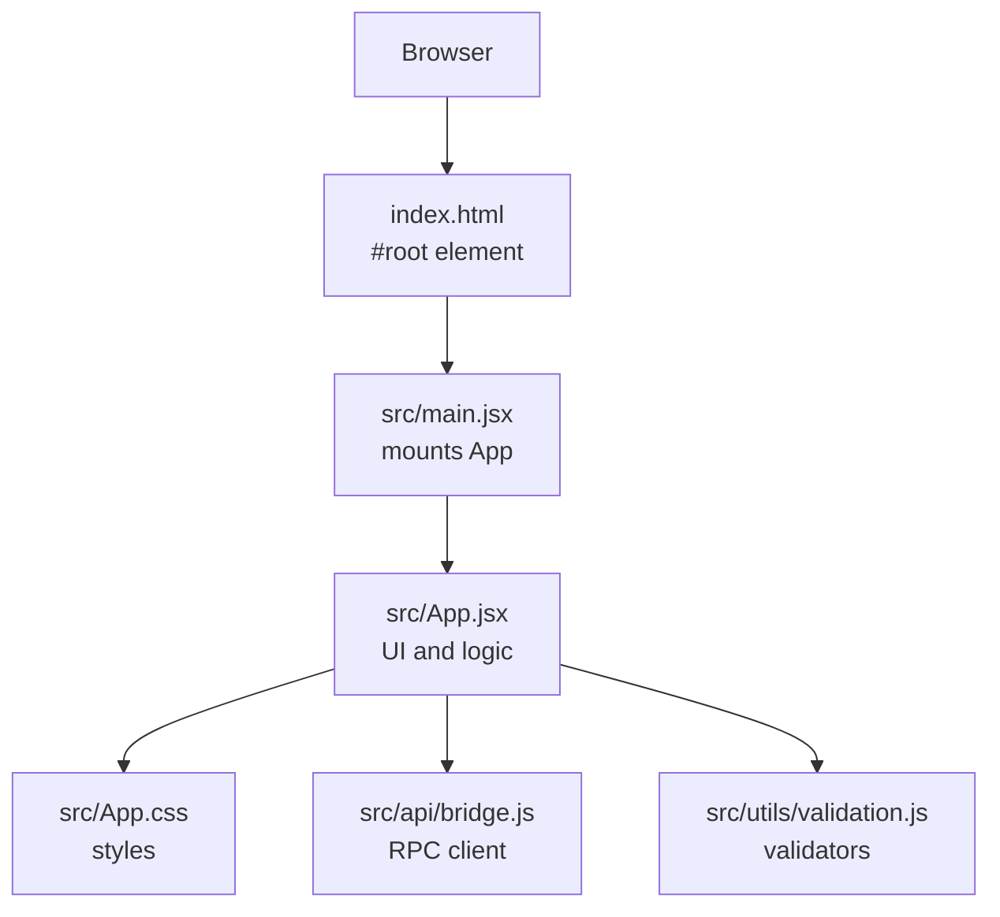
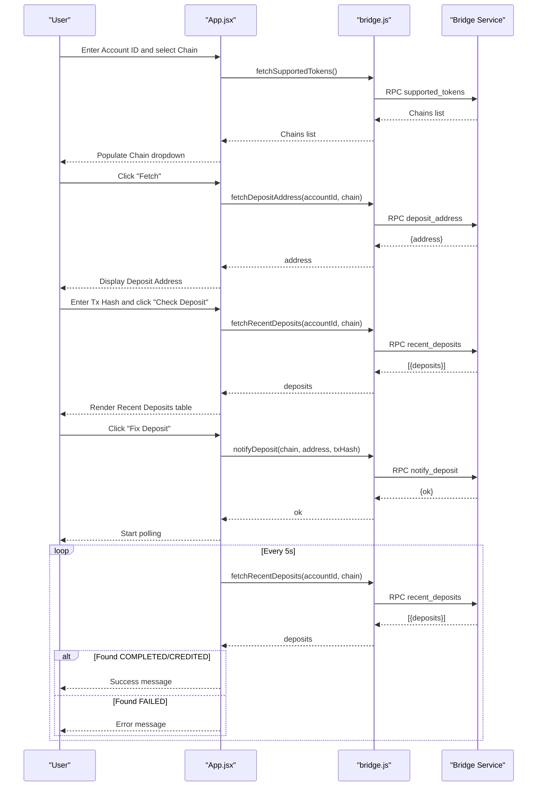
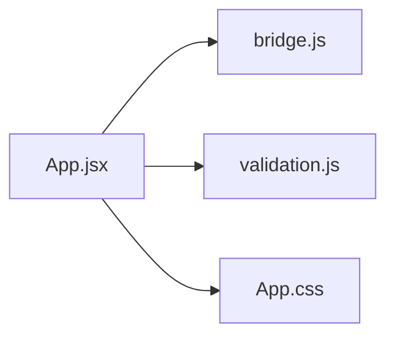

# User Guide

<cite>
**Referenced Files in This Document**
- [index.html](file://index.html)
- [src/main.jsx](file://src/main.jsx)
- [src/App.jsx](file://src/App.jsx)
- [src/App.css](file://src/App.css)
- [src/api/bridge.js](file://src/api/bridge.js)
- [src/utils/validation.js](file://src/utils/validation.js)
- [netlify.toml](file://netlify.toml)
</cite>

## Table of Contents
1. [Introduction](#introduction)
2. [Project Structure](#project-structure)
3. [Core Components](#core-components)
4. [Architecture Overview](#architecture-overview)
5. [Detailed Component Analysis](#detailed-component-analysis)
6. [Dependency Analysis](#dependency-analysis)
7. [Performance Considerations](#performance-considerations)
8. [Troubleshooting Guide](#troubleshooting-guide)
9. [Conclusion](#conclusion)
10. [Appendices](#appendices)

## Introduction
This user guide explains how to use the Bridge Fixer application to recover bridged deposits. It covers the complete user workflow: entering your Account ID, selecting a chain, generating a deposit address, checking recent deposits, and monitoring status. It also documents the interface components (form inputs, status badges, deposit rows, and action buttons), provides step-by-step tutorials for common scenarios, and explains real-time polling, timeouts, error messaging, accessibility, and responsive design.

## Project Structure
The application is a React single-page app built with Vite. The runtime entry point mounts the root React component into the DOM. Styling is handled via a dedicated CSS module. The app communicates with a backend bridge service through RPC endpoints.

**Diagram sources**
- [index.html:1-13](file://index.html#L1-L13)
- [src/main.jsx:1-11](file://src/main.jsx#L1-L11)
- [src/App.jsx:1-373](file://src/App.jsx#L1-L373)
- [src/App.css:1-303](file://src/App.css#L1-L303)
- [src/api/bridge.js:1-72](file://src/api/bridge.js#L1-L72)
- [src/utils/validation.js:1-49](file://src/utils/validation.js#L1-L49)

**Section sources**
- [index.html:1-13](file://index.html#L1-L13)
- [src/main.jsx:1-11](file://src/main.jsx#L1-L11)
- [src/App.jsx:1-373](file://src/App.jsx#L1-L373)
- [src/App.css:1-303](file://src/App.css#L1-L303)
- [src/api/bridge.js:1-72](file://src/api/bridge.js#L1-L72)
- [src/utils/validation.js:1-49](file://src/utils/validation.js#L1-L49)

## Core Components
- Application shell and layout: header, main content area, footer.
- Deposit Details form: Account ID, Chain, Deposit Address, Transaction Hash inputs.
- Status card: shows overall status badge for the entered transaction hash.
- Action buttons: Check Deposit and Fix Deposit.
- Recent Deposits table: lists recent deposits with status, token, amount, tx hash, time, and chain.
- Messaging: success and error messages.
- Real-time polling: automatic status checks every 5 seconds with a 60-second timeout.

Key behaviors:
- Chain list is loaded on startup and cached for subsequent use.
- Fetching a deposit address requires a valid Account ID and selected Chain.
- Checking deposits requires a valid Account ID and Chain.
- Fixing a deposit requires a valid Account ID, Chain, Deposit Address, and Transaction Hash, and only when the deposit status allows fixing.

**Section sources**
- [src/App.jsx:53-373](file://src/App.jsx#L53-L373)
- [src/App.css:14-303](file://src/App.css#L14-L303)

## Architecture Overview
The UI orchestrates user actions and state, while the RPC client handles network requests to the bridge service. Validation ensures inputs meet chain-specific requirements before submission.

**Diagram sources**
- [src/App.jsx:76-146](file://src/App.jsx#L76-L146)
- [src/App.jsx:148-216](file://src/App.jsx#L148-L216)
- [src/api/bridge.js:33-65](file://src/api/bridge.js#L33-L65)

## Detailed Component Analysis

### Form Inputs and Validation
- Account ID: Required for all operations. No chain-specific validation here; the validator confirms presence.
- Chain: Required; populated from supported tokens. Disabled during loading.
- Deposit Address: Required for Fix Deposit; validated based on chain prefix:
  - EVM-like chains require an “0x” prefix and 42-character length.
  - TRON requires a “T” prefix.
  - BTC supports legacy (“1”, “3”) and Bech32 (“bc1”) prefixes.
- Transaction Hash: Required for Fix Deposit and Check Deposit.

Validation outcomes:
- Invalid inputs show an error message and disable the affected action button.
- Fix Deposit is disabled unless the overall status allows fixing (NOT_FOUND or FAILED).

Accessibility:
- Labels are associated with inputs via for/id.
- Focus states improve keyboard navigation.

Responsive behavior:
- On small screens, input rows stack vertically, and action buttons become full-width.

**Section sources**
- [src/App.jsx:57-67](file://src/App.jsx#L57-L67)
- [src/App.jsx:148-216](file://src/App.jsx#L148-L216)
- [src/utils/validation.js:1-49](file://src/utils/validation.js#L1-L49)
- [src/App.css:79-104](file://src/App.css#L79-L104)
- [src/App.css:278-302](file://src/App.css#L278-L302)

### Status Badge Component
- Renders a colored badge indicating deposit status:
  - Not Indexed, Pending, Completed, Failed, or Unknown.
- Used in the status card and within the recent deposits table.

**Section sources**
- [src/App.jsx:18-28](file://src/App.jsx#L18-L28)
- [src/App.jsx:30-51](file://src/App.jsx#L30-L51)
- [src/App.css:172-199](file://src/App.css#L172-L199)

### Deposit Row Component
- Displays a single deposit row with:
  - Status badge
  - Token identifier (shortened for readability)
  - Amount formatted to six decimals
  - Transaction hash with tooltip and truncation
  - Creation time and chain

**Section sources**
- [src/App.jsx:30-51](file://src/App.jsx#L30-L51)
- [src/App.css:239-266](file://src/App.css#L239-L266)

### Action Buttons
- Check Deposit:
  - Triggers fetching recent deposits for the Account ID and Chain.
  - Disables itself while loading and when inputs are invalid.
- Fix Deposit:
  - Sends a notification to re-index a specific deposit.
  - Starts polling to monitor completion or failure.
  - Disabled unless the overall status allows fixing and all inputs are valid.

Hints:
- A hint appears when fixing is disabled due to status.

**Section sources**
- [src/App.jsx:172-192](file://src/App.jsx#L172-L192)
- [src/App.jsx:194-216](file://src/App.jsx#L194-L216)
- [src/App.jsx:310-330](file://src/App.jsx#L310-L330)

### Messages and Status Card
- Success and error messages appear near the top of the main content.
- Status card shows the overall status for the entered transaction hash and indicates when auto-checking is active.

**Section sources**
- [src/App.jsx:332-335](file://src/App.jsx#L332-L335)
- [src/App.jsx:296-306](file://src/App.jsx#L296-L306)
- [src/App.css:200-210](file://src/App.css#L200-L210)

### Recent Deposits Table
- Populated after clicking Check Deposit.
- Columns: Status, Token, Amount, Tx Hash, Time, Chain.
- Hover highlights improve readability.

**Section sources**
- [src/App.jsx:337-364](file://src/App.jsx#L337-L364)
- [src/App.css:239-266](file://src/App.css#L239-L266)

### Real-Time Polling and Timeout
- After Fix Deposit, the app polls every 5 seconds for up to 60 seconds.
- Stops polling when:
  - The target transaction reaches COMPLETED or CREDITED (success).
  - The target transaction reaches FAILED (error).
  - The timeout threshold is reached (error).

**Section sources**
- [src/App.jsx:15-16](file://src/App.jsx#L15-L16)
- [src/App.jsx:116-146](file://src/App.jsx#L116-L146)

## Dependency Analysis
The UI depends on:
- RPC client for all backend interactions.
- Validation utilities for input correctness.
- CSS for styling and responsive behavior.

**Diagram sources**
- [src/App.jsx:1-13](file://src/App.jsx#L1-L13)
- [src/api/bridge.js:1-72](file://src/api/bridge.js#L1-L72)
- [src/utils/validation.js:1-49](file://src/utils/validation.js#L1-L49)
- [src/App.css:1-303](file://src/App.css#L1-L303)

**Section sources**
- [src/App.jsx:1-13](file://src/App.jsx#L1-L13)
- [src/api/bridge.js:1-72](file://src/api/bridge.js#L1-L72)
- [src/utils/validation.js:1-49](file://src/utils/validation.js#L1-L49)
- [src/App.css:1-303](file://src/App.css#L1-L303)

## Performance Considerations
- Polling interval: 5 seconds balances responsiveness with server load.
- Timeout: 60 seconds prevents indefinite polling.
- Debounce by disabling actions during requests reduces redundant calls.
- Table rendering uses minimal formatting; consider virtualization for very large datasets.

[No sources needed since this section provides general guidance]

## Troubleshooting Guide
Common issues and resolutions:
- Missing Account ID or Chain:
  - Ensure both are filled before fetching addresses or checking deposits.
- Invalid Deposit Address:
  - For EVM-like chains, ensure the address starts with “0x” and is 42 characters long.
  - For TRON, ensure it starts with “T”.
  - For BTC, ensure it starts with “1”, “3”, or “bc1”.
- Fix Deposit disabled:
  - Fixing is only allowed when the status is NOT_FOUND or FAILED.
  - If the status is Pending or Completed, the system does not allow re-notification.
- Timeout during polling:
  - The system stops polling after 60 seconds and displays a message.
  - Manually check deposits again or contact support.
- Network errors:
  - The RPC client surfaces HTTP and RPC errors; retry after a short delay.
- Responsive layout issues:
  - On small screens, inputs and buttons stack vertically for easier touch interaction.

**Section sources**
- [src/utils/validation.js:1-49](file://src/utils/validation.js#L1-L49)
- [src/App.jsx:116-146](file://src/App.jsx#L116-L146)
- [src/api/bridge.js:20-31](file://src/api/bridge.js#L20-L31)

## Conclusion
Bridge Fixer streamlines deposit recovery by letting you quickly generate deposit addresses, check recent activity, and trigger fixes with real-time status updates. Follow the step-by-step workflows below to accomplish your tasks efficiently and safely.

[No sources needed since this section summarizes without analyzing specific files]

## Appendices

### Step-by-Step Tutorials

#### Generate a New Deposit Address
1. Enter your Account ID in the Account ID field.
2. Select the destination Chain from the dropdown.
3. Click Fetch next to the Deposit Address input.
4. The system validates inputs and retrieves the deposit address.
5. Copy the displayed address and fund it from your source chain.

Tips:
- Ensure the Chain matches the intended destination.
- If the Chain dropdown is empty, wait for the initial load or refresh the page.

**Section sources**
- [src/App.jsx:148-170](file://src/App.jsx#L148-L170)
- [src/App.jsx:264-282](file://src/App.jsx#L264-L282)

#### Check Recent Deposits
1. Enter your Account ID and select the Chain.
2. Click Check Deposit.
3. Review the Recent Deposits table for matching transactions.
4. Use the Status column to assess progress.

Notes:
- The table shows up to 20 recent deposits by default.
- If no deposits are found, confirm the Account ID and Chain are correct.

**Section sources**
- [src/App.jsx:172-192](file://src/App.jsx#L172-L192)
- [src/App.jsx:337-364](file://src/App.jsx#L337-L364)

#### Trigger a Recovery Process (Fix Deposit)
1. Enter your Account ID and Chain.
2. Enter the Deposit Address and Transaction Hash.
3. Click Fix Deposit.
4. The system sends a notification to re-index the deposit and starts polling.
5. Watch the Status card for updates; success or failure ends polling.

Constraints:
- Fixing is allowed only when the status is NOT_FOUND or FAILED.
- The system disables Fix Deposit otherwise.

**Section sources**
- [src/App.jsx:194-216](file://src/App.jsx#L194-L216)
- [src/App.jsx:218-224](file://src/App.jsx#L218-L224)
- [src/App.jsx:296-306](file://src/App.jsx#L296-L306)

#### Troubleshoot a Failed Transaction
1. Enter your Account ID and Chain.
2. Enter the Transaction Hash and click Check Deposit.
3. Observe the Status badge for the transaction.
4. If the status is FAILED, click Fix Deposit to re-index.
5. Monitor the polling indicator and messages until completion or timeout.

Timeout handling:
- If the status remains unchanged after 60 seconds, the system stops polling and suggests manual verification.

**Section sources**
- [src/App.jsx:172-192](file://src/App.jsx#L172-L192)
- [src/App.jsx:116-146](file://src/App.jsx#L116-L146)

### Accessibility and Responsive Design Notes
- Keyboard-friendly focus states and labels improve usability.
- On small screens, stacked layouts and full-width buttons enhance touch interaction.
- Status badges and messages use color contrast to convey meaning.

**Section sources**
- [src/App.css:79-95](file://src/App.css#L79-L95)
- [src/App.css:278-302](file://src/App.css#L278-L302)
- [src/App.css:172-199](file://src/App.css#L172-L199)
- [src/App.css:213-230](file://src/App.css#L213-L230)

### Deployment and Routing
- The app is deployed as a static site and uses a single-page routing strategy so all routes resolve to index.html.

**Section sources**
- [netlify.toml:1-9](file://netlify.toml#L1-L9)